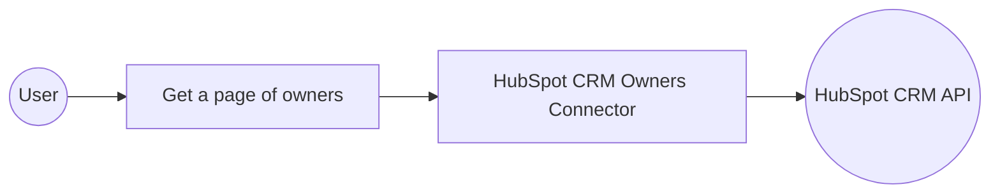

# Example

## What you'll build

This integration retrieves a page of CRM owners from HubSpot and logs the result. It connects to the HubSpot CRM Owners API using a private app access token and returns owner data as a JSON-serialized response.

**Operations used:**
- **Get a page of owners** : Retrieves a paginated list of CRM owners from HubSpot

## Architecture

## Prerequisites

- A HubSpot account with a private app access token (bearer token)

## Setting up the HubSpot CRM Owners integration

> **New to WSO2 Integrator?** Follow the [Create a New Integration](../../../../develop/create-integrations/create-a-new-integration.md) guide to set up your integration first, then return here to add the connector.

## Adding the HubSpot CRM Owners connector

### Step 1: Open the connector palette and select the HubSpot CRM Owners connector

1. In the canvas, select **Add Connection** (or the **+** icon next to **Connections** in the sidebar).
2. The connector palette opens. In the search field, enter `hubspot.crm.owners`.
3. Select **ballerinax/hubspot.crm.owners** from the results.

## Configuring the HubSpot CRM Owners connection

### Step 2: Fill in the connection parameters

Bind the connection parameters to configurable variables so credentials aren't hardcoded.

- **Config** : The connection configuration record containing the bearer token, bound to the `hubspotToken` configurable variable
- **Connection Name** : Set to `ownersClient`

### Step 3: Save the connection

Select **Save Connection** to persist the connection. The `ownersClient` connection node appears on the canvas.

### Step 4: Set actual values for your configurables

1. In the left panel, select **Configurations**.
2. Set a value for each configurable listed below.

- **hubspotToken** (string) : Your HubSpot private app access token

## Configuring the HubSpot CRM Owners get a page of owners operation

### Step 5: Add an automation entry point

1. In the sidebar, select **Add Entry Point** (the **+** button next to **Entry Points**).
2. Select **Automation**.
3. In the **Create New Automation** form, accept the defaults and select **Create**.

### Step 6: Select and configure the get a page of owners operation

1. Select the **+** (Add Step) button between the **Start** node and **Error Handler**.
2. Under **Connections**, select **ownersClient** to expand it and reveal available operations.

3. Select **Get a page of owners**.
4. In the **Result** field, enter `result`.
5. Select **Save**.

## Try it yourself

Try this sample in WSO2 Integration Platform.

[View source on GitHub](https://github.com/wso2/integration-samples/tree/main/connectors/hubspot.crm.owners_connector_sample)

## More code examples

The `HubSpot CRM Owners` connector provides practical examples illustrating usage in various scenarios.

1. [Retrieve the owner IDs for all users in the account to later assign CRM records across the team.](https://github.com/ballerina-platform/module-ballerinax-hubspot.crm.owners/tree/main/examples/retrieve-owner-ids) - This example demonstrates how to use the HubSpot CRM Owners connector to retrieve a page of owners from your HubSpot account. It shows how to fetch owner details—such as owner ID, first name, and last name—which can then be used to assign CRM records to team members.
