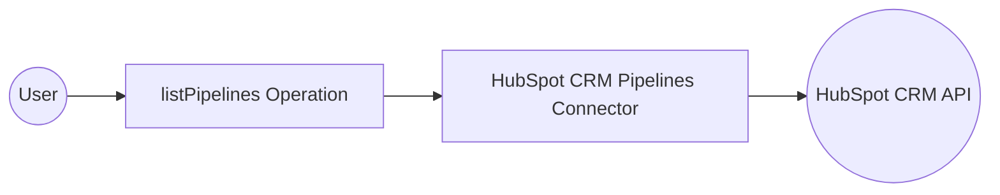

# Example

## What you'll build

Build a WSO2 Integrator automation that retrieves all HubSpot CRM deal pipelines using the `ballerinax/hubspot.crm.pipelines` connector. The integration calls the `listPipelines` operation for a specified object type and logs the full pipeline collection as a JSON string.

**Operations used:**
- **listPipelines** : Retrieves all CRM pipelines for a given object type (such as `deals`)

## Architecture

## Prerequisites

- A HubSpot account with a Private App configured and the `crm.schemas.deals.read` scope enabled
- A HubSpot Private App token to use as the authentication credential

## Setting up the HubSpot CRM Pipelines integration

> **New to WSO2 Integrator?** Follow the [Create a New Integration](../../../../develop/create-integrations/create-new-integration.md) guide to set up your integration first, then return here to add the connector.

## Adding the HubSpot CRM Pipelines connector

### Step 1: Open the connector palette

Select **Add Connection** (the **+** next to **Connections**) in the WSO2 Integrator panel to open the connector palette.

## Configuring the HubSpot CRM Pipelines connection

### Step 2: Fill in the connection parameters

Search for "Pipelines" in the palette, then select the **Pipelines** connector card (published by HubSpot, Standard tier) to open the **Configure Pipelines** form. Bind all sensitive values to configurable variables so credentials are never hard-coded.

- **Config** : Set to expression mode and bind to a new configurable variable `hubspotAuthToken` (type `string`), injecting the expression `{auth: {token: hubspotAuthToken}}`
- **serviceUrl** : Expand **Advanced Configurations** and bind to a new configurable variable `hubspotServiceUrl` (type `string`)
- **connectionName** : Keep the default value `pipelinesClient`

### Step 3: Save the connection

Select **Save Connection** to persist the connection. The `pipelinesClient` entry now appears in the **Connections** panel.

### Step 4: Set actual values for your configurables

1. In the left panel, select **Configurations**.
2. Set a value for each configurable listed below.

- **hubspotAuthToken** (string) : Your HubSpot Private App token with CRM read scopes
- **hubspotServiceUrl** (string) : The HubSpot Pipelines API base URL (for example, `https://api.hubapi.com/crm/v3/pipelines`)

## Configuring the HubSpot CRM Pipelines listPipelines operation

### Step 5: Add an Automation entry point

1. On the canvas, select **+ Add Artifact**.
2. Select **Automation** in the Artifacts panel.
3. Select **Create** in the **Create New Automation** panel.

The `main` entry point appears under **Entry Points** and the flow canvas opens showing a **Start** node and an **Error Handler** node.

### Step 6: Select and configure the listPipelines operation

1. Select the **+** (Add step) button between **Start** and **Error Handler** on the flow canvas.
2. Select **pipelinesClient** under **Connections** in the node panel to expand its available operations.

3. Select **Retrieve all pipelines** to open the operation form.
4. Fill in the operation parameters:

- **objectType** : Enter `deals` as the object type to retrieve pipelines for
- **result** : Enter `result` as the output variable name

5. Select **Save**.

## Try it yourself

Try this sample in WSO2 Integration Platform.

[View source on GitHub](https://github.com/wso2/integration-samples/tree/main/connectors/hubspot.crm.pipelines_connector_sample)

## More code examples

The `HubSpot CRM Pipelines` connector provides practical examples illustrating usage in various scenarios. Explore these [examples](https://github.com/ballerina-platform/module-ballerinax-hubspot.crm.pipelines/tree/main/examples), covering the following use cases:

1. [Pipeline management](https://github.com/ballerina-platform/module-ballerinax-hubspot.crm.pipelines/tree/main/examples/pipeline-management/main.bal)
2. [Support pipeline](https://github.com/ballerina-platform/module-ballerinax-hubspot.crm.pipelines/tree/main/examples/support-pipeline/main.bal)
3. [Pipeline stage management](https://github.com/ballerina-platform/module-ballerinax-hubspot.crm.pipelines/tree/main/examples/pipeline-stage-management/main.bal)
