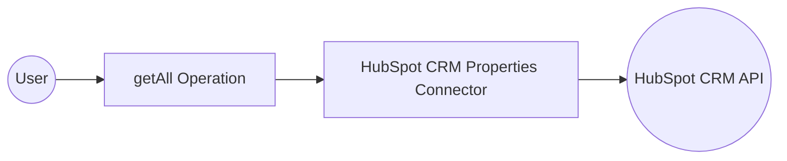

# Example

## What you'll build

Build a WSO2 Integrator automation that connects to the HubSpot CRM Properties API and retrieves all property definitions for a given object type (such as `contacts`). The integration authenticates using a HubSpot private app Bearer token and returns all CRM property definitions in JSON format.

**Operations used:**
- **getAll** : Reads all CRM property definitions for a specified object type

## Architecture

## Prerequisites

- A HubSpot account with a private app token (OAuth Bearer token)

## Setting up the HubSpot CRM Properties integration

> **New to WSO2 Integrator?** Follow the [Create a New Integration](../../../../develop/create-integrations/create-a-new-integration.md) guide to set up your integration first, then return here to add the connector.

## Adding the HubSpot CRM Properties connector

### Step 1: Open the Add connection panel

Select **+ Add Artifact** on the canvas, then under **Other Artifacts**, select **Connection** to open the connector search palette.

## Configuring the HubSpot CRM Properties connection

### Step 2: Fill in the connection parameters

Search for `hubspot` in the connector palette and select **ballerinax/hubspot.crm.properties**. Select **Next** to open the **Configure Properties** form. Bind each field to a configurable variable:

- **Config** : Set to a `ConnectionConfig` record using your `hubspotAuthToken` configurable variable for the Bearer token
- **ServiceUrl** : Bind to the `hubspotServiceUrl` configurable variable (defaults to `https://api.hubapi.com/crm/v3/properties`)
- **Connection name** : Set to `propertiesClient`

### Step 3: Save the connection

Select **Save Connection** to persist the connection. Confirm that `propertiesClient` appears in the **Connections** panel on the canvas.

### Step 4: Set actual values for your configurables

In the left panel, select **Configurations**. Set a value for each configurable listed below:

- **hubspotAuthToken** (string) : Your HubSpot private app Bearer token
- **hubspotServiceUrl** (string) : The HubSpot CRM Properties API base URL (for example, `https://api.hubapi.com/crm/v3/properties`)

## Configuring the HubSpot CRM Properties getAll operation

### Step 5: Add an automation entry point

Select **+ Add Artifact** on the canvas, then select **Automation** under the Automation section. In the **Create New Automation** dialog, keep the defaults and select **Create**.

### Step 6: Select and configure the getAll operation

In the flow canvas, select the **+** button between **Start** and **Error Handler**. In the node panel, expand **Connections → propertiesClient** to see all available operations.

Select **Read all properties** (the `getAll` operation) and fill in the operation parameters:

- **ObjectType** : The object type to retrieve property definitions for (for example, `contacts`)
- **Result** : The variable name to store the returned collection (for example, `result`)

Select **Save**.

## Try it yourself

Try this sample in WSO2 Integration Platform.

[View source on GitHub](https://github.com/wso2/integration-samples/tree/main/connectors/hubspot.crm.properties_connector_sample)

## More code examples

The `Ballerina HubSpot CRM Properties Connector` connector provides practical examples illustrating usage in various scenarios. Explore these [examples](https://github.com/ballerina-platform/module-ballerinax-hubspot.crm.properties/tree/main/examples), covering the following use cases:

1. [Customer Behavior Handling](https://github.com/ballerina-platform/module-ballerinax-hubspot.crm.properties/tree/main/examples/customer-behavior)
2. [Marketing Preference Management](https://github.com/ballerina-platform/module-ballerinax-hubspot.crm.properties/tree/main/examples/marketing-preference)
