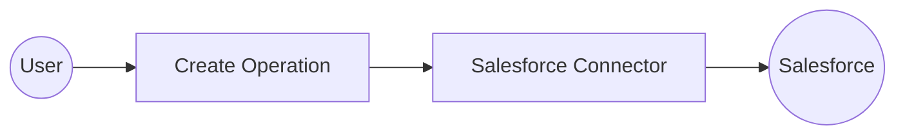

# Example

## What you'll build

Build a WSO2 Integrator automation that creates an Account record in Salesforce using the Salesforce connector. The integration connects to your Salesforce instance and submits a new Account sObject with name and industry fields. On success, it logs the creation response containing the new record's ID.

**Operations used:**
- **create** : Creates a new sObject record (Account) in Salesforce and returns a creation response with the record ID and success status.

## Architecture

## Prerequisites

- A Salesforce account with API access enabled
- Your Salesforce instance URL (e.g., `https://yourorg.my.salesforce.com`)
- A Salesforce connected app access token

## Setting up the Salesforce integration

> **New to WSO2 Integrator?** Follow the [Create a New Integration](../../../../develop/create-integrations/create-new-integration.md) guide to set up your integration first, then return here to add the connector.

## Adding the Salesforce connector

### Step 1: Add the Salesforce connector

1. In the left sidebar under your project, locate the **Connections** section.
2. Select the **+** icon next to **Connections** (or select **Add Connection**).
3. In the search field, enter `salesforce`.
4. Select **Salesforce** from the results.

## Configuring the Salesforce connection

### Step 2: Fill in the Salesforce connection parameters

In the **Configure Salesforce** form, bind each field to a configurable variable so credentials aren't hardcoded.

1. In the **Config** field, select the **Expression** tab to switch to expression mode.
2. Enter the following expression, referencing the configurable variables you'll define:
   `{baseUrl: salesforceServiceUrl, auth: {token: salesforceToken}}`
3. Confirm the **Connection Name** field shows `salesforceClient`.

- **Config** : Full `salesforce:ConnectionConfig` record expression referencing `salesforceServiceUrl` and `salesforceToken`
- **Connection Name** : Logical name used to reference this connection on the canvas

### Step 3: Save the connection

Select **Save Connection** to persist the connection. The dialog closes and `salesforceClient` appears as a connection node on the canvas.

### Step 4: Set actual values for your configurables

1. In the left panel, select **Configurations**.
2. Set a value for each configurable listed below.

- **salesforceServiceUrl** (string) : Your Salesforce instance URL (e.g., `https://yourorg.my.salesforce.com`)
- **salesforceToken** (string) : Your Salesforce connected app access token

## Configuring the Salesforce create operation

### Step 5: Add an Automation entry point

1. Select **+ Add Artifact** on the canvas toolbar.
2. In the **Artifacts** panel, select **Automation**.
3. In the **Create New Automation** form, select **Create**.

The Automation flow view opens showing a **Start** node and an **Error Handler** node.

### Step 6: Select and configure the create operation

1. Select the **+** button between the **Start** and **Error Handler** nodes to add a step.
2. In the node panel, under **Connections**, expand **salesforceClient** to see its operations.

3. Select **Create** from the list of operations.
4. In the **salesforceClient → create** form, fill in the fields:

- **S Object Name** : Set to `"Account"` (use expression mode)
- **S Object** : Set to `{"Name": "Test Account", "Industry": "Technology"}`
- **Result** : Enter `result` as the variable name
- **Result Type** : Auto-filled as `salesforce:CreationResponse`

Select **Save**. The `salesforce : create` node now appears in the flow between **Start** and **Error Handler**.

## Try it yourself

Try this sample in WSO2 Integration Platform.

[View source on GitHub](https://github.com/wso2/integration-samples/tree/main/connectors/salesforce_connector_sample)

## More code examples

The `salesforce` connector provides practical examples illustrating usage in various scenarios. Explore these examples below, covering use cases like creating sObjects, retrieving records, and executing bulk operations.

1. [Salesforce REST API use cases](https://github.com/ballerina-platform/module-ballerinax-salesforce/tree/master/examples/rest_api_usecases) - How to employ the REST API of Salesforce to carry out various tasks.

2. [Salesforce Bulk API use cases](https://github.com/ballerina-platform/module-ballerinax-salesforce/tree/master/examples/bulk_api_usecases) - How to employ Bulk API of Salesforce to execute Bulk jobs.

3. [Salesforce Bulk v2 API use cases](https://github.com/ballerina-platform/module-ballerinax-salesforce/tree/master/examples/bulkv2_api_usecases) - How to employ Bulk v2 API to execute an ingest job.

4. [Salesforce APEX REST API use cases](https://github.com/ballerina-platform/module-ballerinax-salesforce/tree/master/examples/apex_rest_api_usecases) - How to employ APEX REST API to create a case in Salesforce.
