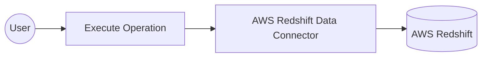

# Example

## What you'll build

Build a WSO2 Integrator automation that connects to the AWS Redshift Data API and runs an SQL query using the `ballerinax/aws.redshiftdata` connector. The integration configures AWS credentials as configurable variables and calls the **Execute** operation to submit a SQL statement to Redshift.

**Operations used:**
- **Execute** (`executeStatement`) : Runs a SQL statement against an AWS Redshift database and returns an execution response containing the statement ID

## Architecture

## Prerequisites

- AWS credentials: Access Key ID, Secret Access Key, and optionally a Session Token
- The target AWS region and Redshift database name

## Setting up the AWS Redshift Data integration

> **New to WSO2 Integrator?** Follow the [Create a New Integration](../../../../develop/create-integrations/create-new-integration.md) guide to set up your integration first, then return here to add the connector.

## Adding the AWS Redshift Data connector

### Step 1: Open the Add Connection palette

Select the **+** (Add Connection) button next to **Connections** in the component tree to open the **Add Connection** palette on the right side of the canvas.

### Step 2: Search for the AWS Redshift Data connector

In the **Add Connection** search box, enter `redshiftdata` and select **`ballerinax/aws.redshiftdata`** from the results to open the connection configuration form.

## Configuring the AWS Redshift Data connection

### Step 3: Fill in the connection parameters

Enter a descriptive name for the connection and bind each parameter to a configurable variable so that credentials are never hard-coded:

- **connectionName** : A unique name for this connection (for example, `redshiftdataClient`)
- **region** : The AWS region where your Redshift cluster is hosted (use Expression mode to enter a string literal such as `"us-east-1"`)
- **accessKeyId** : AWS access key ID bound to a configurable variable
- **secretAccessKey** : AWS secret access key bound to a configurable variable
- **sessionToken** : Optional AWS session token bound to a configurable variable

### Step 4: Save the connection

Select **Save** to persist the connection. The canvas updates to show the new `redshiftdataClient` connection node, and the sidebar lists it under **Connections**.

### Step 5: Set actual values for your configurables

1. In the left panel, select **Configurations**.
2. Set a value for each configurable listed below:

- **awsAccessKeyId** : `string` — your AWS access key ID
- **awsSecretAccessKey** : `string` — your AWS secret access key
- **awsSessionToken** : `string` — your AWS session token (leave blank if not required)

## Configuring the AWS Redshift Data executeStatement operation

### Step 6: Add an Automation entry point

1. In the component tree, select **Add Artifact** (or the **+** next to **Entry Points**).
2. Select **Automation** from the artifact type list.
3. Select **Create** to generate a `main` automation entry point.

The canvas switches to the Automation flow view showing a **Start** node, an empty placeholder node, and an **Error Handler** node.

### Step 7: Select and configure the Execute operation

Select the empty placeholder node on the canvas to open the node panel, then locate **`redshiftdataClient`** and select **Execute** to open the operation configuration form. Fill in the following fields:

- **statement** : The SQL query to run (for example, `SELECT * FROM public.users LIMIT 10`)
- **dbAccessConfig** : Override the connection-level database access config for this call (for example, `{id: "", database: "dev"}`)
- **statementName** : A logical name for the SQL statement to aid traceability (for example, `"executeRedshiftQuery"`)
- **withEvent** : Whether to send an event to Amazon EventBridge after execution — set to `false`

Select **Save**. The canvas updates to show a new **`redshiftdata : execute`** node between the Start and Error Handler nodes. The result variable `redshiftdataExecutionresponse` (of type `redshiftdata:ExecutionResponse`) is now available for downstream steps.

## Try it yourself

Try this sample in WSO2 Integration Platform.

[View source on GitHub](https://github.com/wso2/integration-samples/tree/main/connectors/aws.redshiftdata_connector_sample)

## More code examples

The `aws.redshiftdata` connector provides practical examples illustrating usage in various scenarios. Explore these [examples](https://github.com/ballerina-platform/module-ballerinax-aws.redshiftdata/tree/main/examples).

1. [Manage users](https://github.com/ballerina-platform/module-ballerinax-aws.redshiftdata/tree/main/examples/manage-users/) - This example demonstrates how to use the Ballerina Redshift Data connector to perform SQL operations on an AWS Redshift cluster. It includes creating a table, inserting data, and querying data.

2. [Music store](https://github.com/ballerina-platform/module-ballerinax-aws.redshiftdata/tree/main/examples/music-store) - This example illustrates the process of creating an HTTP RESTful API with Ballerina to perform basic CRUD operations on a database, specifically AWS Redshift, involving setup, configuration, and running examples.
