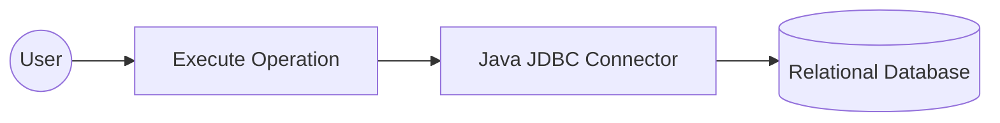

# Example

## What you'll build

Build a low-code integration using the `ballerinax/java.jdbc` connector in WSO2 Integrator that connects to a relational database and executes a SQL INSERT statement. You'll configure a JDBC connection with Configurable variables and run the `execute` operation from an Automation entry point.

**Operations used:**
- **Execute** — executes an INSERT, UPDATE, or DELETE SQL statement and returns an execution result

## Architecture

## Prerequisites

- A running relational database (MySQL, PostgreSQL, MSSQL, H2, or similar) with a JDBC-compatible driver
- JDBC connection URL, database username, and database password

## Setting up the Java JDBC integration

> **New to WSO2 Integrator?** Follow the [Create a New Integration](../../../../develop/create-integrations/create-new-integration.md) guide to set up your integration first, then return here to add the connector.

## Adding the Java JDBC connector

### Step 1: Open the connector palette and search for the JDBC connector

1. On the integration canvas, click **+ Add Connection** to open the connector palette.
2. In the search panel, type `jdbc`.
3. Select **Jdbc** (`ballerinax/java.jdbc`) from the results.

## Configuring the Java JDBC connection

### Step 2: Bind all connection parameters to configurable variables

After selecting the connector, the **Configure Jdbc** form opens. Bind each field to a Configurable variable so no literal credentials are stored in source code:

- **url**: the JDBC connection string (e.g., `jdbcUrl` of type `string`)
- **user**: the database username (e.g., `dbUser` of type `string`; found under **Advanced Configurations**)
- **password**: the database password (e.g., `dbPassword` of type `string`; found under **Advanced Configurations**)
- **Connection name**: set to `jdbcClient`

For each field, click the field textbox, open the **Configurables** tab in the helper panel, click **New Configurable**, enter the variable name and type, and click **Save**.

### Step 3: Save the connection

Click **Save Connection**. The `jdbcClient` connection node appears on the canvas.

### Step 4: Set actual values for your configurables

1. In the left panel of WSO2 Integrator, click **Configurations** (at the bottom of the project tree, under Data Mappers).
2. Set a value for each configurable listed below:
   - **jdbcUrl**: string : your full JDBC connection URL
   - **dbUser**: string : your database username
   - **dbPassword**: string : your database password

## Configuring the Java JDBC execute operation

### Step 5: Add an automation entry point

1. Click **+ Add Artifact** on the canvas toolbar.
2. Select **Automation** from the artifact type list.
3. Leave defaults and click **Create**.

The Automation flow opens in the canvas editor with a **Start** node and an **Error Handler** block created automatically.

### Step 6: Select and configure the execute operation

1. In the Automation flow canvas, click the **+** node (between Start and Error Handler) to open the node selection panel.
2. In the **Connections** section, click **jdbcClient** to expand it and reveal available operations.

3. Click **Execute** to open the configuration panel, then fill in the following parameters:
   - **SQL query** — the parameterized SQL statement to execute (for example, an INSERT targeting your target table)
   - **Result** — the variable name for the execution result (default: `sqlExecutionresult`)
   - **Result type** — `sql:ExecutionResult` (auto-filled)

4. Click **Save**. The `jdbc : execute` node appears in the Automation flow.

## Try it yourself

Try this sample in WSO2 Integration Platform.

[View source on GitHub](https://github.com/wso2/integration-samples/tree/main/connectors/java.jdbc_connector_sample)
