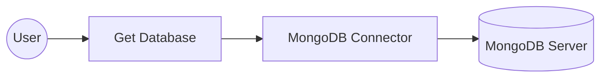

# Example

## What you'll build

Build a WSO2 Integrator automation that connects to a MongoDB server and retrieves a database handle using the `getDatabase` operation on `mongodbClient`. The integration uses configurable variables to keep credentials out of source code, and runs on a scheduled Automation entry point.

**Operations used:**
- **Get Database** retrieves a `mongodb:Database` handle from the connected MongoDB server

## Architecture

## Prerequisites

- A running MongoDB server reachable from your host
- MongoDB credentials (username, password, and authentication database name)

## Setting up the MongoDB integration

> **New to WSO2 Integrator?** Follow the [Create a New Integration](../../../../develop/create-integrations/create-a-new-integration.md) guide to set up your integration first, then return here to add the connector.

## Adding the MongoDB connector

### Step 1: Open the connector palette and search for MongoDB

1. On the main canvas, click **+ Add Connection** to open the connector palette.
2. Type **MongoDB** in the search box.
3. Select the **MongoDB** card (`ballerinax/mongodb`).

## Configuring the MongoDB connection

### Step 2: Fill in the connection parameters

In the **Configure MongoDB** panel, bind each field to a configurable variable using Expression mode in the **Connection** textbox. For each parameter listed below:

1. Open the helper panel beside the field and go to the **Configurables** tab.
2. Select an existing configurable or click **+ New Configurable**.
3. Supply a camelCase name and the appropriate type, then click **Save**. The configurable is injected into the field.

- **serverAddress.host**: MongoDB server hostname or IP address, bound to a `string` configurable named `mongoHost`
- **serverAddress.port**: MongoDB server port number, bound to an `int` configurable named `mongoPort`
- **auth.username**: Database username, bound to a `string` configurable named `mongoUsername`
- **auth.password**: Database password, bound to a `string` configurable named `mongoPassword`
- **auth.database**: Authentication database name (typically `admin`), bound to a `string` configurable named `mongoDatabase`

After creating all five configurables, set **Connection Name** to `mongodbClient`.

> **Alternative connection URI**: If you already have a complete MongoDB connection URI (`mongodb://...` or `mongodb+srv://...`), you can paste it directly into the **Connection** field as a single string instead of binding the individual sub-fields. See the [setup guide](setup-guide.md) for how to obtain that URI.

> **Authentication mechanism**: The walkthrough above uses **password-based authentication**. The three password records share the `username/password/database` field shape but each has a distinct, read-only `authMechanism`.

Pick `BasicAuthCredential` for `PLAIN`, `ScramSha1AuthCredential` for SCRAM-SHA-1, or `ScramSha256AuthCredential` for SCRAM-SHA-256 (the default mechanism on modern MongoDB servers). The connector dispatches on the `authMechanism` constant, so the record type you choose is what determines the wire-level mechanism.

For X.509 client-certificate or GSSAPI/Kerberos authentication, use `X509Credential` or `GssApiCredential` instead. See [Authentication credentials](actions.md#authentication-credentials) for the field shapes.

### Step 3: Save the connection

Click **Save Connection** to persist the connection. The `mongodbClient` node appears in the **Connections** section of the left sidebar and on the canvas.

### Step 4: Set actual values for your configurables

1. In the left panel, click **Configurations**.
2. Set a value for each configurable listed below.

- **mongoHost**: hostname or IP of your MongoDB server (`string`)
- **mongoPort**: port your MongoDB server listens on (`int`)
- **mongoUsername**: username for MongoDB authentication (`string`)
- **mongoPassword**: password for MongoDB authentication (`string`)
- **mongoDatabase**: name of the authentication database (`string`)

## Configuring the MongoDB get database operation

### Step 5: Add an automation entry point

1. On the main canvas, click **+ Add Artifact**.
2. Choose **Automation** under the Automation heading.
3. Leave all defaults and click **Create**.

The automation flow canvas opens, showing a **Start** node and an **Error Handler** node with an empty step slot between them.

### Step 6: Select and configure the get database operation

1. Click the **+** button between the Start and Error Handler nodes in the flow.
2. Under **Connections**, expand **mongodbClient** to reveal available operations.

3. Click **Get Database** to open its configuration form, then fill in the following parameters:

- **Database Name** — name of the MongoDB database to retrieve (for example, `"hrdb"`)
- **Result** — variable name for the returned `mongodb:Database` handle (for example, `mongodbDatabase`)

4. Click **Save**. The node is added to the flow.

## Try it yourself

Try this sample in WSO2 Integration Platform.

[View source on GitHub](https://github.com/wso2/integration-samples/tree/main/integrator-default-profile/connectors/mongodb_connector_sample)

## More code examples

The MongoDB connector provides practical examples illustrating usage in various scenarios. Explore these [examples](https://github.com/ballerina-platform/module-ballerinax-mongodb/tree/master/examples/) covering common MongoDB operations.

1. [Movie database](https://github.com/ballerina-platform/module-ballerinax-mongodb/tree/master/examples/movie-database) - Implement a movie database using MongoDB.
2. [Order management system](https://github.com/ballerina-platform/module-ballerinax-mongodb/tree/master/examples/order-management-system) - Implement an order management system using MongoDB.
