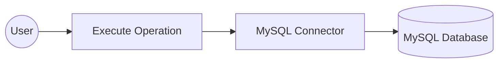

# Example

## What you'll build

Build a WSO2 Integrator automation that connects to a MySQL database using configurable connection parameters and executes an INSERT SQL statement. The integration uses the MySQL connector to insert a record into a database table safely, without hardcoding credentials in source code.

**Operations used:**
- **Execute** — runs a parameterized SQL INSERT statement against the connected MySQL database and returns an execution result

## Architecture

## Prerequisites

- A running MySQL database instance with a table to insert records into
- MySQL database credentials (host, user, password, database name, and port)

## Setting up the MySQL integration

> **New to WSO2 Integrator?** Follow the [Create a New Integration](../../../../develop/create-integrations/create-a-new-integration.md) guide to set up your integration first, then return here to add the connector.

## Adding the MySQL connector

### Step 1: Open the add connection palette

Click the **+ Add Connection** button on the WSO2 Integrator canvas to open the connector palette. The palette displays a search field at the top and a list of pre-built connectors including MySQL, MongoDB, PostgreSQL, and others.

## Configuring the MySQL connection

### Step 2: Fill in the MySQL connection parameters

After selecting **MySQL** from the palette, the **Configure MySQL** form opens. Expand **Advanced Configurations** to reveal all connection fields. For each field, bind the value to a **Configurable variable** rather than hardcoding a literal — this keeps secrets out of your source code and makes the integration portable across environments.

Configure the following parameters:

- **host**: MySQL server hostname, bound to a string configurable
- **user**: Database username, bound to a string configurable
- **password**: Database user password, bound to a string configurable
- **database**: Database name to connect to, bound to a string configurable
- **port**: MySQL server port, bound to an int configurable

Set the **Connection Name** to `mysqlClient`.

### Step 3: Save the MySQL connection

Click **Save Connection** to save the connector. The canvas returns to the integration overview and `mysqlClient` is now visible under **Connections** in the left-hand project tree.

### Step 4: Set actual values for your configurables

1. In the left panel, click **Configurations** (at the bottom of the project tree, under Data Mappers).
2. Set a value for each configurable listed below:

- **mysqlHost**: string : hostname or IP address of your MySQL server
- **mysqlUser**: string : database username
- **mysqlPassword**: string : database user password
- **mysqlDatabase**: string : name of the database to connect to
- **mysqlPort**: int : port number your MySQL server listens on

## Configuring the MySQL execute operation

### Step 5: Add an automation entry point

Click **+ Add Artifact** on the canvas and select **Automation**. In the Automation creation form, click **Create** to create a new automation with the default settings. The automation flow canvas opens, showing a **Start** node and an **Error Handler** node with an empty step slot between them.

### Step 6: Expand the MySQL connection node and select the execute operation

Click the empty step placeholder in the flow to open the step addition panel. In the right-hand panel, locate the **Connections** section, click **mysqlClient** to expand its available operations, and then click **Execute** to select it.

### Step 7: Configure the execute operation parameters and save

Fill in the operation fields, then click **Save** to add the step to the automation flow.

- **sqlQuery** — parameterized SQL INSERT statement to execute against the database (for example, `INSERT INTO users (name, email) VALUES ("John Doe", "john@example.com")`)
- **result** — variable that holds the returned `sql:ExecutionResult`; pre-filled as `sqlExecutionresult`

## Try it yourself

Try this sample in WSO2 Integration Platform.

[View source on GitHub](https://github.com/wso2/integration-samples/tree/main/connectors/mysql_connector_sample)
