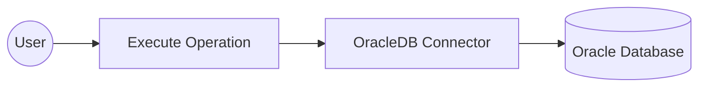

# Example

## What you'll build

Build an Oracle Database integration using the OracleDB connector in WSO2 Integrator's low-code canvas. The integration establishes an Oracle DB connection with configurable variables and executes a SQL INSERT statement to add a record to a database table.

**Operations used:**
- **execute** — Runs a SQL INSERT statement against the Oracle Database and returns an execution result.

## Architecture

## Prerequisites

- An Oracle Database instance accessible from the integration runtime.

## Setting up the OracleDB integration

> **New to WSO2 Integrator?** Follow the [Create a New Integration](../../../../develop/create-integrations/create-a-new-integration.md) guide to set up your integration first, then return here to add the connector.

## Adding the OracleDB connector

### Step 1: Open the add connection palette

On the canvas, click **+ Add Connection** (or the **+** button in the Connections panel) to open the Add Connection palette, which shows available connectors.

### Step 2: Search for and select the OracleDB connector

1. In the search box, type `oracledb` and press **Enter**.
2. Select **ballerinax/oracledb** from the results.

## Configuring the OracleDB connection

### Step 3: Bind connection parameters to configurable variables

In the **Configure OracleDB** dialog, scroll down to the **Advanced Configurations** section and expand it. Bind each of the following fields to a Configurable variable so values can be supplied at runtime:

- **host** : The Oracle Database server hostname, bound to a string configurable
- **port** : The Oracle Database port number, bound to an int configurable
- **user** : The database username, bound to a string configurable
- **password** : The database password, bound to a string configurable
- **database** : The target database/service name, bound to a string configurable

### Step 4: Save the connection

1. Scroll to the top of the dialog and verify the **Connection Name** is set to `oracledbClient`.
2. Click **Save** — the dialog closes and the `oracledbClient` connection node appears on the canvas.

### Step 5: Set actual values for your configurables

1. In the left panel, click **Configurations** (at the bottom of the project tree, under Data Mappers).
2. Set a value for each configurable listed below:

- **oracleHost** : string : hostname or IP address of your Oracle Database server
- **oraclePort** : int : port on which Oracle Database listens (commonly 1521)
- **oracleDatabase** : string : Oracle service name or SID (for example, `ORCL`)
- **oracleUser** : string : database username
- **oraclePassword** : string : database password

## Configuring the OracleDB execute operation

### Step 6: Add an automation entry point and expand the connection node

1. On the canvas, click **+ Add Entry Point** (or the **+** button in the Entry Points panel).
2. Select **Automation** from the entry point types — an Automation flow is added with **Start** and **End** nodes.
3. Click the **+** button between **Start** and **End** to open the step panel.
4. Expand **oracledbClient** in the connections list to see all available operations.

### Step 7: Select and configure the execute operation

Under **oracledbClient**, click **execute** to open the Execute operation form, then fill in the fields:

- **SQL Query** : The SQL statement to run against the database (for example, an INSERT into the Employees table)
- **Result Variable Name** : The variable that stores the execution result (for example, `sqlExecutionresult`)
- **Result Type** : The type of the result variable (for example, `sql:ExecutionResult`)

Click **Save**.

## Try it yourself

Try this sample in WSO2 Integration Platform.

[View source on GitHub](https://github.com/wso2/integration-samples/tree/main/connectors/oracledb_connector_sample)
