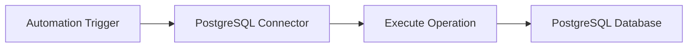

# Example

## What you'll build

Build a PostgreSQL database integration using the WSO2 Integrator low-code canvas. The integration connects to a running PostgreSQL instance and executes a SQL INSERT operation to add records into a database table.

**Operations used:**
- **Execute** — runs a SQL INSERT statement and returns an execution result containing affected row count and last insert ID

## Architecture

## Prerequisites

- A running PostgreSQL instance with host, database name, username, and password available

## Setting up the PostgreSQL integration

> **New to WSO2 Integrator?** Follow the [Create a New Integration](../../../../develop/create-integrations/create-new-integration.md) guide to set up your integration first, then return here to add the connector.

## Adding the PostgreSQL connector

### Step 1: Open the add connection palette

From the low-code canvas or the sidebar, click **Add Connection** to open the connector palette.

### Step 2: Search for and select the PostgreSQL connector

Search for "postgresql" and select the `ballerinax/postgresql` connector card to open the connection form.

## Configuring the PostgreSQL connection

### Step 3: Bind connection parameters to configurable variables

Bind each field in the connection form to a Configurable variable so that deployment environments can supply values without changing code:

- **host**: hostname of the PostgreSQL server
- **port**: port number the PostgreSQL server listens on
- **database**: name of the PostgreSQL database to connect to
- **username**: PostgreSQL username for authentication
- **password**: PostgreSQL password for authentication

### Step 4: Save the connection

Click **Save** to persist the connection. The connection card `postgresqlClient` appears on the canvas and in the sidebar under **Connections**.

### Step 5: Set actual values for your configurables

1. In the left panel, click **Configurations** (at the bottom of the project tree, under Data Mappers).
2. Set a value for each configurable listed below:

- **postgresHost**: string : hostname of your PostgreSQL server
- **postgresPort**: int : port your PostgreSQL server listens on
- **postgresDatabase**: string : name of the target database
- **postgresUser**: string : PostgreSQL username
- **postgresPassword**: string : PostgreSQL password

## Configuring the PostgreSQL execute operation

### Step 6: Add an automation entry point

1. In the sidebar, click **+** next to **Entry Points**.
2. Select **Automation**.
3. Accept the default name `main`.
4. Click **Create**.

### Step 7: Open the operations panel

On the Automation canvas, click the **+** drop zone between **Start** and **Error Handler** to open the node selection panel.

### Step 8: Select and configure the Execute operation

Select **Execute** to open the configuration form, then fill in the operation fields:

- **SQL Query**: the parameterized SQL statement to execute (for example, an INSERT into your target table)
- **Result**: variable name to store the execution result (for example, `sqlExecutionresult`)
- **Result Type**: set to `sql:ExecutionResult`

Click **Save**. The execute node is placed on the canvas.

## Try it yourself

