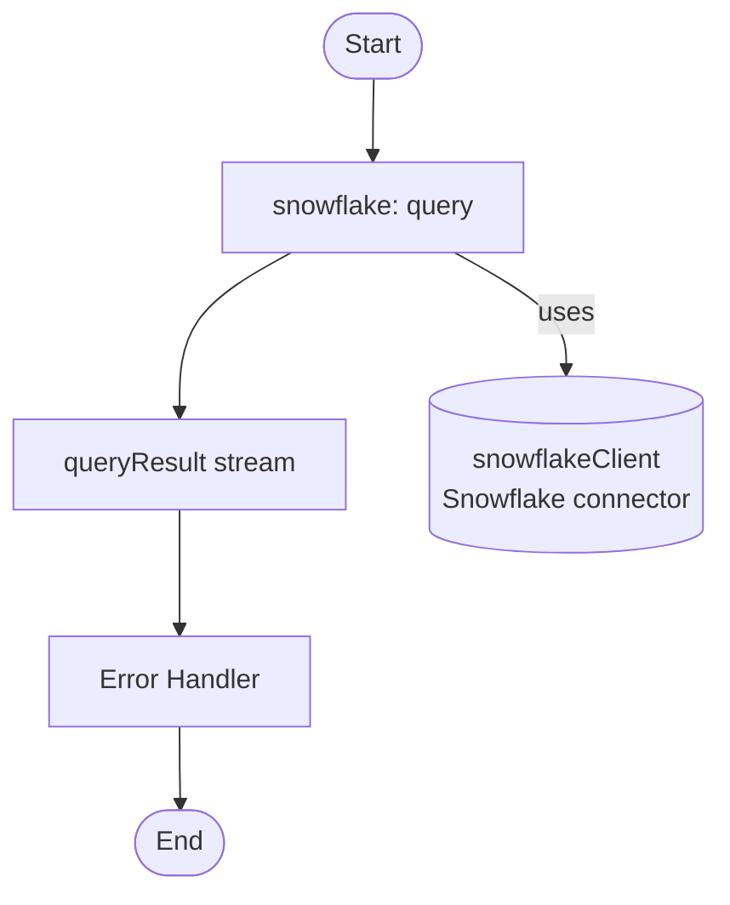

# Example

## What you'll build

This integration connects to a live Snowflake instance using the Snowflake connector on the WSO2 Integrator low-code canvas. It sets up an Automation entry point that executes a SQL query operation and captures the result stream, with connection credentials stored safely as Configurable variables.

**Operations used:**
- **Query** — executes a parameterized SQL query against a Snowflake database and returns results as a typed stream

## Architecture

## Prerequisites

- A Snowflake account with a running warehouse, database, and schema
- Network access from your WSO2 Integrator host to `<account>.snowflakecomputing.com`

## Setting up the Snowflake integration

Set up a new WSO2 Integrator project by following the [project creation guide](../../../../develop/create-integrations/create-a-new-integration.md) before proceeding with the steps below.

## Adding the Snowflake connector

### Step 1: Open the add connection palette

On the low-code canvas, click **+ Add Connection** (or the **＋** icon in the Connections section of the left sidebar) to open the Add Connection palette, which shows a searchable grid of available connectors.

### Step 2: Search for and select the Snowflake connector

In the palette search box, type **snowflake** to filter the results. Click the **Snowflake** connector card to open the connector variant picker, choose the **Standard** variant, and click **Select** to proceed to the connection configuration form.

## Configuring the Snowflake connection

### Step 3: Bind connection parameters to configurable variables

Fill in the connection form by binding each required field to a Configurable variable so that credentials are injected at runtime rather than hard-coded. For each field, click the **Expression** toggle to switch it to expression mode, then use the Configurables tab to create and assign a new variable.

- **accountIdentifier** — the Snowflake account identifier (for example, `orgname-accountname`)
- **user** — the Snowflake username
- **password** — the Snowflake account password

### Step 4: Save the connection

Click **Save** at the bottom of the connection form. The canvas refreshes and the new connection node—**snowflakeClient**—appears in the Connections section of the left sidebar and as a node on the canvas.

### Step 5: Set actual values for your configurables

Click **Configurations** in the left panel of WSO2 Integrator (at the bottom of the project tree, under Data Mappers) to open the Configurations panel and supply runtime values for each variable created above.

- **accountIdentifier** — string — your Snowflake account identifier (for example, `myorg-myaccount`)
- **user** — string — your Snowflake username
- **password** — string — your Snowflake account password

## Configuring the Snowflake query operation

### Step 6: Add an automation entry point and open the flow editor

In the left sidebar, locate the **Entry Points** section, click **＋ Add Entry Point**, and select **Automation**. A new Automation node named `main` appears on the canvas. Click the node to open its flow editor, then click the **＋** button between the Start and End nodes to add a new step.

### Step 7: Expand the Snowflake connector operations

In the Add Step panel, locate **snowflakeClient** under the Connections section and click it to expand the node and reveal all available operations, including Query, Query Row, Execute, Batch Execute, Call, and Close.

### Step 8: Select and configure the query operation

Click **Query** to open the Query operation configuration form and fill in the fields as follows, then click **Save** to confirm.

- **SQL Query** — the parameterized SQL statement to execute (for example, `SELECT * FROM SNOWFLAKE_SAMPLE_DATA.TPCH_SF1.CUSTOMER LIMIT 10`)
- **Result Variable** — the name for the result stream variable (for example, `queryResult`)
- **Row Type** — the record type used for flexible column mapping (for example, `record {| anydata...; |}`)

## More code examples

The following example shows how to use the Snowflake connector to create a table, insert data, and query data from the Snowflake database.

[Employees Data Management Example](https://github.com/ballerina-platform/module-ballerinax-snowflake/tree/master/examples/employees-db) - Manages employee data in a Snowflake database and exposes an HTTP service to interact with the database.
