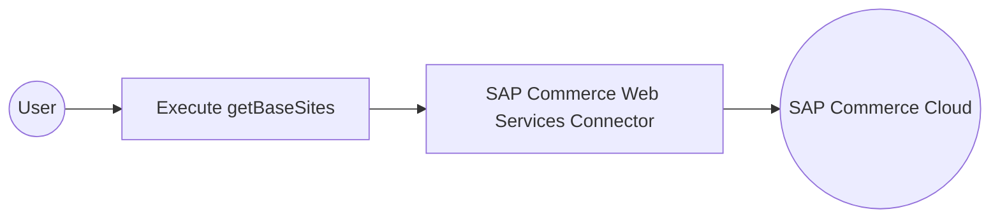

# Example

## What you'll build

This integration uses the `ballerinax/sap.commerce.webservices` connector to connect to the SAP Commerce Cloud OCC REST API and retrieve commerce data on a scheduled basis. The workflow demonstrates how to authenticate with SAP Commerce Cloud using OAuth2 credentials and call the `getBaseSites` operation to fetch base site information. The integration runs as an Automation trigger that periodically queries SAP Commerce Cloud and stores the response in a result variable, providing a foundation for commerce data synchronization workflows.

**Operations used:**
- **getBaseSites** : retrieves all base sites configured in the SAP Commerce Cloud instance, returning site identifiers, URLs, and locale settings

## Architecture

## Prerequisites

- A running SAP Commerce Cloud instance with the OCC REST API enabled and accessible over HTTPS.
- An OAuth2 client application registered in SAP Commerce Cloud with the required scopes to access base site and catalog resources.
- The OAuth2 Client ID, Client Secret, and Token URL for your SAP Commerce Cloud OAuth2 client.
- The base URL of your SAP Commerce Cloud OCC REST API.

## Setting up the SAP commerce web services integration

> **New to WSO2 Integrator?** Follow the [Create a New Integration](../../../../develop/create-integrations/create-a-new-integration.md) guide to set up your integration first, then return here to add the connector.

## Adding the SAP commerce web services connector

### Step 1: Open the add connection palette

Select **Add Connection** (or the **+** icon in the **Connections** section of the sidebar) to open the connector palette, which displays a search field and a list of available connectors.

### Step 2: Search for and select the SAP commerce web services connector

1. In the palette search box, enter `sap.commerce.webservices` to filter the connector list.
2. Locate the `ballerinax/sap.commerce.webservices` connector card in the results.
3. Select the connector card to open the inline connection configuration form.

## Configuring the SAP commerce web services connection

### Step 3: Bind SAP commerce web services connection parameters to configurables

For each connection field, open the configurables panel, navigate to the **Configurables** tab, select **+ New Configurable**, enter the variable name and type, and select **Save** to automatically inject the configurable reference into the field.

- **Config** : the OAuth2 connection configuration record containing authentication credentials for SAP Commerce Cloud, including the token URL, client ID, and client secret
- **Service Url** : the base URL of the SAP Commerce Cloud OCC REST API endpoint
- **Connection Name** : the identifier used to reference this connection throughout the integration

### Step 4: Save the SAP commerce web services connection

Select **Save Connection** to persist the connection configuration. The SAP Commerce Web Services connector node now appears in the **Connections** panel on the low-code canvas.

### Step 5: Set actual values for your configurables

In the left panel of WSO2 Integrator, select **Configurations** (listed at the bottom of the project tree, under Data Mappers) to open the Configurations panel. Set a value for each configurable listed below.

- **sapCommerceServiceUrl** (string) : the full base URL of your SAP Commerce OCC REST API
- **sapCommerceTokenUrl** (string) : the OAuth2 token endpoint for your SAP Commerce Cloud instance
- **sapCommerceClientId** (string) : your OAuth2 client ID registered in SAP Commerce Cloud
- **sapCommerceClientSecret** (string) : your OAuth2 client secret — keep this value secure

## Configuring the SAP commerce web services getBaseSites operation

### Step 6: Add an automation entry point

1. On the low-code canvas, select **+ Add Entry Point** in the **Entry Points** section, then select **Automation** to add a scheduled automation trigger.
2. Select **Create** to confirm.
3. The automation block appears on the canvas with **Start** and **Error Handler** nodes in its body.

### Step 7: Select and configure the getBaseSites operation

1. Inside the automation body, select the **+** (Add Step) button between the **Start** and **End** nodes to open the right-side step panel.
2. Under **Connections** in the step panel, select the SAP Commerce Web Services connection node to expand it and reveal all available operations.

3. Select **Get Base Sites** (`getBaseSites`) from the list of operations and review the operation fields:

- **Result** : the name of the variable that will store the operation response
- **Result Type** : the type of the result variable

4. Select **Save** to add the SAP Commerce Web Services remote function call to the automation flow.

## Try it yourself

Try this sample in WSO2 Integration Platform.

[View source on GitHub](https://github.com/wso2/integration-samples/tree/main/connectors/sap.commerce.webservices_connector_sample)

## More code examples

The `sap.commerce.webservices` connector provides practical examples illustrating usage in various scenarios. Explore these [examples](https://github.com/ballerina-platform/module-ballerinax-sap.commerce.webservices/tree/main/examples), covering the following use cases:

1. [Procurement cost center setup](https://github.com/ballerina-platform/module-ballerinax-sap.commerce.webservices/tree/main/examples/procurement-cost-center-setup) - Demonstrates how to configure and manage procurement cost centers using the SAP Commerce Web Services connector.
2. [Catalog inventory management](https://github.com/ballerina-platform/module-ballerinax-sap.commerce.webservices/tree/main/examples/catalog-inventory-management) - Illustrates managing product catalogs and inventory levels through SAP Commerce Web Services.
3. [Support ticket management](https://github.com/ballerina-platform/module-ballerinax-sap.commerce.webservices/tree/main/examples/support-ticket-management) - Shows how to create, update, and track customer support tickets using the connector.
4. [Customer service workflow](https://github.com/ballerina-platform/module-ballerinax-sap.commerce.webservices/tree/main/examples/customer-service-workflow) - Demonstrates automating customer service processes and workflows through SAP Commerce Web Services.
