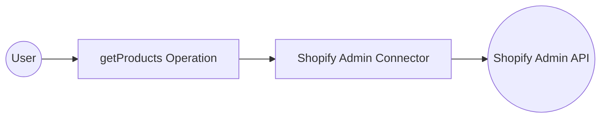
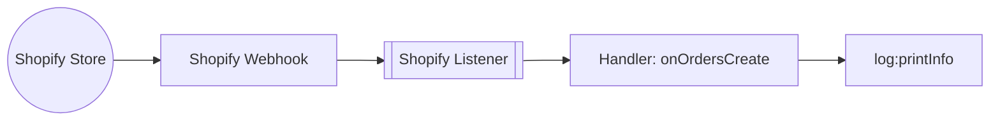

# Example

## Table of Contents

- [Shopify Connector Example](#shopify-connector-example)
- [Shopify Trigger Example](#shopify-trigger-example)

## Shopify Connector Example

### What you'll build

Create a WSO2 Integrator automation that connects to the Shopify Admin API using the **ballerinax/shopify.admin** connector. The integration is triggered on a scheduled interval and calls the `getProducts` operation to retrieve a list of products from your Shopify store's Admin API. The complete flow, Automation trigger → Shopify Admin connector call → End, is assembled entirely in the WSO2 Integrator low-code canvas.

**Operations used:**
- **getProducts** : Retrieves a list of products from the Shopify store's Admin API

### Architecture

### Prerequisites

- A Shopify store with Admin API access enabled (a Shopify Partner account or development store is sufficient).
- A Shopify Admin API access token with the necessary permissions for the operation being called (e.g., `read_products`).
- The Shopify store's base URL in the format `https://{your-store}.myshopify.com/admin/api/{api-version}`.

### Setting up the Shopify admin integration

> **New to WSO2 Integrator?** Follow the [Create a New Integration](../../../../develop/create-integrations/create-a-new-integration.md) guide to set up your integration first, then return here to add the connector.

### Adding the Shopify admin connector

### Step 1: Open the add connection palette

Select the **+ Add Connection** button in the **Connections** section of the low-code canvas sidebar to open the connector search palette.

### Step 2: Search for and select the shopify.admin connector

1. In the search box, enter **shopify** to filter the connector list.
2. Locate the **Admin** connector card (labelled `ballerinax / shopify.admin`) in the search results.
3. Select the connector card to open the connection configuration form.

### Configuring the Shopify admin connection

### Step 3: Bind Shopify admin connection parameters to configurables

For each connection field, use the **Configurables** tab to create a new configurable variable and auto-inject the reference into the field.

- **Api Key Config** : API keys for authorization. Contains the `xShopifyAccessToken` field, which represents the Shopify Admin API access token (`X-Shopify-Access-Token` header).
- **Service Url** : The base URL of the Shopify Admin API endpoint for your store.

### Step 4: Save the shopify.admin connection

Select **Save Connection** to persist the connection configuration. The shopify.admin connector now appears as a named connection entry (`adminClient`) in the **Connections** panel on the low-code canvas.

### Step 5: Set actual values for your configurables

1. In the left panel of WSO2 Integrator, select **Configurations** (listed at the bottom of the project tree, under **Data Mappers**).
2. Set a value for each configurable listed below.

- **shopifyAccessToken** (string) : Your Shopify Admin API access token (found in your Shopify Partner dashboard or app settings)
- **shopifyServiceUrl** (string) : The full base URL of your Shopify Admin API, e.g., `https://your-store.myshopify.com/admin/api/2024-01`

### Configuring the Shopify admin getProducts operation

### Step 6: Add an automation entry point

1. In the left sidebar, hover over **Entry Points** and select **Add Entry Point**.
2. Select **Automation** in the artifact selection panel.
3. Select **Create** to confirm and create the automation entry point.

### Step 7: Select the getProducts operation and configure its parameters

1. Select the **+** (Add Step) button in the automation flow between the **Start** and **Error Handler** nodes to open the step-addition panel.
2. Under **Connections** in the node panel, select the **adminClient** connection node to expand it and reveal all available Shopify Admin API operations.

3. Select **Get Products** from the list of operations, then verify the operation fields:
   - **Result** : The variable name that will hold the Shopify API response (auto-filled as `adminProductlist`)
   - **Result Type** : The type of the result variable (`admin:ProductList`)
4. Select **Save** to add the Shopify Admin operation step to the automation flow.

### Try it yourself

Try this sample in WSO2 Integration Platform.

[View source on GitHub](https://github.com/wso2/integration-samples/tree/main/integrator-default-profile/connectors/shopify.admin_connector_sample)

---
## Shopify Trigger Example

### What you'll build

This integration listens for incoming Shopify webhook events by configuring a Shopify webhook listener with a shared secret. When a matching Shopify Orders event is received, the registered handler, `onOrdersCreate`, is invoked with the event payload of type `shopify:OrderEvent`, and the payload is logged as a JSON string using `log:printInfo`. The overall flow is: Shopify Store → Shopify Listener → Handler → `log:printInfo`.

### Architecture

### Prerequisites

- A Shopify store or Partner account with webhook configuration permissions.
- A Shopify webhook shared secret (generated in the Shopify admin or Partner Dashboard under **Notifications → Webhooks**).
- A publicly accessible Shopify webhook endpoint URL (use a tunneling tool such as ngrok if your environment is not publicly reachable).

### Setting up the Shopify integration

> **New to WSO2 Integrator?** Follow the [Create a New Integration](../../../../develop/create-integrations/create-a-new-integration.md) guide to set up your integration first, then return here to add the trigger.

### Adding the Shopify trigger

### Step 1: Open the artifacts palette and select the Shopify trigger

1. Select **+ Add Artifact** on the integration canvas to open the artifacts palette.
2. In the **Event Integration** category, locate and select the **Shopify** card.

### Configuring the Shopify listener

### Step 2: Bind Shopify listener parameters to configuration variables

For each required listener parameter, open the helper panel next to the field, select the **Configurables** tab, select **+ New Configurable**, enter a camelCase variable name and the appropriate type (`configurable string` for text or credential fields, `configurable int` for numeric fields), and select **Save**. The configuration is automatically injected into the field. Repeat for every required field:

- **API Secret Key** : The webhook API secret key used to verify that incoming requests originate from Shopify.
- **Port** : The port on which the Shopify webhook listener accepts incoming HTTP requests.

### Step 3: Set actual values for your configurations

Select **Configurations** in the left panel of WSO2 Integrator (at the bottom of the project tree, under Data Mappers) to open the Configurations panel, then set a value for each configuration listed below:

- **shopifyApiSecretKey** (string) : Your Shopify webhook API secret key, copied from the Shopify admin or Partner Dashboard.
- **shopifyListenerPort** (int) : The port number on which the listener should run.

### Step 4: Select Create to register the listener and open the Service view

Select **Create** to submit the Shopify trigger listener configuration. Select the **Event Channel** type, for example, **Orders**, and provide a service name. The listener is created automatically and the Service view opens, showing the Shopify listener chip and the Event Handlers section with all available Orders event handlers pre-registered (`onOrdersCreate`, `onOrdersCancelled`, `onOrdersFulfilled`, `onOrdersPaid`, `onOrdersPartiallyFulfilled`, `onOrdersUpdated`).

### Handling Shopify events

### Step 5: Open the add handler side panel

1. In the Service view, review the **Event Handlers** section: for the **Orders** event channel, all six Orders handlers are pre-registered automatically when the service is created.
2. Select any handler row (for example, **onOrdersCreate**) to open its flow canvas.

### Step 6: Select the onOrdersCreate handler and review the payload type

1. In the project tree, select **onOrdersCreate** under `shopify:OrdersService` to open the handler's flow canvas.
2. The handler function signature is `remote function onOrdersCreate(shopify:OrderEvent event) returns error?`; the event payload is already strongly typed as `shopify:OrderEvent`, so no custom type schema definition is required.
3. The flow canvas opens showing **Start** → *(empty)* → **Error Handler**, ready for logic to be added.

### Step 7: Add a log statement to the handler flow

1. In the flow canvas for `onOrdersCreate`, select **+** between **Start** and **Error Handler** to open the node panel.
2. Expand the **Logging** category and select **Log Info**. The `log:printInfo` configuration form appears on the right.
3. In the **Msg*** field, switch to **Expression** mode and enter `event.toJsonString()`.
4. Select **Save**. The `log:printInfo` node now appears in the flow canvas between **Start** and **Error Handler**, displaying `event.toJsonString()` as its message.

### Step 8: Confirm the handler is registered in the Service view

Select the back arrow in the canvas header (or re-select `shopify:OrdersService` in the project tree) to return to the Service view. The Event Handlers list confirms all Orders handlers, including `onOrdersCreate`, are registered and ready.

### Running the integration

### Step 9: Run the integration and trigger a test Shopify event

1. In the WSO2 Integrator panel, select **Run** to start the integration. The Shopify listener begins accepting webhook requests on the configured port.
2. Trigger a test Shopify order-created event using one of the following methods:
   - A WSO2 Integrator **HTTP Client** integration, assembled from the same low-code canvas (recommended), that sends a POST request to the listener endpoint with a valid `X-Shopify-Hmac-SHA256` header and a JSON body matching the `shopify:OrderEvent` structure.
   - The **Shopify Partner Dashboard** or Shopify Admin → **Settings → Notifications → Webhooks → Send test notification** to fire a real webhook to a publicly accessible endpoint.
3. Observe the log output in the integration console: the Shopify order event payload JSON appears printed by `log:printInfo` (for example: `{"id":1,"email":"customer@example.com","total_price":"99.00"}`).

### Try it yourself

Try this sample in WSO2 Integration Platform.

[View source on GitHub](https://github.com/wso2/integration-samples/tree/main/integrator-default-profile/connectors/shopify_trigger_sample)
