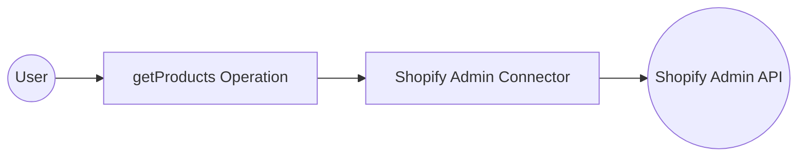

# Example

## What you'll build

Create a WSO2 Integrator automation that connects to the Shopify Admin API using the **ballerinax/shopify.admin** connector. The integration is triggered on a scheduled interval and calls the `getProducts` operation to retrieve a list of products from your Shopify store's Admin API. The complete flow—Automation trigger → Shopify Admin connector call → End—is assembled entirely in the WSO2 Integrator low-code canvas.

**Operations used:**
- **getProducts** : Retrieves a list of products from the Shopify store's Admin API

## Architecture

## Prerequisites

- A Shopify store with Admin API access enabled (a Shopify Partner account or development store is sufficient).
- A Shopify Admin API access token with the necessary permissions for the operation being called (e.g., `read_products`).
- The Shopify store's base URL in the format `https://{your-store}.myshopify.com/admin/api/{api-version}`.

## Setting up the Shopify Admin integration

> **New to WSO2 Integrator?** Follow the [Create a New Integration](../../../../develop/create-integrations/create-new-integration.md) guide to set up your integration first, then return here to add the connector.

## Adding the Shopify Admin connector

### Step 1: Open the Add Connection palette

Select the **+ Add Connection** button in the **Connections** section of the low-code canvas sidebar to open the connector search palette.

### Step 2: Search for and select the shopify.admin connector

1. In the search box, enter **shopify** to filter the connector list.
2. Locate the **Admin** connector card (labelled `ballerinax / shopify.admin`) in the search results.
3. Select the connector card to open the connection configuration form.

## Configuring the Shopify Admin connection

### Step 3: Bind Shopify Admin connection parameters to configurables

For each connection field, use the **Configurables** tab to create a new configurable variable and auto-inject the reference into the field.

- **Api Key Config** : API keys for authorization. Contains the `xShopifyAccessToken` field, which represents the Shopify Admin API access token (`X-Shopify-Access-Token` header).
- **Service Url** : The base URL of the Shopify Admin API endpoint for your store.

### Step 4: Save the shopify.admin connection

Select **Save Connection** to persist the connection configuration. The shopify.admin connector now appears as a named connection entry (`adminClient`) in the **Connections** panel on the low-code canvas.

### Step 5: Set actual values for your configurables

1. In the left panel of WSO2 Integrator, select **Configurations** (listed at the bottom of the project tree, under **Data Mappers**).
2. Set a value for each configurable listed below.

- **shopifyAccessToken** (string) : Your Shopify Admin API access token (found in your Shopify Partner dashboard or app settings)
- **shopifyServiceUrl** (string) : The full base URL of your Shopify Admin API, e.g., `https://your-store.myshopify.com/admin/api/2024-01`

## Configuring the Shopify Admin getProducts operation

### Step 6: Add an automation entry point

1. In the left sidebar, hover over **Entry Points** and select **Add Entry Point**.
2. Select **Automation** in the artifact selection panel.
3. Select **Create** to confirm and create the automation entry point.

### Step 7: Select the getProducts operation and configure its parameters

1. Select the **+** (Add Step) button in the automation flow between the **Start** and **Error Handler** nodes to open the step-addition panel.
2. Under **Connections** in the node panel, select the **adminClient** connection node to expand it and reveal all available Shopify Admin API operations.

3. Select **Get Products** from the list of operations, then verify the operation fields:
   - **Result** : The variable name that will hold the Shopify API response (auto-filled as `adminProductlist`)
   - **Result Type** : The type of the result variable (`admin:ProductList`)
4. Select **Save** to add the Shopify Admin operation step to the automation flow.

## Try it yourself

Try this sample in WSO2 Integration Platform.

[View source on GitHub](https://github.com/wso2/integration-samples/tree/main/connectors/shopify.admin_connector_sample)
