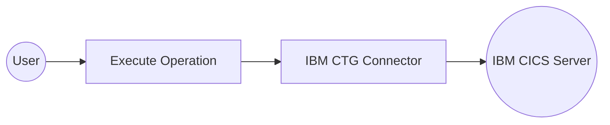

# Example

## What you'll build

Build a WSO2 Integrator automation that connects to an IBM CICS Transaction Gateway (CTG) server and executes a CICS transaction program. The integration uses the IBM CTG connector to invoke a named CICS program and capture the result as a byte array for further processing.

**Operations used:**
- **Execute** : Sends a request to the IBM CTG server to invoke a specified CICS program and returns the result as a byte array

## Architecture

## Prerequisites

- Access to an IBM CICS Transaction Gateway server
- The following connection details:
  - **Host** : CTG server hostname or IP
  - **CICS Server** : Name of the target CICS server
  - **User ID** : Authentication user ID
  - **Password** : Authentication password

## Setting up the IBM CTG integration

> **New to WSO2 Integrator?** Follow the [Create a New Integration](../../../../develop/create-integrations/create-new-integration.md) guide to set up your integration first, then return here to add the connector.

## Adding the IBM CTG connector

### Step 1: Open the Add Connection panel

Select the **+** button next to **Connections** in the project tree to open the **Add Connection** palette, which displays available pre-built connectors.

## Configuring the IBM CTG connection

### Step 2: Fill in the connection parameters

Search for **ibm.ctg** in the search field, select the **IBM CTG** connector card, and bind each connection parameter to a configurable variable.

- **connectionName** : Unique identifier for this connection
- **host** : CTG server hostname
- **port** : CTG server port number
- **cicsServer** : Target CICS server name
- **auth** : Authentication credentials record containing user ID and password

### Step 3: Save the connection

Select **Save Connection** to create the connection. The `ctgClient` entry appears in the **Connections** panel on the canvas.

### Step 4: Set actual values for your configurables

In the left panel, select **Configurations** and set a value for each configurable listed below.

- **ibmCtgHost** (string) : IBM CTG server hostname or IP address
- **ibmCtgPort** (int) : IBM CTG server port number
- **ibmCtgCicsServer** (string) : Name of the target CICS server
- **ibmCtgUserId** (string) : User ID for CTG authentication
- **ibmCtgPassword** (string) : Password for CTG authentication

## Configuring the IBM CTG Execute operation

### Step 5: Add an Automation entry point

Select the **+** button next to **Entry Points** in the project tree and select **Automation** as the entry point type. The automation flow canvas opens with a **Start** node, an empty placeholder, and an **Error Handler** node.

### Step 6: Select and configure the Execute operation

Expand **ctgClient** in the **Connections** section of the node panel to view available operations, then select **Execute** to add it to the automation flow and configure its parameters.

- **programName** : The CICS program to invoke on the server (for example, `EC01`)
- **result** : Name of the result variable (for example, `byteResult`)
- **resultType** : Return type of the result (`byte[]|()`)

Select **Save** to add the operation to the flow.

## Try it yourself

Try this sample in WSO2 Integration Platform.

[View source on GitHub](https://github.com/wso2/integration-samples/tree/main/connectors/ibm.ctg_connector_sample)
