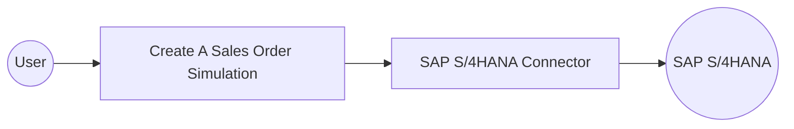

# Example

## What you'll build

Build an automation that connects to an SAP S/4HANA system, simulates the creation of a sales order using the Sales Order Simulation API, and logs the result as a JSON string for inspection.

**Operations used:**
- **Create A Sales Order Simulation** : Simulates the creation of a sales order in SAP S/4HANA and returns a simulation result wrapper.

## Architecture

## Prerequisites

- Access to an SAP S/4HANA system with the Sales Order Simulation API enabled
- SAP hostname and authentication token

## Setting up the SAP S/4HANA API Sales Order Simulation integration

> **New to WSO2 Integrator?** Follow the [Create a New Integration](../../../../develop/create-integrations/create-new-integration.md) guide to set up your integration first, then return here to add the connector.

## Adding the SAP S/4HANA API Sales Order Simulation connector

### Step 1: Open the connector palette

In the WSO2 Integrator sidebar, select **Add Artifact** to open the connector palette.

## Configuring the SAP S/4HANA API Sales Order Simulation connection

### Step 2: Fill in the connection parameters

Search for `sap.s4hana.api_sales_order_simulation_srv` in the connector search box, select the connector card to open the connection form, and bind each field to a configurable variable:

- **Config** : The connection configuration record, including the authentication token — set to expression mode using a configurable variable for `auth.token`
- **Hostname** : The SAP S/4HANA server hostname — bind to a configurable variable

### Step 3: Save the connection

Select **Save** to create the connection. The connector appears as `apiSalesOrderSimulationSrvClient` in the Connections panel.

### Step 4: Set actual values for your configurables

1. In the left panel, select **Configurations**.
2. Set a value for each configurable listed below.

- **sapHostname** (string) : The SAP S/4HANA server hostname
- **sapAuthToken** (string) : The authentication token for SAP access

## Configuring the SAP S/4HANA API Sales Order Simulation Create A Sales Order Simulation operation

### Step 5: Add an automation entry point

1. Select **Add Artifact** in the WSO2 Integrator sidebar.
2. Select **Automation** as the entry point type.
3. Enter the name `main` and select **Create**.

### Step 6: Select and configure the Create A Sales Order Simulation operation

Select the **+** button in the automation flow to open the node selection panel. Under **Connections**, expand `apiSalesOrderSimulationSrvClient` to reveal available operations, then select **Create A Sales Order Simulation** and configure its parameters:

- **Payload** : The sales order simulation request body — set to expression mode with a valid `CreateA_SalesOrderSimulation` record
- **Result** : The variable name to store the simulation result

Select **Save** to add the operation to the flow.

## Try it yourself

Try this sample in WSO2 Integration Platform.

[View source on GitHub](https://github.com/wso2/integration-samples/tree/main/connectors/sap.s4hana.api_sales_order_simulation_srv_connector_sample)

## More code examples

The S/4 HANA Sales and Distribution Ballerina connectors provide practical examples illustrating usage in various
scenarios. Explore
these [examples](https://github.com/ballerina-platform/module-ballerinax-sap.s4hana.sales/tree/main/examples), covering
use cases like accessing S/4HANA Sales Order (A2X) API.

1. [Salesforce to S/4HANA Integration](https://github.com/ballerina-platform/module-ballerinax-sap.s4hana.sales/tree/main/examples/salesforce-to-sap) -
   Demonstrates leveraging the `sap.s4hana.api_sales_order_srv:Client` in Ballerina for S/4HANA API interactions. It
   specifically showcases how to respond to a Salesforce Opportunity Close Event by automatically generating a Sales
   Order in the S/4HANA SD module.

2. [Shopify to S/4HANA Integration](https://github.com/ballerina-platform/module-ballerinax-sap.s4hana.sales/tree/main/examples/shopify-to-sap) -
   Details the integration process between [Shopify](https://admin.shopify.com/), a leading e-commerce platform,
   and [SAP S/4HANA](https://www.sap.com/products/erp/s4hana.html), a comprehensive ERP system. The objective is to
   automate SAP sales order creation for new orders placed on Shopify, enhancing efficiency and accuracy in order
   management.
