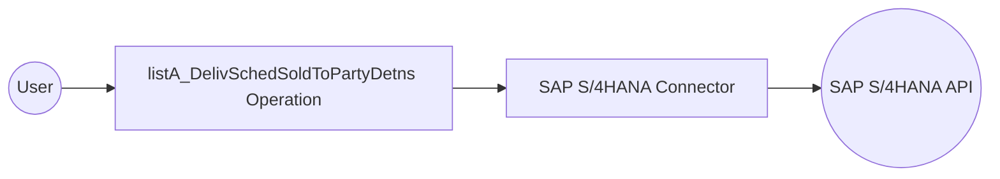

# Example

## What you'll build

This integration connects to the SAP S/4HANA API for Delivery Schedule Sold-To-Party Determination and retrieves a list of delivery schedule sold-to-party determination records. The response is stored in the `result` variable for downstream processing.

**Operations used:**
- **listA_DelivSchedSoldToPartyDetns** : Retrieves a collection of delivery schedule sold-to-party determination records from an SAP S/4HANA system

## Architecture

## Prerequisites

- Access to an SAP S/4HANA system with OData API credentials

## Setting up the SAP S/4HANA integration

> **New to WSO2 Integrator?** Follow the [Create a New Integration](../../../../develop/create-integrations/create-a-new-integration.md) guide to set up your integration first, then return here to add the connector.

## Adding the SAP S/4HANA connector

### Step 1: Add the SAP S/4HANA connector from the palette

In the WSO2 Integrator sidebar, select **Add Artifact**, then select **Connector** from the artifact type list. Search for `sap.s4hana.api_sd_sa_soldtopartydetn` in the connector search palette and select the **sap.s4hana.api_sd_sa_soldtopartydetn** connector card to add it to your project.

## Configuring the SAP S/4HANA connection

### Step 2: Fill in the connection parameters

In the sidebar, expand **Connections** and select **+ Add Connection**. Select the `sap.s4hana.api_sd_sa_soldtopartydetn` connector type and enter `apiSdSaSoldtopartydetnClient` as the connection name. Bind each field to a configurable variable as listed below:

- **Config** : Authentication object referencing the `sapUsername` and `sapPassword` configurable variables
- **Hostname** : SAP S/4HANA server hostname, bound to the `hostname` configurable variable

### Step 3: Save the connection

Select **Save** to persist the connection. The new connection `apiSdSaSoldtopartydetnClient` appears in the Connections panel.

### Step 4: Set actual values for your configurables

In the left panel, select **Configurations**. Set a value for each configurable listed below:

- **hostname** (string) : SAP S/4HANA server hostname
- **sapUsername** (string) : SAP system username for authentication
- **sapPassword** (string) : SAP system password for authentication

## Configuring the SAP S/4HANA listA_DelivSchedSoldToPartyDetns operation

### Step 5: Add the automation entry point

Select **Add Artifact**, then select **Automation** from the artifact type list. Enter `main` as the automation name and select **Create**. The automation canvas opens showing the default flow with **Start** and **Error Handler** nodes.

### Step 6: Select and configure the listA_DelivSchedSoldToPartyDetns operation

On the automation canvas, select the **+** button between the **Start** node and the **Error Handler**. In the node panel, select **Connectors**, choose the `api_sd_sa_soldtopartydetn` connector, and expand the connection node to view available operations.

Select **List A Deliv Sched Sold To Party Detns** and configure the operation fields:

- **Connection** : Pre-selected as `apiSdSaSoldtopartydetnClient`
- **Result Variable** : Set to `result`
- **Result Type** : Auto-resolved as `api_sd_sa_soldtopartydetn:CollectionOfA_DelivSchedSoldToPartyDetnWrapper`

Select **Save** to apply the configuration.

## Try it yourself

Try this sample in WSO2 Integration Platform.

[View source on GitHub](https://github.com/wso2/integration-samples/tree/main/connectors/sap.s4hana.api_sd_sa_soldtopartydetn_connector_sample)

## More code examples

The S/4 HANA Sales and Distribution Ballerina connectors provide practical examples illustrating usage in various
scenarios. Explore
these [examples](https://github.com/ballerina-platform/module-ballerinax-sap.s4hana.sales/tree/main/examples), covering
use cases like accessing S/4HANA Sales Order (A2X) API.

1. [Salesforce to S/4HANA Integration](https://github.com/ballerina-platform/module-ballerinax-sap.s4hana.sales/tree/main/examples/salesforce-to-sap) -
   Demonstrates leveraging the `sap.s4hana.api_sales_order_srv:Client` in Ballerina for S/4HANA API interactions. It
   specifically showcases how to respond to a Salesforce Opportunity Close Event by automatically generating a Sales
   Order in the S/4HANA SD module.

2. [Shopify to S/4HANA Integration](https://github.com/ballerina-platform/module-ballerinax-sap.s4hana.sales/tree/main/examples/shopify-to-sap) -
   Details the integration process between [Shopify](https://admin.shopify.com/), a leading e-commerce platform,
   and [SAP S/4HANA](https://www.sap.com/products/erp/s4hana.html), a comprehensive ERP system. The objective is to
   automate SAP sales order creation for new orders placed on Shopify, enhancing efficiency and accuracy in order
   management.
