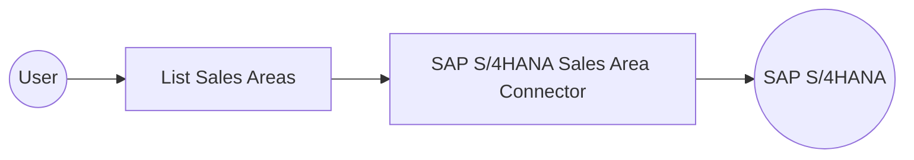

# Example

## What you'll build

Build an automation that connects to an SAP S/4HANA system and retrieves all sales area entities using the OData-based Sales Area API. The integration stores the retrieved sales area data for further processing or verification.

**Operations used:**
- **List Sales Areas** : Retrieves all sales area entities from the SAP S/4HANA system

## Architecture

## Prerequisites

- SAP S/4HANA system credentials (username, password, and hostname)

## Setting up the SAP S/4HANA sales area integration

> **New to WSO2 Integrator?** Follow the [Create a New Integration](../../../../develop/create-integrations/create-a-new-integration.md) guide to set up your integration first, then return here to add the connector.

## Adding the SAP S/4HANA sales area connector

### Step 1: Open the connection palette

Select **Add Connection** in the **Connections** section of the sidebar to open the connector palette.

### Step 2: Fill in the connection parameters

Search for `sap.s4hana.salesarea` and select the **Salesarea_0001** connector card to open the connection configuration form. Bind each field to a configurable variable:

- **config** : Authentication credentials record containing `username` and `password` fields
- **hostname** : SAP S/4HANA system hostname

### Step 3: Save the connection

Select **Save Connection** to persist the connection. The new connection (for example, `salesarea0001Client`) appears on the project canvas.

## Configuring the SAP S/4HANA sales area connection

### Step 4: Set actual values for your configurables

1. In the left panel, select **Configurations**.
2. Set a value for each configurable listed below.

- **sapHostname** (string) : The hostname of your SAP S/4HANA system
- **sapUsername** (string) : Your SAP authentication username
- **sapPassword** (string) : Your SAP authentication password

## Configuring the SAP S/4HANA sales area list sales areas operation

### Step 5: Add an automation entry point

1. Select **Add Artifact** in the project overview.
2. Select **Automation** from the artifact types.
3. Select **Create** to add the automation entry point.

### Step 6: Select and configure the list sales areas operation

1. In the automation flow, select the **+** button after the **Start** node.
2. Expand the **salesarea0001Client** connection to view available operations.

3. Select **List Sales Areas** and configure its parameters:

- **Result Variable** : Name of the variable that stores the operation response
- **Result Type** : Auto-resolved as `salesarea_0001:CollectionOfSalesArea`

Select **Save** to apply the configuration.

## Try it yourself

Try this sample in WSO2 Integration Platform.

[View source on GitHub](https://github.com/wso2/integration-samples/tree/main/connectors/sap.s4hana.salesarea_0001_connector_sample)

## More code examples

The S/4 HANA Sales and Distribution Ballerina connectors provide practical examples illustrating usage in various
scenarios. Explore
these [examples](https://github.com/ballerina-platform/module-ballerinax-sap.s4hana.sales/tree/main/examples), covering
use cases like accessing S/4HANA Sales Order (A2X) API.

1. [Salesforce to S/4HANA Integration](https://github.com/ballerina-platform/module-ballerinax-sap.s4hana.sales/tree/main/examples/salesforce-to-sap) -
   Demonstrates leveraging the `sap.s4hana.api_sales_order_srv:Client` in Ballerina for S/4HANA API interactions. It
   specifically showcases how to respond to a Salesforce Opportunity Close Event by automatically generating a Sales
   Order in the S/4HANA SD module.

2. [Shopify to S/4HANA Integration](https://github.com/ballerina-platform/module-ballerinax-sap.s4hana.sales/tree/main/examples/shopify-to-sap) -
   Details the integration process between [Shopify](https://admin.shopify.com/), a leading e-commerce platform,
   and [SAP S/4HANA](https://www.sap.com/products/erp/s4hana.html), a comprehensive ERP system. The objective is to
   automate SAP sales order creation for new orders placed on Shopify, enhancing efficiency and accuracy in order
   management.
