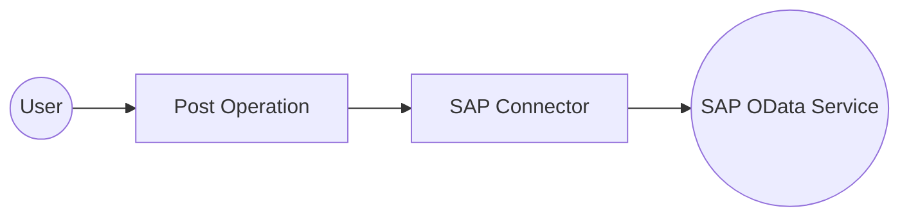

# Example

## What you'll build

Build an integration that sends an HTTP POST request to an SAP OData service using the SAP connector. The integration creates a Business Partner record by calling the SAP Business Partner API with a JSON payload and logs the response.

**Operations used:**
- **Post** : Sends an HTTP POST request to an SAP OData service endpoint to create a Business Partner record

## Architecture

## Prerequisites

- SAP system endpoint URL
- SAP system credentials configured via `http:ClientConfiguration`

## Setting up the SAP integration

> **New to WSO2 Integrator?** Follow the [Create a New Integration](../../../../develop/create-integrations/create-new-integration.md) guide to set up your integration first, then return here to add the connector.

## Adding the SAP connector

### Step 1: Add the SAP connector

1. In the WSO2 Integrator side panel, select **Add Artifact** or navigate to the **Connections** section.
2. Select the **+** button next to **Connections** to open the connector palette.
3. Search for **sap** in the search box.

4. Select the **SAP** connector card from the results.

## Configuring the SAP connection

### Step 2: Fill in the SAP connection parameters

Enter the connection parameters below, binding each field to a configurable variable:

- **Url** : The SAP system HTTP endpoint URL
- **Config** : Optional HTTP client configuration record for authentication, TLS, and timeouts
- **Connection Name** : The identifier for this connection instance

### Step 3: Save the connection

Select **Save** to create the connection. The `sapClient` connection appears in the project tree under **Connections**.

### Step 4: Set actual values for your configurables

1. In the left panel, select **Configurations**.
2. Set a value for each configurable listed below.

- **sapUrl** (string) : The base URL of the SAP system

## Configuring the SAP Post operation

### Step 5: Add an Automation entry point

1. In the WSO2 Integrator side panel, select **Add Artifact**.
2. Select **Automation** as the entry point type.

### Step 6: Select and configure the Post operation

Expand the **sapClient** connection node in the right-side panel to view available operations, then select **Post**.

Configure the operation with the following values:

- **Path** : The SAP OData service resource path (for example, `/sap/opu/odata/sap/API_BUSINESS_PARTNER/A_BusinessPartner`)
- **Message** : The JSON payload for the request body
- **Result** : Variable name to store the operation response
- **Target Type** : Expected response type for data binding

Select **Save** to add the operation to the automation flow.

## Try it yourself

Try this sample in WSO2 Integration Platform.

[View source on GitHub](https://github.com/wso2/integration-samples/tree/main/connectors/sap_connector_sample)

## More code examples

The `sap` connector provides practical examples illustrating usage in various scenarios. Explore
these [examples](https://github.com/ballerina-platform/module-ballerinax-sap/tree/main/examples), covering use cases
like accessing S/4HANA Sales Order (A2X) API.

1. [Send a reminder on approval of pending orders](https://github.com/ballerina-platform/module-ballerinax-sap/tree/main/examples/pending-order-reminder) -
   This example illustrates the use of the `sap:Client` in Ballerina to interact with S/4HANA APIs. Specifically, it
   demonstrates how to send a reminder email for sales orders that are pending approval.
