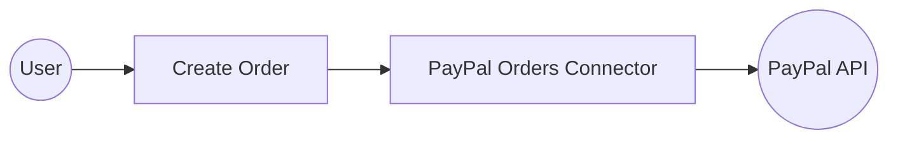

# Example

## What you'll build

Build a WSO2 Integrator automation that uses the PayPal Orders connector to create a new order via the PayPal API. The integration runs as an Automation entry point and logs the result of the order creation as a JSON string.

**Operations used:**
- **Create order** : Creates a new PayPal order with a specified purchase intent and units

## Architecture

## Prerequisites

- A PayPal developer account with a **Client ID** and **Client Secret** for OAuth2 authentication

## Setting up the PayPal Orders integration

> **New to WSO2 Integrator?** Follow the [Create a New Integration](../../../../develop/create-integrations/create-new-integration.md) guide to set up your integration first, then return here to add the connector.

## Adding the PayPal Orders connector

### Step 1: Open the connector palette

In the project overview, select **Add Artifact**, then under **Other Artifacts** select **Connection** to open the connector palette.

### Step 2: Add an Automation entry point

In the project overview, select **Add Artifact**, then select **Automation** under the Automation category, and select **Create** to add the Automation entry point. The flow canvas opens with a **Start** node and an **Error Handler** node.

## Configuring the PayPal Orders connection

### Step 3: Configure connection parameters

Search for **Orders** (PayPal) in the connector palette, select the **Orders** connector card to open the configuration form, and enter the following parameters using configurable variables for your OAuth2 credentials:

- **config** : Set to Expression mode referencing `paypalClientId` and `paypalClientSecret` configurable variables for OAuth2 authentication
- **connectionName** : The name used to reference this connection in the flow

### Step 4: Save the connection

Select **Save Connection** to persist the connection. The connection is now visible in the project overview under **Connections**.

### Step 5: Set actual values for your configurables

In the left panel, select **Configurations** and set a value for each configurable listed below:

- **paypalClientId** (string) : Your PayPal OAuth2 client ID from the PayPal Developer Dashboard
- **paypalClientSecret** (string) : Your PayPal OAuth2 client secret from the PayPal Developer Dashboard

## Configuring the PayPal Orders Create order operation

### Step 6: Select and configure the Create order operation

1. Select the **+** button on the flow canvas to open the node panel.
2. Expand the **ordersClient** connection under **Connections** to see available operations.

3. Select **Create order** to add it to the flow, then configure the following parameters:

- **payload** : An `OrderRequest` value specifying the purchase units and intent for the new order
- **result** : The variable that stores the returned order details

Select **Save** to apply the configuration.

## Try it yourself

Try this sample in WSO2 Integration Platform.

[View source on GitHub](https://github.com/wso2/integration-samples/tree/main/connectors/paypal.orders_connector_sample)

## More code examples

The `PayPal Orders` connector provides practical examples illustrating usage in various scenarios. Explore these [examples](https://github.com/ballerina-platform/module-ballerinax-paypal.orders/tree/main/examples/), covering the following use cases:

1. [**Order lifecycle**](https://github.com/ballerina-platform/module-ballerinax-paypal.orders/tree/main/examples/order-lifecycle): Process a complete PayPal order from creation and updates through confirming and capturing payments.

2. [**Manage shipping**](https://github.com/ballerina-platform/module-ballerinax-paypal.orders/tree/main/examples/manage-shipping): Enrich an order with shipping details, add or update tracking information, and push shipment updates back to PayPal.
