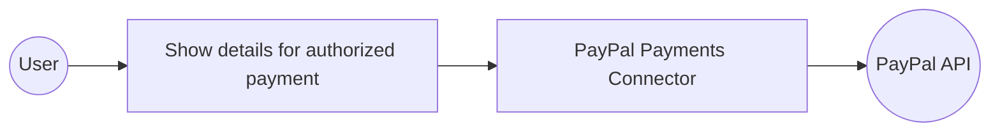

# Example

## What you'll build

Build a WSO2 Integrator automation that connects to the PayPal Payments API and retrieves details for an authorized payment. The integration uses configurable variables to securely manage API credentials and logs the payment details as a JSON string.

**Operations used:**
- **Show details for authorized payment** : Retrieves details of a specific authorized payment by its authorization ID

## Architecture

## Prerequisites

- PayPal developer account with API credentials (Client ID and Client Secret)
- OAuth2 Client Credentials Grant configured in your PayPal developer dashboard

## Setting up the PayPal payments integration

> **New to WSO2 Integrator?** Follow the [Create a New Integration](../../../../develop/create-integrations/create-a-new-integration.md) guide to set up your integration first, then return here to add the connector.

## Adding the PayPal payments connector

### Step 1: Add the PayPal payments connection

1. In the WSO2 Integrator sidebar, navigate to **Connections**.
2. Select **Add Connection** to open the connection palette.

3. Search for and select the **Payments** connector from the list of available connectors.

## Configuring the PayPal payments connection

### Step 2: Fill in the connection parameters

Bind each credential field to a configurable variable so that sensitive values aren't hardcoded.

- **Config** : The configurations for initializing the connector, including OAuth2 credentials
- **Connection Name** : Name of the connection instance

### Step 3: Save the connection

Select **Save Connection** to persist the connection. The `paymentsClient` connection now appears on the design canvas and in the sidebar under **Connections**.

### Step 4: Set actual values for your configurables

In the left panel, select **Configurations** and set a value for each configurable listed below.

- **paypalClientId** (string) : Your PayPal developer Client ID
- **paypalClientSecret** (string) : Your PayPal developer Client Secret

## Configuring the PayPal payments show details for authorized payment operation

### Step 5: Add an automation entry point

1. Select **+ Add Artifact** on the design canvas.
2. Select **Automation** from the artifact types.
3. Select **Create** to add the automation entry point with default settings.

### Step 6: Select and configure the operation

1. Select the **+** button on the flow canvas to open the node panel.
2. Under **Connections**, expand **paymentsClient** to see all available operations.

3. Select **Show details for authorized payment**.
4. Fill in the operation parameters:

- **AuthorizationId** : The PayPal-generated ID for the authorized payment
- **Result** : Name of the variable to store the operation result

5. Select **Save** to add the operation to the flow.

## Try it yourself

Try this sample in WSO2 Integration Platform.

[View source on GitHub](https://github.com/wso2/integration-samples/tree/main/connectors/paypal.payments_connector_sample)

## More code examples

The `PayPal Payments` connector provides practical examples illustrating usage in various scenarios. Explore these [examples](https://github.com/ballerina-platform/module-ballerinax-paypal.payments/tree/main/examples/), covering the following use cases:

1. [**Order creation**](https://github.com/ballerina-platform/module-ballerinax-paypal.payments/tree/main/examples/order-creation): Process a complete product purchase from order creation through payment authorization, capture, and partial refunds.

2. [**Subscription management**](https://github.com/ballerina-platform/module-ballerinax-paypal.payments/tree/main/examples/subscription-management): Simulate a recurring billing flow with subscription-style orders, monthly payments, plan switching, and pro-rated refunds.
