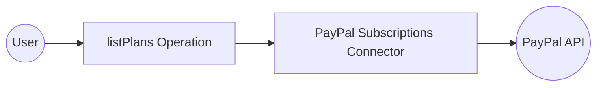

# Example

## What you'll build

Build a WSO2 Integrator automation that uses the PayPal Subscriptions connector to retrieve all subscription plans and log the result. The integration uses an Automation entry point to invoke the `listPlans` operation and captures the response.

**Operations used:**
- **listPlans** : Retrieves all subscription plans from the PayPal Subscriptions API

## Architecture

## Prerequisites

- A PayPal developer account with OAuth2 client credentials (Client ID and Client Secret)

## Setting up the PayPal Subscriptions integration

> **New to WSO2 Integrator?** Follow the [Create a New Integration](../../../../develop/create-integrations/create-new-integration.md) guide to set up your integration first, then return here to add the connector.

## Adding the PayPal Subscriptions connector

### Step 1: Open the connector palette

1. In the WSO2 Integrator sidebar, select **Add Artifact**.
2. Select **Connection** from the artifact options.
3. In the connector search palette, search for **paypal.subscriptions**.
4. Select the `ballerinax/paypal.subscriptions` connector card to open the connection form.

## Configuring the PayPal Subscriptions connection

### Step 2: Fill in the connection parameters

Fill in the connection form by binding each field to a configurable variable:

- **Connection Name** : Enter `subscriptionsClient`
- **clientId** : Bind to the configurable variable `paypalClientId`
- **clientSecret** : Bind to the configurable variable `paypalClientSecret`

### Step 3: Save the connection

Select **Save** to create the connection. The `subscriptionsClient` connection appears in the **Connections** section of the WSO2 Integrator sidebar and on the design canvas.

### Step 4: Set actual values for your configurables

1. In the left panel, select **Configurations**.
2. Set a value for each configurable listed below.

- **paypalClientId** (string) : Your PayPal OAuth2 client ID from the PayPal developer dashboard
- **paypalClientSecret** (string) : Your PayPal OAuth2 client secret from the PayPal developer dashboard

## Configuring the PayPal Subscriptions listPlans operation

### Step 5: Add an Automation entry point

1. Select **Add Artifact** in the WSO2 Integrator sidebar.
2. Select **Automation** as the entry point type.

The Automation entry point `main` is created and appears under **Entry Points** in the sidebar.

### Step 6: Select and configure the listPlans operation

1. Select the **main** Automation entry point to open its flow view.
2. In the flow diagram, select the **+** button to add a new step.
3. Select the **subscriptionsClient** connection to view its available operations.

4. Select the **List plans** operation (`listPlans`).
5. Review the available parameters (all optional for this operation) and set the **Result Variable** name to `result`.
6. Select **Save** to add the operation to the flow.

- **Result Variable** : Name of the variable that stores the returned `PlanCollection` response

## Try it yourself

Try this sample in WSO2 Integration Platform.

[View source on GitHub](https://github.com/wso2/integration-samples/tree/main/connectors/paypal.subscriptions_connector_sample)

## More code examples

The `PayPal Subscriptions` connector provides practical examples illustrating usage in various scenarios. Explore these [examples](https://github.com/ballerina-platform/module-ballerinax-paypal.subscriptions/tree/main/examples/), covering the following use cases:

1. [**Create and List Plans**](https://github.com/ballerina-platform/module-ballerinax-paypal.subscriptions/tree/main/examples/create-and-list-plans): Create a subscription plan and list all available plans.
2. [**Monitor and Manage Subscription Status**](https://github.com/ballerina-platform/module-ballerinax-paypal.subscriptions/tree/main/examples/monitor-and-manage-subscription): Retrieve a subscription's status and suspend or reactivate it based on its state.
3. [**Manage Premium Subscription**](https://github.com/ballerina-platform/module-ballerinax-paypal.subscriptions/tree/main/examples/manage-premium-subscription): Create a subscription plan, enroll a customer, and retrieve subscription details for a premium membership.
