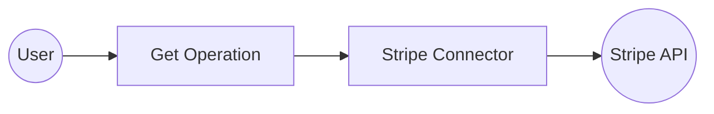

# Example

## What you'll build

Build a WSO2 Integrator automation that connects to Stripe, retrieves a list of customers using the Stripe API, and logs the result. This integration uses configurable variables to securely manage API credentials at runtime.

**Operations used:**
- **get** : Retrieves a list of customers from your Stripe account, sorted by creation date with the most recent customers appearing first.

## Architecture

## Prerequisites

- A Stripe account with API access
- A Stripe API key (Bearer token)

## Setting up the Stripe integration

> **New to WSO2 Integrator?** Follow the [Create a New Integration](../../../../develop/create-integrations/create-a-new-integration.md) guide to set up your integration first, then return here to add the connector.

## Adding the Stripe connector

### Step 1: Open the add connection panel

Open the WSO2 Integrator side panel and hover over the **Connections** tree item, then select the **+** button that appears to open the **Add Connection** palette.

### Step 2: Add an automation entry point

1. In the WSO2 Integrator side panel, select **Add Artifact**.
2. Select **Automation** as the entry point type.
3. Name the automation `main`.

## Configuring the Stripe connection

### Step 3: Configure the connection form

In the connection form, bind each field to a configurable variable:

- **Connection Name** : The display name for this connection instance
- **token** : The Stripe Bearer token, bound to the `stripeToken` configurable variable

### Step 4: Save the connection

Select **Save** to create the connection. The connection appears in the **Connections** section of the WSO2 Integrator side panel.

### Step 5: Set actual values for your configurables

1. In the left panel, select **Configurations**.
2. Set a value for each configurable listed below.

- **stripeToken** (string) : Your Stripe API key, obtainable from the Stripe Dashboard under **Developers > API keys**

## Configuring the Stripe get operation

### Step 6: Expand the connection and select the operation

1. Select the **+** button on the edge between the **Start** node and the **Error Handler** node.
2. In the step selection panel, locate the **Connections** section.
3. Expand the **stripeClient** connection to reveal all available Stripe operations.

4. Search for **customers** to filter the operations list.
5. Select **Returns a list of your customers** (`get` operation) from the filtered results, then configure the following:

- **Result** : Name of the variable to store the response — set to `customerList`

Select **Save** to add the operation to the flow.

## Try it yourself

Try this sample in WSO2 Integration Platform.

[View source on GitHub](https://github.com/wso2/integration-samples/tree/main/connectors/stripe_connector_sample)

## More code examples

The `ballerinax/stripe` connector provides practical examples illustrating usage in various scenarios. Explore these [examples](https://github.com/ballerina-platform/module-ballerinax-stripe/tree/main/examples), covering various Stripe functionalities.

1. [Manage Stripe payments](https://github.com/ballerina-platform/module-ballerinax-stripe/tree/main/examples/manage-payments) - Manage business payments with Stripe.

2. [Manage one-time charges](https://github.com/ballerina-platform/module-ballerinax-stripe/tree/main/examples/manage-one-time-charges) - Manage one-time charges with Stripe.
