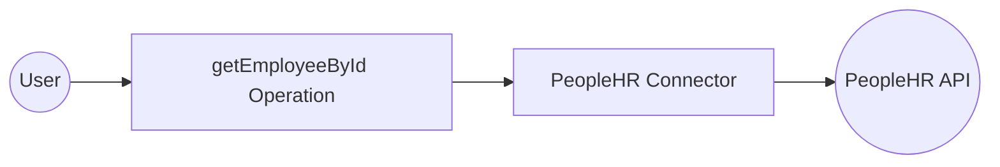

# Example

## What you'll build

Build a WSO2 Integrator automation that retrieves employee information from the PeopleHR HR management platform using the PeopleHR connector. The integration configures a PeopleHR connection, calls the `getEmployeeById` operation, and logs the response.

**Operations used:**
- **getEmployeeById** : Retrieves a full employee record from PeopleHR by a unique employee identifier

## Architecture

## Prerequisites

- A PeopleHR account with an API key

## Setting up the PeopleHR integration

> **New to WSO2 Integrator?** Follow the [Create a New Integration](../../../../develop/create-integrations/create-a-new-integration.md) guide to set up your integration first, then return here to add the connector.

## Adding the PeopleHR connector

Select **+** in the **Connections** section of the left panel to open the connector search panel.

### Step 1: Add an automation entry point

1. Hover over the **Entry Points** section in the left panel.
2. Select the **Add Entry Point** (+) button.
3. Select **Automation** in the artifact type selection screen.
4. In the **Create New Automation** dialog, select **Create** to accept the default settings.

## Configuring the PeopleHR connection

### Step 2: Configure the PeopleHR connection parameters

Open the **Configure Peoplehr** form and bind each field to a configurable variable:
- **apiKey** : Your PeopleHR API key, bound to a new configurable variable
- **connectionName** : `peoplehrClient`

### Step 3: Save the connection

Select **Save Connection** to persist the connection. The `peoplehrClient` connection appears under **Connections** in the left panel and as a node on the integration canvas.

### Step 4: Set actual values for your configurables

1. In the left panel, select **Configurations**.
2. Set a value for each configurable listed below.

- **peoplehrApiKey** (string) : Your PeopleHR API key from your account settings

## Configuring the PeopleHR getEmployeeById operation

### Step 5: Add the getEmployeeById operation to the flow

1. On the automation flow canvas, select the **+** button between the **Start** node and the **Error Handler** node.
2. Under **Connections**, select **peoplehrClient** to expand its operations.

3. Select **Get Employee By Id** from the list of operations.
4. Fill in the operation fields:
   - **Employee Request Detail** : Enter the employee request record, for example `{EmployeeId: "EMP001"}`
   - **Result** : Auto-filled as `peoplehrEmployeeresponse`

Select **Save** to add the operation to the flow.

## Try it yourself

Try this sample in WSO2 Integration Platform.

[View source on GitHub](https://github.com/wso2/integration-samples/tree/main/connectors/peoplehr_connector_sample)
