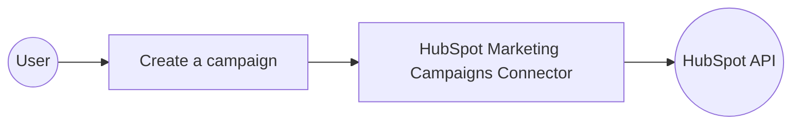

# Example

## What you'll build

Build a WSO2 Integrator automation that connects to HubSpot Marketing Campaigns and creates a new marketing campaign using the `ballerinax/hubspot.marketing.campaigns` connector. The integration authenticates via a Bearer Token and submits a campaign payload to the HubSpot API.

**Operations used:**
- **Create a campaign** : Creates a new marketing campaign in HubSpot with the specified properties.

## Architecture

## Prerequisites

- A HubSpot account with API access and a valid Bearer Token (Private App token)

## Setting up the HubSpot marketing campaigns integration

> **New to WSO2 Integrator?** Follow the [Create a New Integration](../../../../develop/create-integrations/create-a-new-integration.md) guide to set up your integration first, then return here to add the connector.

## Adding the HubSpot marketing campaigns connector

### Step 1: Open the add connection panel

Select the **+** button next to the **Connections** section in the WSO2 Integrator side panel to open the **Add Connection** panel.

### Step 2: Search for and select the HubSpot marketing campaigns connector

1. In the search box, enter `hubspot` to filter available connectors.
2. Select **ballerinax/hubspot.marketing.campaigns** from the results to open the connection form.

## Configuring the HubSpot marketing campaigns connection

### Step 3: Fill in connection parameters and save

Bind each connection parameter to a configurable variable, then select **Save** to persist the connection.

- **Config** : The `ConnectionConfig` record containing authentication details — expand `ConnectionConfig → auth → BearerTokenConfig`, select the `token` field, navigate to the **Configurables** tab, and create a new configurable named `hubspotBearerToken` of type `string`
- **Connection Name** : The variable name for this connector client instance — enter `campaignsClient`

The connection `campaignsClient` now appears under the **Connections** section in the project tree.

### Step 4: Set actual values for your configurables

1. In the left panel, select **Configurations**.
2. Set a value for each configurable listed below.

- **hubspotBearerToken** (string) : Your HubSpot Private App Bearer Token (e.g., `pat-na1-xxxxxxxx-xxxx-xxxx-xxxx-xxxxxxxxxxxx`)

## Configuring the HubSpot marketing campaigns create a campaign operation

### Step 5: Add an automation entry point

Select **Add Artifact** in the WSO2 Integrator side panel and choose **Automation**. Accept the default name `main` and select **Create**. The automation flow canvas opens showing a **Start** node and an **Error Handler** node.

### Step 6: Select and configure the create a campaign operation

1. On the automation canvas, select the **+** (Add Step) button between the **Start** node and the **Error Handler** node.
2. In the node panel, locate the **Connections** section and expand **campaignsClient** to reveal all available operations.

3. Select **Create a campaign** (`campaignsClient → post`) to open the operation form.
4. Configure the following fields:

- **Payload** : The campaign input payload — select the **Expression** tab and enter `{properties: {"hs_name": "Summer Sale Campaign"}}`
- **Result** : Name of the variable that holds the API response — enter `campaignResult`

Select **Save** to add the step to the canvas.

## Try it yourself

Try this sample in WSO2 Integration Platform.

[View source on GitHub](https://github.com/wso2/integration-samples/tree/main/connectors/hubspot.marketing.campaigns_connector_sample)

## More code examples

The `HubSpot Marketing Campaigns` connector provides practical examples illustrating usage in various scenarios. Explore these [examples](https://github.com/ballerina-platform/module-ballerinax-hubspot.marketing.campaigns/tree/main/examples), covering the following use cases:

1. [Batch of Campaigns](https://github.com/ballerina-platform/module-ballerinax-hubspot.marketing.campaigns/tree/main/examples/batch_of_campaigns) - Fully manage a batch of campaigns
2. [Campaign Lifecycle with Assets](https://github.com/ballerina-platform/module-ballerinax-hubspot.marketing.campaigns/tree/main/examples/campaign_lifecycle_with_assets) - Full life cycle of a campaign associated with assets such as forms
