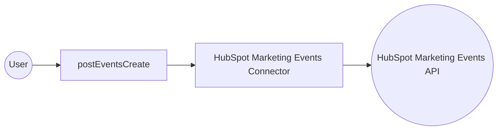

# Example

## What you'll build

Build an integration that connects to the HubSpot Marketing Events API and creates a marketing event programmatically. The integration uses an Automation entry point to trigger the operation and returns a `MarketingEventDefaultResponse` confirming the event was created.

**Operations used:**
- **postEventsCreate** : Creates a new marketing event in HubSpot with details such as event name, organizer, and external identifiers

## Architecture

## Prerequisites

- A HubSpot developer account with a Private App bearer token that has the `crm.objects.marketing_events.write` scope

## Setting up the HubSpot marketing events integration

> **New to WSO2 Integrator?** Follow the [Create a New Integration](../../../../develop/create-integrations/create-a-new-integration.md) guide to set up your integration first, then return here to add the connector.

## Adding the HubSpot marketing events connector

### Step 1: Open the connector palette

Select **+ Add Artifact → Connection** from the Integration overview canvas to open the connector palette.

### Step 2: Search for and select the connector

1. Enter `hubspot marketing events` in the search box.
2. Select the connector card labelled **"Events / ballerinax / hubspot.marketing.events"**.

## Configuring the HubSpot marketing events connection

### Step 3: Fill in the connection parameters

In the **Add Connection** form, bind the connection parameters to configurable variables:

1. Select the **Config** field to open the **Record Configuration** modal.
2. Expand **auth** → **BearerTokenConfig**.
3. Select **+ New Configurable** next to the `token` field, name it `hubspotBearerToken` (type: `string`), and select **Save Configurable**.
4. Enter `eventsClient` in the **Connection Name** field.

- **Config** : Connector configuration holding the bearer token authentication details, bound to the `hubspotBearerToken` configurable variable
- **Connection Name** : Logical name for the connection instance

### Step 4: Save the connection

Select **Save Connection** to persist the connection. The integration canvas shows the `eventsClient` connection node, and the left sidebar lists it under **Connections → eventsClient**.

### Step 5: Set actual values for your configurables

1. In the left panel, select **Configurations**.
2. Set a value for each configurable listed below.

- **hubspotBearerToken** (string) : Your HubSpot Private App bearer token with the `crm.objects.marketing_events.write` scope

## Configuring the HubSpot marketing events postEventsCreate operation

### Step 6: Add an automation entry point

1. Select **+ Add Artifact** on the canvas.
2. Select **Automation** from the artifact picker.
3. Accept the default settings and select **Create**.

The automation flow is created with a **Start** node and an **Error Handler** node.

### Step 7: Select and configure the postEventsCreate operation

1. Select the **+** button between the **Start** and **Error Handler** nodes to open the node panel.
2. Select **eventsClient** under the **Connections** section to expand it and reveal all available operations.

3. Select **Post Events Create** to open the configuration panel.
4. Switch to the **Expression** tab for the **Payload** field and enter your event details.

- **Payload** : `MarketingEventCreateRequestParams` record containing the event details — required fields include `externalAccountId`, `eventOrganizer`, `externalEventId`, and `eventName`
- **Result** : Variable name for the returned `events:MarketingEventDefaultResponse` — defaults to `eventsMarketingeventdefaultresponse`

5. Select **Save** to add the operation to the automation flow.

## Try it yourself

Try this sample in WSO2 Integration Platform.

[View source on GitHub](https://github.com/wso2/integration-samples/tree/main/connectors/hubspot.marketing.events_connector_sample)

## More code examples

The `HubSpot Marketing Events` connector provides practical examples illustrating usage in various scenarios. Explore these [examples](https://github.com/ballerina-platform/module-ballerinax-hubspot.marketing.events/tree/main/examples/), covering the following use cases:

1. [Event Participation Management](https://github.com/ballerina-platform/module-ballerinax-hubspot.marketing.events/tree/main/examples/event_participation_management/) - Use Marketing Event API to Manage and Update Participants seamlessly.
2. [Marketing Event Management](https://github.com/ballerina-platform/module-ballerinax-hubspot.marketing.events/tree/main/examples/marketing_event_management/) - Create, update and manage multiple Marketing Events and automate event management.
