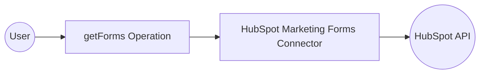

# Example

## What you'll build

Build a low-code integration that retrieves a list of HubSpot Marketing Forms using the `ballerinax/hubspot.marketing.forms` connector in WSO2 Integrator. The integration runs as an Automation entry point and stores the response in a result variable for further processing.

**Operations used:**
- **getForms** : Retrieves a list of all HubSpot Marketing Forms associated with your account

## Architecture

## Prerequisites

- A HubSpot account with a valid Bearer token (OAuth 2.0 access token or private app token)

## Setting up the HubSpot marketing forms integration

> **New to WSO2 Integrator?** Follow the [Create a New Integration](../../../../develop/create-integrations/create-a-new-integration.md) guide to set up your integration first, then return here to add the connector.

## Adding the HubSpot marketing forms connector

### Step 1: Open the add connection panel

Select **Add Connection** (or the **+** next to **Connections** in the side panel) to open the connector search palette.

### Step 2: Search for and select the HubSpot marketing forms connector

1. In the search box, enter `hubspot.marketing.forms`.
2. Select **ballerinax/hubspot.marketing.forms** from the results to open the **Connection Configuration** form.

## Configuring the HubSpot marketing forms connection

### Step 3: Fill in the connection parameters

Bind the connection parameters to configurable variables so credentials aren't hardcoded. In the **Config** field (of type `ConnectionConfig`), select the text box to open the **Record Configuration** modal, then set the `token` field inside `auth` → `BearerTokenConfig` to a new configurable variable named `hubspotBearerToken`. The **Config** field should read `{auth: {token: hubspotBearerToken}}` after binding.

- **config** : The connection configuration object containing Bearer Token authentication details
- **connectionName** : Enter `formsClient` as the name for this connection

### Step 4: Save the connection

Select **Save** to persist the connection. The `formsClient` connection node appears on the canvas.

### Step 5: Set actual values for your configurables

1. In the left panel, select **Configurations**.
2. Set a value for each configurable listed below.

- **hubspotBearerToken** (string) : Your HubSpot Bearer token (OAuth 2.0 access token or private app token)

## Configuring the HubSpot marketing forms getForms operation

### Step 6: Add an automation entry point

1. On the canvas overview, select **Add Artifact**.
2. Select **Automation** from the artifact type list.
3. Accept the defaults and select **Create**.

The Automation canvas opens showing a **Start** node and an **Error Handler** block.

### Step 7: Select the getForms operation and configure its parameters

1. Select the **+** (Add Step) button between the **Start** node and the **Error Handler** block.
2. Under **Connections**, select **formsClient** to expand its operations.

3. Select **Get a list of forms**.
4. In the **Result** field, enter `formsResult`.

- **result** : Name of the result variable that stores the retrieved forms list

Select **Save** to add the step to the flow.

## Try it yourself

Try this sample in WSO2 Integration Platform.

[View source on GitHub](https://github.com/wso2/integration-samples/tree/main/connectors/hubspot.marketing.forms_connector_sample)

## More code examples

The "HubSpot Marketing Forms" connector provides practical examples illustrating usage in various scenarios. Explore these [examples](https://github.com/ballerina-platform/module-ballerinax-hubspot.marketing.forms/tree/main/examples), covering the following use cases:

1. [Contact Us Form Integration](https://github.com/ballerina-platform/module-ballerinax-hubspot.marketing.forms/tree/main/examples/contact-us-form) - Build dynamic 'Contact Us' forms to handle customer inquiries efficiently, enabling seamless communication and accurate data collection.

2. [Sign Up Form Integration](https://github.com/ballerina-platform/module-ballerinax-hubspot.marketing.forms/tree/main/examples/sign-up-form) - Create, update, and manage user registration forms with customizable fields such as name, email, and consent checkboxes to streamline user onboarding.
