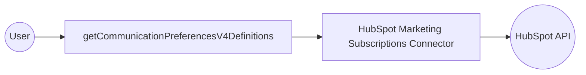

# Example

## What you'll build

Build an integration that fetches all HubSpot email subscription definitions and logs them as JSON. The integration uses an Automation entry point that calls the HubSpot Marketing Subscriptions connector to retrieve all subscription type definitions.

**Operations used:**
- **getCommunicationPreferencesV4Definitions** : Retrieves all HubSpot email subscription type definitions and returns them as a structured response.

## Architecture

## Prerequisites

- A HubSpot account with a valid private app access token (bearer token).

## Setting up the HubSpot Marketing Subscriptions integration

> **New to WSO2 Integrator?** Follow the [Create a New Integration](../../../../develop/create-integrations/create-new-integration.md) guide to set up your integration first, then return here to add the connector.

## Adding the HubSpot Marketing Subscriptions connector

### Step 1: Open the Add Connection panel

In the project overview, expand **Connections** in the left panel and select **+ Add Connection**.

### Step 2: Search for and select the connector

1. Search for **hubspot marketing subscriptions** in the connector search panel.
2. Select the **HubSpot Marketing Subscriptions** connector card (`ballerinax/hubspot.marketing.subscriptions`) to open the configuration form.

## Configuring the HubSpot Marketing Subscriptions connection

### Step 3: Fill in the connection parameters

Enter the connection details and bind the auth token to a configurable variable:

- **connectionName** : Enter `subscriptionsClient` as the connection name.
- **auth.token** : Select **+ New Configurable** to create a new configurable variable named `hubspotAuthToken` of type `string`, then save the configurable dialog.

### Step 4: Save the connection

Select **Save Connection** to persist the connection. The canvas updates to show the `subscriptionsClient` connection node in the **Connections** section.

### Step 5: Set actual values for your configurables

1. In the left panel, select **Configurations** (at the bottom of the project tree, under **Data Mappers**).
2. Set a value for each configurable listed below.

- **hubspotAuthToken** (string) : Your HubSpot private app bearer token.

## Configuring the HubSpot Marketing Subscriptions getCommunicationPreferencesV4Definitions operation

### Step 6: Add an Automation entry point

In the left sidebar under **Entry Points**, select **+** and choose **Automation**. Name the entry point `main` and confirm. The Automation flow canvas opens showing a minimal flow: **Start** → **Error Handler** → **End**.

### Step 7: Select and configure the getCommunicationPreferencesV4Definitions operation

1. Select the **+** connector button on the flow line inside the `do` block to open the step selection panel.
2. Navigate to **Connections**, select **subscriptionsClient**, then select **getCommunicationPreferencesV4Definitions** from the list of available operations.
3. Configure the operation fields:

- **resultVariable** : Enter `result` as the variable name to store the operation output.
- **resultType** : Set to `subscriptions:ActionResponseWithResultsSubscriptionDefinition`.

After selecting the operation, the configuration panel opens. Enter the output variable details as shown below.

Select **Save** to apply the operation settings and return to the canvas.

You should now see the completed flow with the operation placed between **Start** and **Error Handler**.

## Try it yourself

Try this sample in WSO2 Integration Platform.

[View source on GitHub](https://github.com/wso2/integration-samples/tree/main/connectors/hubspot.marketing.subscriptions_connector_sample)

## More code examples

The `HubSpot Marketing Subscriptions` connector provides practical examples that illustrate its usage in various scenarios. Explore these [examples](https://github.com/ballerina-platform/module-ballerinax-hubspot.marketing.subscriptions/tree/main/examples/), which cover the following use cases:

1. [Event-Based Email Preference Update](https://github.com/ballerina-platform/module-ballerinax-hubspot.marketing.subscriptions/tree/main/examples/event-based-email-preference-update) - Check and update email preferences for event attendees, ensuring that those who unsubscribed post-event are bulk resubscribed for future engagement.

2. [Bulk Opt-Out of All Email Communication](https://github.com/ballerina-platform/module-ballerinax-hubspot.marketing.subscriptions/tree/main/examples/bulk-opt-out-of-email-communication) - Process a batch of opt-out requests to efficiently unsubscribe multiple customers from all email communications in bulk.
