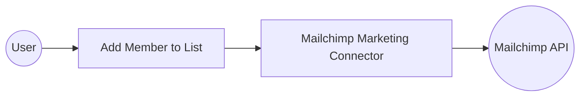

# Example

## What you'll build

Build a WSO2 Integrator automation that subscribes a new member to a Mailchimp mailing list. The integration authenticates via HTTP Basic Auth and calls the Mailchimp Marketing API to add a member to a specified audience list.

**Operations used:**
- **Add member to list** : Subscribes a new member to a Mailchimp audience list by providing the list ID and member details

## Architecture

## Prerequisites

- A Mailchimp account with API access
- Your Mailchimp **username** and **API key** (used as the HTTP Basic Auth password)
- A Mailchimp **List ID** (also called Audience ID) for the target mailing list

## Setting up the Mailchimp Marketing integration

> **New to WSO2 Integrator?** Follow the [Create a New Integration](../../../../develop/create-integrations/create-new-integration.md) guide to set up your integration first, then return here to add the connector.

## Adding the Mailchimp Marketing connector

### Step 1: Open the connector palette

In the left sidebar, hover over **Connections** to reveal the **+** button, then select **+** to open the connector palette.

### Step 2: Search for and select the connector

1. In the **Search** field, enter `mailchimp` to filter the results.
2. Select **Marketing** (the `ballerinax/mailchimp.marketing` connector) from the search results.

## Configuring the Mailchimp Marketing connection

### Step 3: Fill in the connection parameters

In the **Configure Marketing** form, bind each connection parameter to a configurable variable:

- **Connection Name** : Enter `marketingClient`
- **username** : Bind to a new configurable variable named `mailchimpUsername` of type `string`
- **password** : Bind to a new configurable variable named `mailchimpPassword` of type `string`

### Step 4: Save the connection

Select **Save** to create the connection. The `marketingClient` connection node now appears on the design canvas and in the left sidebar under **Connections**.

### Step 5: Set actual values for your configurables

1. In the left panel, select **Configurations**.
2. Set a value for each configurable listed below.

- **mailchimpUsername** (string) : Your Mailchimp account username
- **mailchimpPassword** (string) : Your Mailchimp API key, used as the HTTP Basic Auth password

## Configuring the Mailchimp Marketing add member to list operation

### Step 6: Add an Automation entry point

1. Select **+ Add Artifact** in the design canvas area.
2. Under **Automation**, select **Automation**.
3. In the **Create New Automation** dialog, accept the default settings and select **Create**.

The canvas switches to the Automation flow view, showing a **Start** node, an **Error Handler** node, and an **End** node.

### Step 7: Select and configure the add member to list operation

1. Select the **+** button between **Start** and **Error Handler**.
2. In the **Node Panel**, select **marketingClient** to expand its list of available operations.

3. Scroll to the **Lists** section and select **Add member to list**.
4. Fill in the required fields:

- **ListId** : The unique Mailchimp Audience/List ID to subscribe to
- **Payload** : Member details including email address and subscription status
- **Result** : Variable name to store the API response

Select **Save** to add the operation to the automation flow.

## Try it yourself

Try this sample in WSO2 Integration Platform.

[View source on GitHub](https://github.com/wso2/integration-samples/tree/main/connectors/mailchimp.marketing_connector_sample)

## More code examples

The `Mailchimp Marketing` connector provides practical examples illustrating usage in various scenarios. Explore these [examples](https://github.com/ballerina-platform/module-ballerinax-mailchimp.marketing/tree/main/examples), covering the following use cases:

1. [Add Mailchimp Subscriber](https://github.com/ballerina-platform/module-ballerinax-mailchimp.marketing/tree/main/examples/add_subscriber) – Add a new subscriber to a specific Mailchimp audience list.
2. [List Mailchimp Audiences](https://github.com/ballerina-platform/module-ballerinax-mailchimp.marketing/tree/main/examples/list_audiences) – Fetch and display a list of all your Mailchimp audience lists.
