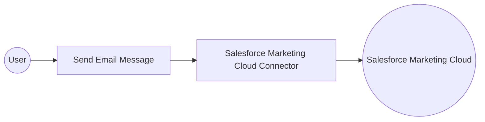

# Example

## What you'll build

Build a WSO2 Integrator automation that connects to Salesforce Marketing Cloud and sends a transactional email using the **Send Email Message** operation. The integration creates a connection to Marketing Cloud using OAuth 2.0 credentials, then calls the send email endpoint with a recipient payload.

**Operations used:**
- **Send Email Message** : Sends a transactional email to one or more recipients using a pre-configured Email Definition key

## Architecture

## Prerequisites

- A Salesforce Marketing Cloud account with an OAuth 2.0 Client Credentials app created
- Your app's `clientId`, `clientSecret`, and `subDomain` values ready

## Setting up the Salesforce Marketing Cloud integration

> **New to WSO2 Integrator?** Follow the [Create a New Integration](../../../../develop/create-integrations/create-new-integration.md) guide to set up your integration first, then return here to add the connector.

## Adding the Salesforce Marketing Cloud connector

### Step 1: Open the connector palette

In the **Connections** section of the left panel, select **Add Connection** to open the connector palette.

### Step 2: Search for and select the Marketing Cloud connector

1. In the search field, enter `marketingcloud`.
2. Locate **Marketingcloud** (`ballerinax/salesforce.marketingcloud`) and select **Add**.

## Configuring the Salesforce Marketing Cloud connection

### Step 3: Fill in the connection parameters

In the **Configure Marketingcloud** form, bind each field to a configurable variable:

- **subDomain** : The subdomain prefix of your Marketing Cloud instance
- **clientId** : The OAuth 2.0 client ID of your Marketing Cloud app
- **clientSecret** : The OAuth 2.0 client secret of your Marketing Cloud app

### Step 4: Save the connection

Select **Save Connection** to persist the connection. The `marketingcloudClient` connection node appears on the design canvas.

### Step 5: Set actual values for your configurables

1. In the left panel, select **Configurations**.
2. Set a value for each configurable listed below.

- **marketingCloudSubDomain** (string) : The subdomain prefix of your Marketing Cloud instance (for example, `mcdev`)
- **marketingCloudClientId** (string) : The OAuth 2.0 client ID of your Marketing Cloud app
- **marketingCloudClientSecret** (string) : The OAuth 2.0 client secret of your Marketing Cloud app

## Configuring the Salesforce Marketing Cloud Send Email Message operation

### Step 6: Add an Automation entry point

1. On the design canvas, select **+ Add Artifact**.
2. Select **Automation** in the artifacts panel.
3. Accept the defaults in the **Create New Automation** form and select **Create**.

The `main` automation is created and the flow canvas opens, showing a **Start** node and an **Error Handler**.

### Step 7: Select the Send Email Message operation and configure its parameters

1. Select the **+** placeholder node between **Start** and **Error Handler**.
2. Under **Connections**, expand **`marketingcloudClient`** to see all available operations.

3. Select **Send Email Message** to open its configuration form.
4. Fill in the operation fields:

- **payload** : A `SendEmailMessageRequest` record containing the `definitionKey` (the key of the Email Definition in Marketing Cloud) and `recipients` (a list of recipient objects each with a `contactKey` and `to` email address)
- **Result** : Auto-generated variable name `marketingcloudSendemailmessageresponse`

5. Select **Save**.

## Try it yourself

Try this sample in WSO2 Integration Platform.

[View source on GitHub](https://github.com/wso2/integration-samples/tree/main/connectors/salesforce.marketingcloud_connector_sample)

## More code examples

The `ballerinax/salesforce.marketingcloud` connector provides practical examples illustrating usage in various scenarios. Explore these [examples](https://github.com/ballerina-platform/module-ballerinax-salesforce.marketingcloud/tree/main/examples) to understand common Salesforce Marketing Cloud integration patterns.

1. [**Seasonal Journey**](https://github.com/ballerina-platform/module-ballerinax-salesforce.marketingcloud/tree/main/examples/seasonal-journey) – Shows how to enroll new users into the Seasonal Journey by adding a row to a Data Extension, with checks to prevent enrolling users who are already part of the Rewin Journey.
2. [**Sync Images**](https://github.com/ballerina-platform/module-ballerinax-salesforce.marketingcloud/tree/main/examples/sync-images) - demonstrates how to synchronize images from Digital Asset Management (DAM) systems to Salesforce Marketing Cloud Content Builder using the Ballerina client. It retrieves images from external URLs, encodes them in base64, and uploads them to a specified category (folder) in Content Builder.
