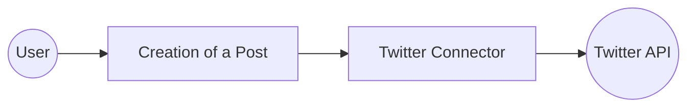

# Example

## What you'll build

Build a Twitter (X) integration that posts a tweet using the `ballerinax/twitter` connector in WSO2 Integrator's low-code canvas. The integration uses an Automation entry point to call the **Creation of a Post** operation via a securely configured `twitterClient` connection.

**Operations used:**
- **Creation of a Post** : Creates a new tweet on Twitter (X) using a `TweetCreateRequest` payload

---

## Architecture

---

## Prerequisites

- An active Twitter (X) Developer account with a Bearer Token

---

## Setting up the Twitter integration

> **New to WSO2 Integrator?** Follow the [Create a New Integration](../../../../develop/create-integrations/create-a-new-integration.md) guide to set up your integration first, then return here to add the connector.

---

## Adding the Twitter connector

### Step 1: Open the add connection palette

In the WSO2 Integrator sidebar, hover over the **Connections** section and select **Add Connection** (the **+** icon) to open the Add Connection palette.

### Step 2: Select the Twitter connector

Search for `twitter` in the palette and select **ballerinax/twitter** from the results to open the connection configuration form.

---

## Configuring the Twitter connection

### Step 3: Fill in the connection parameters

Enter the connection details, binding each field to a configurable variable:

- **connectionName** : Enter `twitterClient` as the connection name
- **config** : Select the **Record** editor icon to open the Record Configuration modal, expand **auth**, select **BearerTokenConfig**, and for the `token` field select **+ New Configurable** to create a new configurable variable named `twitterBearerToken` of type `string`

### Step 4: Save the connection

Select **Save** to persist the connection. The `twitterClient` connection appears in the Connections panel.

### Step 5: Set actual values for your configurables

1. In the left panel, select **Configurations**.
2. Set a value for each configurable listed below.

- **twitterBearerToken** (string) : Your Twitter (X) Developer Bearer Token with write permissions

---

## Configuring the Twitter creation of a post operation

### Step 6: Add an automation entry point

1. In the sidebar, hover over **Entry Points** and select **Add Entry Point**.
2. Select **Automation** from the Artifacts panel.
3. Leave the defaults and select **Create**.

The canvas switches to the Automation flow view showing **Start → (empty placeholder) → Error Handler → End**.

### Step 7: Select and configure the creation of a post operation

1. Select the **+** (Add Step) button between the **Start** and **Error Handler** nodes on the canvas.
2. Under **Connections**, select **twitterClient** to expand it and reveal all available Twitter API operations.

3. Scroll to the **Posts** group and select **Creation of a Post**.
4. Configure the operation fields:
   - **payload** : Select **Record**, check the `text` field checkbox, and enter your tweet text in the Record Configuration modal
   - **result** : Leave as `twitterTweetcreateresponse` (auto-generated)

5. Select **Save**.

## Try it yourself

Try this sample in WSO2 Integration Platform.

[View source on GitHub](https://github.com/wso2/integration-samples/tree/main/connectors/twitter_connector_sample)

## More code examples

The `Twitter` connector provides practical examples illustrating usage in various scenarios. Explore these [examples](https://github.com/ballerina-platform/module-ballerinax-twitter/tree/main/examples/), covering the following use cases:

1. [Direct message company mentions](https://github.com/ballerina-platform/module-ballerinax-twitter/tree/main/examples/DM-mentions) - Integrate Twitter to send direct messages to users who mention the company in tweets.

2. [Tweet performance tracker](https://github.com/ballerina-platform/module-ballerinax-twitter/tree/main/examples/tweet-performance-tracker) - Analyze the performance of tweets posted by a user over the past month.
