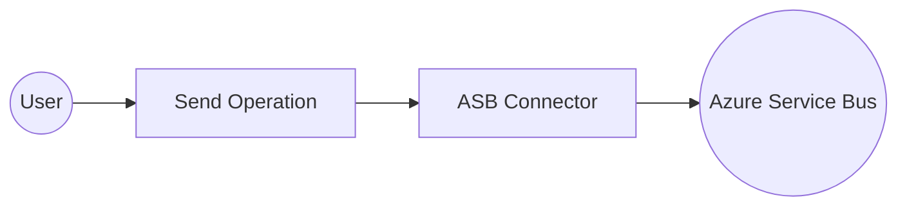
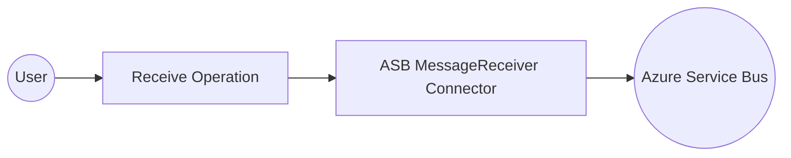

# Examples

- [ASB MessageSender Example](#asb-messagesender-example)
- [ASB MessageReceiver Example](#asb-messagereceiver-example)

## ASB MessageSender Example

### What you'll build

Build a WSO2 Integrator automation that sends a message to an Azure Service Bus topic or queue using the `ballerinax/asb` connector. The integration connects to your Azure Service Bus namespace and delivers a structured message with content type and label metadata.

**Operations used:**
- **Send** : Sends an `asb:Message` record to the configured Azure Service Bus topic or queue

### Architecture

### Prerequisites

- An active Azure Service Bus namespace with a topic or queue
- Your connection string and topic or queue name ready

### Setting up the ASB integration

> **New to WSO2 Integrator?** Follow the [Create a New Integration](../../../../develop/create-integrations/create-new-integration.md) guide to set up your integration first, then return here to add the connector.

### Adding the ASB connector

#### Step 1: Search for the ASB connector in the palette

Select **Add Connection** in the WSO2 Integrator panel to open the connector search palette, then search for **Azure Service Bus**.

### Configuring the ASB connection

#### Step 2: Fill in the connection parameters

Select the **Azure Service Bus** connector card to open the configuration form. Bind each field to a configurable variable:

- **config** : The `ASBServiceSenderConfig` record expression containing `entityType`, `topicOrQueueName`, and `connectionString`, each bound to a configurable variable
- **connectionName** : The name used to identify this connection on the canvas

#### Step 3: Save the connection

Select **Save Connection** to persist the connection. The `asbMessagesender` entry now appears under **Connections** in the project tree.

#### Step 4: Set actual values for your configurables

In the left panel, select **Configurations**. Set a value for each configurable listed below:

- **asbConnectionString** (string) : The full Azure Service Bus connection string for your namespace
- **asbEntityPath** (string) : The name of the topic or queue to send messages to

### Configuring the ASB Send operation

#### Step 5: Add an Automation entry point

1. Navigate to the **MessageSenderAutomation** integration overview.
2. Select **Add Artifact**.
3. Under **Automation**, select the **Automation** tile.
4. Select **Create** to confirm with default settings.

The design canvas opens showing a bare flow: **Start → Error Handler**.

#### Step 6: Select and configure the Send operation

1. On the canvas, select the **⊕** node between **Start** and **Error Handler**.
2. Under **Connections**, expand **asbMessagesender** to see available operations.

3. Select **Send** to open the configuration form.
4. In the **Expression** tab, enter an `asb:Message` record with `body`, `contentType`, and `label` values.
5. Select **Save**.

### Try it yourself

Try this sample in WSO2 Integration Platform.

[View source on GitHub](https://github.com/wso2/integration-samples/tree/main/connectors/asb_message_sender_connector_sample)

### More code examples

There are two sets of examples demonstrating the use of the Ballerina Azure Service Bus (ASB) Connector.

- **[Management Related Examples](https://github.com/ballerina-platform/module-ballerinax-azure-service-bus/tree/main/examples/admin)**: These examples cover operations related to managing the Service Bus, such as managing queues, topics, subscriptions, and rules.

- **[Message Sending and Receiving Related Examples](https://github.com/ballerina-platform/module-ballerinax-azure-service-bus/tree/main/examples/sender_reciever)**: This set includes examples for sending to and receiving messages from queues, topics, and subscriptions in the Service Bus.

## ASB MessageReceiver Example

### What you'll build

Build an Azure Service Bus (ASB) message receiver integration that polls a queue, receives an `asb:Message`, and logs it as JSON. The integration uses the `ballerinax/asb` connector inside WSO2 Integrator to connect to an Azure Service Bus namespace and process messages from a specified queue.

**Operations used:**
- **Receive** : Polls the Azure Service Bus queue and receives a full `asb:Message` object

### Architecture

### Prerequisites

- An active Azure Service Bus namespace with at least one queue
- A primary or secondary connection string from the Azure portal
- The name of the queue to receive messages from

### Setting up the ASB MessageReceiver integration

> **New to WSO2 Integrator?** Follow the [Create a New Integration](../../../../develop/create-integrations/create-new-integration.md) guide to set up your integration first, then return here to add the connector.

### Adding the ASB MessageReceiver connector

Add the ASB MessageReceiver connector to your integration from the **Connections** panel.

#### Step 1: Open the Add connection panel

1. In the WSO2 Integrator side panel, hover over **Connections** and select the **+** button.
2. In the search field, enter `asb` to filter connectors.
3. Select **ASB MessageReceiver** from the results.

### Configuring the ASB MessageReceiver connection

Configure the connection form by binding each field to a configurable variable.

#### Step 2: Fill in the connection parameters

Bind each connection parameter to a configurable variable so sensitive values are supplied at runtime.

- **connectionString** : The Azure Service Bus primary or secondary connection string
- **entityConfig** : A `QueueConfig` record specifying the target queue name (`asbQueueName`)
- **Connection Name** : A unique name for this connection — enter `asbMessagereceiver`

#### Step 3: Save the connection

Select **Save** to persist the connection. The canvas refreshes and shows the `asbMessagereceiver` connection node.

#### Step 4: Set actual values for your configurables

1. In the left panel, select **Configurations**.
2. Set a value for each configurable listed below.

- **asbConnectionString** (string) : The Azure Service Bus connection string copied from the Azure portal under **Shared Access Policies**
- **asbQueueName** (string) : The name of the queue to receive messages from

### Configuring the ASB MessageReceiver receive operation

#### Step 5: Add an Automation entry point

1. In the WSO2 Integrator side panel, hover over **Entry Points** and select the **+** button.
2. Select **Automation** from the artifacts panel.
3. Leave the default name (`main`) and select **Create**.

The canvas switches to the Automation flowchart view showing a **Start** node and an **Error Handler** node.

#### Step 6: Select and configure the Receive operation

1. Select the **+** button on the placeholder between **Start** and **Error Handler** to open the step panel.
2. Under **Connections**, expand **asbMessagereceiver** to reveal available operations.
3. Select **Receive** to open the operation configuration panel.

Configure the output fields:
- **Result** : Enter `result` as the output variable name
- **Expected Type** : Select `asb:Message`

Select **Save** to add the node to the canvas.

### Try it yourself

Try this sample in WSO2 Integration Platform.

[View source on GitHub](https://github.com/wso2/integration-samples/tree/main/connectors/asb_message_receiver_sample)

### More code examples

There are two sets of examples demonstrating the use of the Ballerina Azure Service Bus (ASB) Connector.

- **[Management Related Examples](https://github.com/ballerina-platform/module-ballerinax-azure-service-bus/tree/main/examples/admin)**: These examples cover operations related to managing the Service Bus, such as managing queues, topics, subscriptions, and rules.

- **[Message Sending and Receiving Related Examples](https://github.com/ballerina-platform/module-ballerinax-azure-service-bus/tree/main/examples/sender_reciever)**: This set includes examples for sending to and receiving messages from queues, topics, and subscriptions in the Service Bus.
