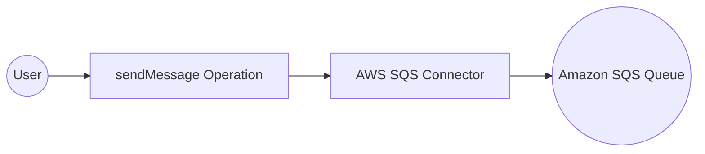

# Example

## What you'll build

Build an integration that sends a message to an Amazon SQS queue using the AWS SQS connector. The integration creates a connection to SQS using static AWS credentials and invokes the `sendMessage` operation from an automation entry point.

**Operations used:**
- **sendMessage** : Sends a message to the specified SQS queue URL

## Architecture

## Prerequisites

- An AWS account with SQS access and an existing SQS queue
- Your AWS Access Key ID and Secret Access Key

## Setting up the AWS SQS integration

> **New to WSO2 Integrator?** Follow the [Create a New Integration](../../../../develop/create-integrations/create-new-integration.md) guide to set up your integration first, then return here to add the connector.

## Adding the AWS SQS connector

### Step 1: Open the connector palette

Select **+ Add Connection** on the integration canvas to open the connector palette.

## Configuring the AWS SQS connection

### Step 2: Fill in the connection parameters

Search for `sqs` to locate the **AWS SQS** connector card, then select it to open the **Configure SQS** form. Bind each connection parameter to a configurable variable:

- **region** : The AWS region where your SQS queue resides
- **accessKeyId** : AWS Access Key ID, bound to a configurable variable
- **secretAccessKey** : AWS Secret Access Key, bound to a configurable variable
- **connectionName** : The name for this connection instance

### Step 3: Save the connection

Select **Save Connection** to persist the connection. The `sqsClient` connection appears as a node on the design canvas and under **Connections** in the sidebar.

### Step 4: Set actual values for your configurables

In the left panel, select **Configurations**. Set a value for each configurable listed below:

- **sqsAccessKey** (string) : Your AWS Access Key ID
- **sqsSecretKey** (string) : Your AWS Secret Access Key

## Configuring the AWS SQS sendMessage operation

### Step 5: Add an automation entry point

Select **+ Add Artifact** on the canvas toolbar, then select **Automation** and select **Create** to generate a new automation entry point named `main`.

### Step 6: Select and configure the sendMessage operation

Select the **+** (Add Step) button in the automation flow body, expand **sqsClient** under **Connections**, and select **Send Message** to open the `sendMessage` operation configuration form. Fill in the following fields:

- **queueUrl** : The full URL of the target SQS queue
- **messageBody** : The message content to send to the queue

Select **Save** to add the operation to the flow.

## Try it yourself

Try this sample in WSO2 Integration Platform.

[View source on GitHub](https://github.com/wso2/integration-samples/tree/main/connectors/aws.sqs_connector_sample)

## More code examples

The `ballerinax/aws.sqs` connector provides practical examples illustrating usage in various scenarios. Explore these [examples](https://github.com/ballerina-platform/module-ballerinax-aws.sqs/tree/master/examples):

1. [**Basic Queue Consumer**](https://github.com/ballerina-platform/module-ballerinax-aws.sqs/tree/master/examples/basic-queue-consumer) – Demonstrates creating a standard SQS queue, sending messages, and consuming them using a Ballerina listener.
2. [**Basic Queue Operations**](https://github.com/ballerina-platform/module-ballerinax-aws.sqs/tree/master/examples/basic-queue-operations) – Shows how to create a queue, send, receive, and delete messages, and delete the queue.
3. [**Advanced Messaging Features**](https://github.com/ballerina-platform/module-ballerinax-aws.sqs/tree/master/examples/advanced-messaging-features) – Demonstrates advanced messaging features such as message attributes, batch sending, and custom queue attributes.
4. [**FIFO Queue**](https://github.com/ballerina-platform/module-ballerinax-aws.sqs/tree/master/examples/fifo-queue) – Shows how to work with FIFO queues, including sending messages with different `messageGroupId`s and grouping received messages.
