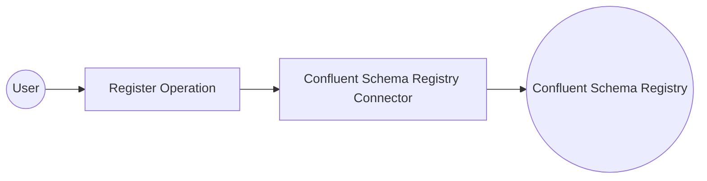

# Example

## What you'll build

Build a WSO2 Integrator automation that uses the Confluent Schema Registry connector to register an Avro schema with a running Confluent Schema Registry instance. The integration captures the returned schema ID and logs it to standard output.

**Operations used:**
- **Register** : Registers a schema under a named subject and returns the assigned schema ID as an integer

## Architecture

## Prerequisites

- Access to a running Confluent Schema Registry instance

## Setting up the Confluent Schema Registry integration

> **New to WSO2 Integrator?** Follow the [Create a New Integration](../../../../develop/create-integrations/create-new-integration.md) guide to set up your integration first, then return here to add the connector.

## Adding the Confluent Schema Registry connector

### Step 1: Open the connector palette

1. In the WSO2 Integrator panel, select **Add Artifact**.
2. Select **Connection** from the artifact list.
3. Enter `confluent.cregistry` in the search box.
4. Select the **Cregistry** connector tile to open the connection configuration form.

## Configuring the Confluent Schema Registry connection

### Step 2: Bind connection parameters to configurable variables

Enter the connection parameters, binding each field to a configurable variable:

- **baseUrl** : The URL of the Confluent Schema Registry service

### Step 3: Save the connection

Select **Save** to create the connection. The `cregistryClient` connection node appears in the WSO2 Integrator project.

### Step 4: Set actual values for your configurables

1. In the left panel, select **Configurations**.
2. Set a value for each configurable listed below.

- **cregistryServiceUrl** (string) : The base URL of your Confluent Schema Registry instance

## Configuring the Confluent Schema Registry Register operation

### Step 5: Add an Automation entry point

1. In the WSO2 Integrator panel, select **Add Artifact**.
2. Select **Automation** as the artifact type.
3. Accept the default name `main` and select **Create**.

### Step 6: Select and configure the Register operation

1. In the Automation flow, select the **+** button between the **Start** and **Error Handler** nodes.
2. Under **Connections**, expand **cregistryClient**.
3. Select **Register** to open the operation configuration form.

Configure the following fields:

- **subject** : The subject name under which the schema will be registered
- **schema** : The Avro schema definition as a JSON string
- **result** : Name of the variable to hold the returned schema ID
- **resultType** : Set to `int`—the registry returns the schema ID as an integer

Select **Save** to add the operation to the flow.

## Try it yourself

Try this sample in WSO2 Integration Platform.

[View source on GitHub](https://github.com/wso2/integration-samples/tree/main/connectors/confluent.cregistry_connector_sample)
