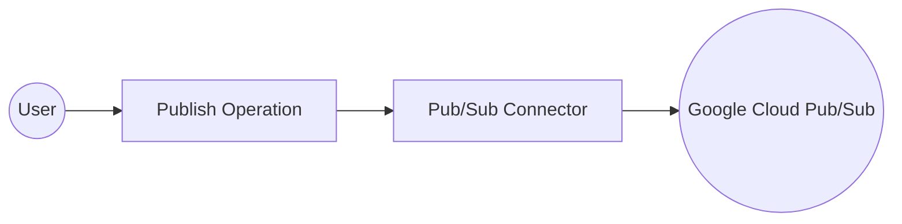

# Example

## What you'll build

Build a low-code integration that publishes messages to a Google Cloud Pub/Sub topic using the `ballerinax/gcloud.pubsub` connector in WSO2 Integrator. The integration uses an Automation entry point to trigger the publish operation and binds all connection and message parameters to configurable variables.

**Operations used:**
- **Publish** : Publishes a single message to the configured Pub/Sub topic and returns the published message ID

## Architecture

## Prerequisites

- A Google Cloud project with Pub/Sub API enabled
- A service account with the Pub/Sub Publisher role and its JSON key
- A Pub/Sub topic already created in your Google Cloud project

## Setting up the Pub/Sub integration

> **New to WSO2 Integrator?** Follow the [Create a New Integration](../../../../develop/create-integrations/create-new-integration.md) guide to set up your integration first, then return here to add the connector.

## Adding the Pub/Sub connector

### Step 1: Open the connector palette and search for Pub/Sub

1. In the side panel, expand **Connections** and select **Add Connection**.
2. The **Add Connection** panel opens, showing the connector palette with all available connectors.
3. Enter `pubsub` in the search box.
4. Select **Pub/Sub Publisher** (`ballerinax/gcloud.pubsub`).

## Configuring the Pub/Sub connection

### Step 2: Fill in the connection parameters

After selecting **Pub/Sub Publisher**, the connection configuration form opens. Fill in every field by binding it to a configurable variable using the helper panel. For each field, select the **Open Helper Panel** icon to the right of the input box, switch to the **Configurables** tab, then select **New Configurable** to create the variable.

- **topicName** : Full Pub/Sub topic resource name (e.g., `projects/my-project/topics/my-topic`)
- **projectId** : Google Cloud project ID
- **credentials** : Service account credentials — select the **Expression** toggle and enter `{credentialsJson: pubsubAuthToken}`, where `pubsubAuthToken` is a `string` configurable holding the service account JSON

> **Note:** The `pubsub:Credentials` record supports `credentialsPath?` (path to a credentials file) and `credentialsJson?` (the JSON string directly). Use `credentialsJson` when passing credentials as a string.

The **Connection Name** field defaults to `pubsubPublisher`. Keep this value.

### Step 3: Save the connection

Select **Save** to create the connection. The canvas updates and the **pubsubPublisher** connection node appears.

### Step 4: Set actual values for your configurables

1. In the left panel, select **Configurations**.
2. Set a value for each configurable listed below.

- **pubsubTopicName** (string) : Full topic resource name, e.g., `projects/YOUR_PROJECT_ID/topics/YOUR_TOPIC_NAME`
- **pubsubProjectId** (string) : Your Google Cloud project ID
- **pubsubAuthToken** (string) : Service account JSON credentials string
- **pubsubMessagePayload** (string) : Message content to publish

## Configuring the Pub/Sub publish operation

### Step 5: Add an Automation entry point

1. In the side panel, expand **Entry Points**.
2. Select **Add Artifact** and choose **Automation**.
3. The Automation entry point named `main` is created and appears under **Entry Points**.
4. Select **main** to open the Automation flow canvas.

### Step 6: Select and configure the publish operation

1. In the node panel on the right side of the Automation canvas, locate the **pubsubPublisher** connection and select it to expand the available operations.

2. Select **Publish** to open the operation configuration form.
3. Configure the operation fields:
   - **Message** : Select the **Expression** toggle, then create a `string` configurable named `pubsubMessagePayload` via the helper panel. Enter `{data: pubsubMessagePayload.toBytes()}` as the expression — `.toBytes()` converts the string to `byte[]` as required by `pubsub:Message`.
   - **Result** : Leave as `result` (the variable name for the returned message ID)
   - **Result Type** : `string` (the `publish` operation returns the published message ID)
4. Select **Save** to add the `publish` step to the flow.

## Try it yourself

Try this sample in WSO2 Integration Platform.

[View source on GitHub](https://github.com/wso2/integration-samples/tree/main/connectors/gcloud.pubsub_connector_sample)
