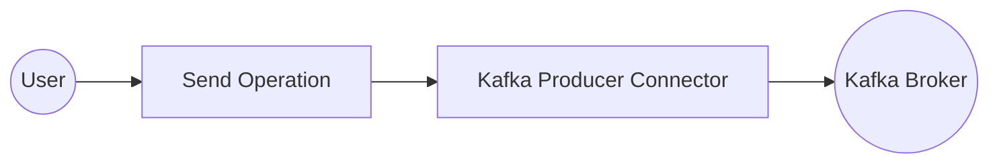
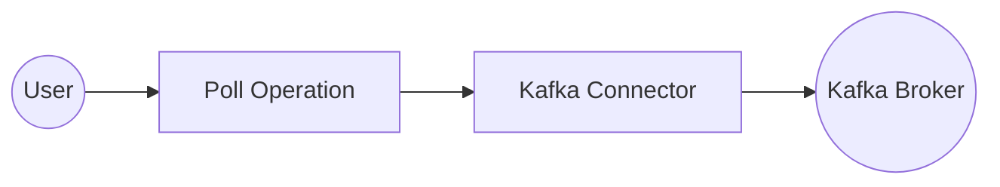

# Example

## Table of Contents

- [Kafka Producer Example](#kafka-producer-example)
- [Kafka Consumer Example](#kafka-consumer-example)

## Kafka Producer Example

### What you'll build

Build a Kafka producer integration that publishes a message to the `orders` Kafka topic on every run. The integration uses an Automation entry point to trigger the message send automatically.

**Operations used:**
- **Send** : Publishes a producer record (topic and value) to a specified Kafka topic

### Architecture

### Prerequisites

- A running Kafka broker with the bootstrap servers address ready

### Setting up the Kafka Producer integration

> **New to WSO2 Integrator?** Follow the [Create a New Integration](../../../../develop/create-integrations/create-new-integration.md) guide to set up your integration first, then return here to add the connector.

### Adding the Kafka Producer connector

Select **Add Connection** from the low-code canvas to open the connector palette.

#### Step 1: Search for and select the Kafka Producer connector

1. Enter `kafka` in the search box.
2. Select **Kafka Producer** from the results to open the **Configure Kafka Producer** form.

### Configuring the Kafka Producer connection

#### Step 2: Bind connection parameters to configurable variables

Bind the bootstrap servers field to a configurable variable rather than entering a hardcoded value.

- **Bootstrap Servers** : The Kafka broker address, bound to a configurable variable
- **Connection Name** : A unique name identifying this connection on the canvas

#### Step 3: Save the connection

Select **Save** on the connection form. The canvas updates to show the `kafkaProducer` connection node.

#### Step 4: Set actual values for your configurables

1. In the left panel, select **Configurations**.
2. Set a value for each configurable listed below.

- **kafkaBootstrapServers** (string) : The bootstrap servers address of your running Kafka broker (for example, `broker-host:9092`)

### Configuring the Kafka Producer Send operation

#### Step 5: Add an Automation entry point

1. In the left panel under **Entry Points**, select **+** (**Add Entry Point**).
2. Select **Automation** from the entry point type list.
3. Accept the default name `main` and select **Save**.

The Automation flow opens on the canvas with a **Start** node and an **Error Handler** node.

#### Step 6: Select and configure the Send operation

Select the **+** drop zone between **Start** and **Error Handler** on the canvas to open the **Add Step** panel. Expand the **kafkaProducer** connection to reveal all available operations.

Select **Send** to open the **kafkaProducer → send** configuration form, then configure the **Producer Record** field with the following values:

- **topic** : The Kafka topic to publish to (`"orders"`)
- **value** : The message payload as a byte array

Select **Save**. The `kafka : send` node is added to the Automation flow.

### Try it yourself

Try this sample in WSO2 Integration Platform.

[View source on GitHub](https://github.com/wso2/integration-samples/tree/main/connectors/kafka_producer_connector_sample)

### More code examples

The following example shows how to use the Ballerina `kafka` connector to produce and consume messages using an Apache Kafka message broker.

- [**Order manager**](https://github.com/ballerina-platform/module-ballerinax-kafka/tree/master/examples/order-manager): A simple order management system that uses Kafka to process orders.
- [**Word count calculator**](https://github.com/ballerina-platform/module-ballerinax-kafka/tree/master/examples/secured-word-count-calculator): A word count calculator that reads messages from a Kafka topic and counts the occurrences of each word.
- [**Twitter filter**](https://github.com/ballerina-platform/module-ballerinax-kafka/tree/master/examples/twitter-filter): A Twitter filter that reads tweets from a Kafka topic and filters them based on certain criteria.
- [**Stock trading analyzer**](https://github.com/ballerina-platform/module-ballerinax-kafka/tree/master/examples/stock-trading-analyzer): This example demonstrates a simulated stock trading system built using Kafka and Ballerina.
- [**Banking transaction processor**](https://github.com/ballerina-platform/module-ballerinax-kafka/tree/master/examples/banking-transaction-system): A banking transaction processor that processes banking transactions using Kafka. It illustrates how banking transactions can be published and consumed in real time, while also integrating with Confluent Schema Registry to manage message schemas between the producer and consumer.

---
## Kafka Consumer Example

### What you'll build

Build a Kafka Consumer integration using the WSO2 Integrator low-code canvas with the `ballerinax/kafka` connector. The integration creates an Automation that polls a Kafka broker for messages on every trigger cycle and stores the consumed records for further processing.

**Operations used:**
- **Poll** : Polls the Kafka broker for available messages and returns consumed records as a typed array

### Architecture

### Prerequisites

- A running Kafka broker reachable from your integration environment

### Setting up the Kafka integration

> **New to WSO2 Integrator?** Follow the [Create a New Integration](../../../../develop/create-integrations/create-new-integration.md) guide to set up your integration first, then return here to add the connector.

### Adding the Kafka connector

#### Step 1: Open the Add connection palette

Select **Connections** in the project tree, then select the **+** icon next to **Connections** to open the **Add Connection** palette.

#### Step 2: Search for and select the Kafka connector

1. Enter `kafka` in the search field.
2. Select the **Kafka** connector tile to open the connection configuration form.

### Configuring the Kafka connection

#### Step 3: Fill in the connection parameters

Set the **Connection Name** to `kafkaConsumer`, then bind each parameter to a configurable variable using the helper panel.

- **bootstrapServers** : The Kafka broker address used to bootstrap the consumer connection
- **groupId** : The consumer group ID that identifies this consumer within a group
- **clientId** : A unique identifier for this Kafka client instance

#### Step 4: Save the connection

Select **Save** to persist the connection. The `kafkaConsumer` connection node appears on the Connections canvas.

#### Step 5: Set actual values for your configurables

In the left panel, select **Configurations**, then set a value for each configurable listed below.

- **kafkaBootstrapServers** (string) : The address of your Kafka broker (for example, `broker-host:9092`)
- **kafkaGroupId** (string) : The consumer group ID for this integration (for example, `my-consumer-group`)
- **kafkaClientId** (string) : A unique client identifier for this consumer (for example, `my-kafka-client`)

### Configuring the Kafka Poll operation

#### Step 6: Add an Automation entry point

In the WSO2 Integrator panel, expand **Entry Points**, then select **+ Add Entry Point** and choose **Automation**. An entry point named `main` is created and the Automation flow canvas opens.

#### Step 7: Select and configure the Poll operation

Select the **+** button on the flow connector between **Start** and the placeholder node to open the node panel. Under **Connections**, select **kafkaConsumer** to expand its operations list, then select **Poll**.

Fill in the Poll operation fields:

- **Timeout** : Polling time in seconds; enter `5`
- **Result** : Name of the variable that holds the consumed records; enter `pollResult`
- **T** : Type descriptor for the returned records; enter `kafka:AnydataConsumerRecord[]`

Select **Save**. The canvas updates to show the complete Automation flow with **Start** → `kafka : poll` → **Error Handler** → **End**.

### Try it yourself

Try this sample in WSO2 Integration Platform.

[View source on GitHub](https://github.com/wso2/integration-samples/tree/main/connectors/kafka_consumer_connector_sample)

### More code examples

The following example shows how to use the Ballerina `kafka` connector to produce and consume messages using an Apache Kafka message broker.

- [**Order manager**](https://github.com/ballerina-platform/module-ballerinax-kafka/tree/master/examples/order-manager): A simple order management system that uses Kafka to process orders.
- [**Word count calculator**](https://github.com/ballerina-platform/module-ballerinax-kafka/tree/master/examples/secured-word-count-calculator): A word count calculator that reads messages from a Kafka topic and counts the occurrences of each word.
- [**Twitter filter**](https://github.com/ballerina-platform/module-ballerinax-kafka/tree/master/examples/twitter-filter): A Twitter filter that reads tweets from a Kafka topic and filters them based on certain criteria.
- [**Stock trading analyzer**](https://github.com/ballerina-platform/module-ballerinax-kafka/tree/master/examples/stock-trading-analyzer): This example demonstrates a simulated stock trading system built using Kafka and Ballerina.
- [**Banking transaction processor**](https://github.com/ballerina-platform/module-ballerinax-kafka/tree/master/examples/banking-transaction-system): A banking transaction processor that processes banking transactions using Kafka. It illustrates how banking transactions can be published and consumed in real time, while also integrating with Confluent Schema Registry to manage message schemas between the producer and consumer.
