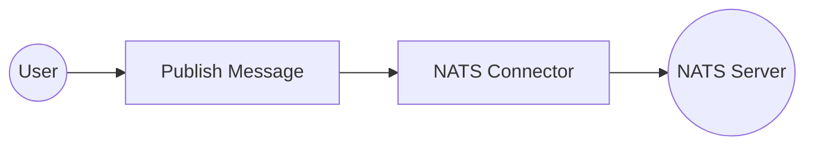

# Example

## What you'll build

Build a WSO2 Integrator automation that connects to a NATS server and publishes a message to a subject. The integration uses a configurable variable for the NATS server URL, making it easy to switch environments without changing the integration logic.

**Operations used:**
- **Publish Message** (`publishMessage`) : Publishes a byte-encoded message to the `integrations.events` subject on the configured NATS server

## Architecture

## Prerequisites

- A running NATS server accessible from your integration environment

## Setting up the NATS integration

> **New to WSO2 Integrator?** Follow the [Create a New Integration](../../../../develop/create-integrations/create-new-integration.md) guide to set up your integration first, then return here to add the connector.

## Adding the NATS connector

### Step 1: Open the Add connection panel

In the WSO2 Integrator panel, expand your project and select the **+** button next to **Connections** to open the Add Connection palette.

### Step 2: Select the NATS connector

1. Enter `nats` in the search box.
2. Select the card labelled **Nats** (the standard, non-JetStream connector—not "Nats JetStream" or "Nats JetStream Listener").

## Configuring the NATS connection

### Step 3: Fill in the connection parameters

Fill in the **Configure Nats** form, binding each field to a configurable variable:

- **Connection Name** : Enter `natsClient` as the connection identifier
- **Url** : Bind to a new configurable variable named `natsUrl` of type `string` using the **Configurables** tab in the helper panel

### Step 4: Save the connection

Select **Save** to persist the connection. The `natsClient` connection node appears on the canvas.

### Step 5: Set actual values for your configurables

1. In the left panel, select **Configurations**.
2. Set a value for each configurable listed below.

- **natsUrl** (string) : The URL of your NATS server (for example, `nats://your-nats-server:4222`)

## Configuring the NATS Publish Message operation

### Step 6: Add an Automation entry point

1. In the WSO2 Integrator panel, expand your project and select **Entry Points**.
2. Select the **+** button, choose **Automation** from the options, and select **Save**.

The Automation canvas opens showing a **Start** node and an **Error Handler** node.

### Step 7: Select and configure the Publish Message operation

1. On the Automation canvas, select the **+** button between **Start** and **Error Handler**.
2. Under the **Connections** section, expand **natsClient** to reveal available operations.

3. Select **Publish Message** to open the `natsClient → publishMessage` form.
4. In the **Message** field, select the **Expression** tab and enter the message record with `content` and `subject` fields.

- **Message** : An `AnydataMessage` record containing `content` (the byte-encoded payload) and `subject` (`integrations.events`)

Select **Save**. The `nats : publishMessage` node is added to the Automation flow.

## Try it yourself

Try this sample in WSO2 Integration Platform.

[View source on GitHub](https://github.com/wso2/integration-samples/tree/main/connectors/nats_connector_sample)
