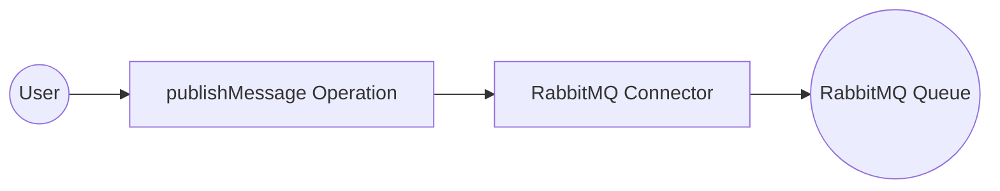

# Example

## What you'll build

Build a WSO2 Integrator automation that publishes a message to a RabbitMQ queue using the **ballerinax/rabbitmq** connector. The integration sends `"Hello, RabbitMQ!"` to a queue named `myQueue`, with all connection credentials bound to configurable variables so no secrets are hard-coded.

**Operations used:**
- **publishMessage** : Publishes a message to a specified RabbitMQ queue using a routing key

## Architecture

## Prerequisites

- A running RabbitMQ server accessible from your integration environment
- RabbitMQ credentials (username, password, virtual host, host, and port)

## Setting up the RabbitMQ integration

> **New to WSO2 Integrator?** Follow the [Create a New Integration](../../../../develop/create-integrations/create-new-integration.md) guide to set up your integration first, then return here to add the connector.

## Adding the RabbitMQ connector

### Step 1: Open the Add Connection panel

In the left sidebar, under **Connections**, select **+ Add Connection** to open the connector palette.

### Step 2: Add an Automation entry point

In the left sidebar, hover over **Entry Points** and select **+ Add Entry Point**. On the artifact selection panel, choose **Automation**, then select **Create**.

A new automation named `main` appears in the sidebar under **Entry Points**, and the low-code flow canvas opens showing a **Start → Error Handler** skeleton.

## Configuring the RabbitMQ connection

### Step 3: Fill in the connection parameters

Search for `RabbitMQ`, select the **ballerinax/rabbitmq** connector card, and bind each field to a configurable variable using the **Helper Panel**.

- **host** : The RabbitMQ server hostname, bound to a configurable variable
- **port** : The RabbitMQ server port (switch to **Expression** mode to access the Helper Panel for `int` fields), bound to a configurable variable
- **username** : The RabbitMQ username (expand **Advanced Configurations**), bound to a configurable variable
- **password** : The RabbitMQ password, bound to a configurable variable
- **virtualHost** : The RabbitMQ virtual host, bound to a configurable variable

Set the **Connection Name** to `rabbitmqClient`.

### Step 4: Save the connection

Select **Save Connection**. The canvas returns to the overview, showing the `rabbitmqClient` connection node.

### Step 5: Set actual values for your configurables

1. In the left panel, select **Configurations**.
2. Set a value for each configurable listed below.

- **rabbitmqHost** (string) : The hostname or IP address of your RabbitMQ server
- **rabbitmqPort** (int) : The port your RabbitMQ server listens on
- **rabbitmqUsername** (string) : The username for authenticating with RabbitMQ
- **rabbitmqPassword** (string) : The password for authenticating with RabbitMQ
- **rabbitmqVirtualHost** (string) : The virtual host to connect to on the RabbitMQ server

## Configuring the RabbitMQ publishMessage operation

### Step 6: Select the publishMessage operation and configure it

On the flow canvas, select the **+** button between **Start** and **Error Handler**. Under **Connections → rabbitmqClient**, expand the connection to see all available operations.

Select **Publish Message** and configure the **Message** field by switching to **Expression** mode and entering the record literal with the fields below.

- **content** : The message payload to publish — set to `"Hello, RabbitMQ!"`
- **routingKey** : The target queue name — set to `"myQueue"`

Select **Save**. The `publishMessage` node appears on the canvas connected to `rabbitmqClient`.

## Try it yourself

Try this sample in WSO2 Integration Platform.

[View source on GitHub](https://github.com/wso2/integration-samples/tree/main/connectors/rabbitmq_connector_sample)
