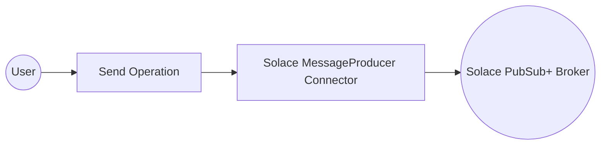
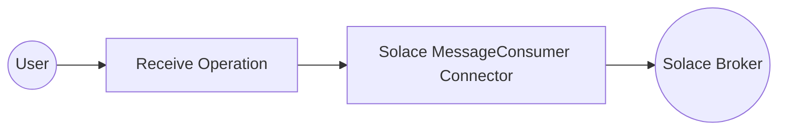

# Examples

- [Solace Producer Example](#solace-producer-example)
- [Solace Consumer Example](#solace-consumer-example)

## Solace Producer Example

#### What you'll build

Build a Solace PubSub+ message-publishing integration using the WSO2 Integrator low-code visual designer. The integration connects to a Solace PubSub+ broker and publishes a message to a configured topic, with all connection parameters stored as configurable variables.

**Operations used:**
- **Send** : Publishes a message to the Solace PubSub+ broker on a configured topic

#### Architecture

#### Prerequisites

- A running Solace PubSub+ broker with access to a host URL, message VPN, username, and password

#### Setting up the Solace MessageProducer integration

> **New to WSO2 Integrator?** Follow the [Create a New Integration](../../../../develop/create-integrations/create-new-integration.md) guide to set up your integration first, then return here to add the connector.

#### Adding the Solace MessageProducer connector

##### Step 1: Open the connector palette

1. Navigate to the **Connections** section in the WSO2 Integrator panel.
2. Select **+ Add Connection** to open the connector marketplace palette.
3. Enter `solace` in the search box to filter results.
4. Select **Solace MessageProducer** from the list.

#### Configuring the Solace MessageProducer connection

##### Step 2: Fill in connection parameters

Bind all sensitive parameters to configurable variables so they can be overridden at runtime without code changes. Use the **Configurables** panel to create each variable, then inject it into the corresponding field.

- **Host URL** : The Solace broker host URL
- **Message VPN** : The message VPN name on the broker
- **Auth** : Authentication configuration — enter the record literal referencing `solaceUsername` and `solacePassword` configurable variables in Expression mode
- **Username** (inside Auth) : Username for basic authentication
- **Password** (inside Auth) : Password for basic authentication

##### Step 3: Save the connection

Select **Save Connection** to persist the connection. The **Connections** panel now shows `solaceMessageproducer` as an available connection in the project.

##### Step 4: Set actual values for your configurables

1. In the left panel, select **Configurations**.
2. Set a value for each configurable listed below.

- **solaceHostUrl** (string) : The Solace broker host URL (for example, `tcp://your-host:55555`)
- **solaceMessageVpn** (string) : The message VPN name on the broker
- **solaceUsername** (string) : Username for basic authentication
- **solacePassword** (string) : Password for basic authentication
- **solaceTopicName** (string) : Topic name to publish messages to

#### Configuring the Solace MessageProducer Send operation

##### Step 5: Add the Automation entry point

Open the **Automation** entry point (`main`) in the WSO2 Integrator panel under **Entry Points**. The flow canvas opens. Select the **+** button on the canvas to open the operations node panel. Under **Connections**, select `solaceMessageproducer` to expand its available operations.

##### Step 6: Select the Send operation and configure its parameters

Select **Send** from the operations list. The **Send** operation form opens with the title `solaceMessageproducer → send`. Configure the following parameter:

- **Message** : A `solace:Message` record — set the `payload` field to `"Hello from Solace!"`

Select **Save** to add the node to the flow.

#### Try it yourself

Try this sample in WSO2 Integration Platform.

[View source on GitHub](https://github.com/wso2/integration-samples/tree/main/connectors/solace_message_producer_connector_sample)

## Solace Consumer Example

#### What you'll build

Build a Solace MessageConsumer integration that connects to a Solace broker, receives a message from a queue, and logs the result. This integration uses the WSO2 Integrator low-code canvas to configure the connection and operation visually.

**Operations used:**
- **Receive** : Receives a message from the configured Solace queue, blocking until a message arrives or a timeout occurs

#### Architecture

#### Prerequisites

- A Solace broker accessible via a host URL

#### Setting up the Solace MessageConsumer integration

> **New to WSO2 Integrator?** Follow the [Create a New Integration](../../../../develop/create-integrations/create-new-integration.md) guide to set up your integration first, then return here to add the connector.

#### Adding the Solace MessageConsumer connector

##### Step 1: Open the Add connection panel

In the WSO2 Integrator sidebar, hover over **Connections** and select the **+** icon to open the Add Connection panel.

#### Configuring the Solace MessageConsumer connection

##### Step 2: Fill in the connection form

Enter the following parameters, binding each field to a configurable variable:

- **Connection Name** : Auto-filled name for this connection instance
- **Url** : The Solace broker host URL, bound to a configurable variable
- **Subscription Config** : Queue or topic subscription record, bound to a configurable variable

##### Step 3: Save the connection

Select **Save** to persist the connection. The `solaceMessageconsumer` node appears in the Connections list on the canvas.

##### Step 4: Set actual values for your configurables

In the left panel, select **Configurations** and set a value for each configurable listed below:

- **solaceHostUrl** (string) : The full host URL of your Solace broker (for example, `tcp://<broker-host>`)
- **solaceQueueName** (string) : The name of the Solace queue to subscribe to

#### Configuring the Solace MessageConsumer Receive operation

##### Step 5: Add an automation entry point

1. In the WSO2 Integrator sidebar, hover over **Entry Points** and select the **+** icon.
2. Select **Automation** from the artifact type panel.
3. Select **Create** to create the automation (named `main` by default).

##### Step 6: Select and configure the Receive operation

1. Select the **+** icon on the placeholder node between **Start** and **Error Handler** on the canvas.
2. Under **Connections** in the node panel, expand **solaceMessageconsumer** to reveal available operations.

3. Select **Receive** to open the operation configuration panel.
4. Configure the following parameter:

- **Result** : Variable name to store the received message

5. Select **Save** to add the `solace : receive` node to the automation flow.

#### Try it yourself

Try this sample in WSO2 Integration Platform.

[View source on GitHub](https://github.com/wso2/integration-samples/tree/main/connectors/solace_message_consumer_connector_sample)
