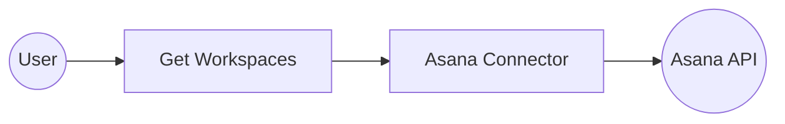

# Example

## What you'll build

This integration connects WSO2 Integrator to the Asana project management API using the `ballerinax/asana` connector. It demonstrates how to authenticate with the Asana API using a Personal Access Token, configure the Asana connection with configurable variables, and call the getWorkspaces operation on a schedule using an Automation entry point. The complete flow on the canvas shows an Automation trigger → Asana Remote Function → End, running periodically to retrieve all Asana workspaces accessible to the authenticated user.

**Operations used:**
- **Get multiple workspaces** — Retrieves all Asana workspaces accessible to the authenticated user

## Architecture

## Prerequisites

- An active Asana account with API access enabled.
- An Asana Personal Access Token (PAT) generated from your Asana developer settings at `https://app.asana.com/0/my-apps`.
- (Optional) An Asana Workspace GID if operations require a workspace identifier.

## Setting up the Asana integration

> **New to WSO2 Integrator?** Follow the [Create a New Integration](../../../../develop/create-integrations/create-a-new-integration.md) guide to set up your integration first, then return here to add the connector.

## Adding the Asana connector

### Step 1: Open the connector palette

Select **Add Connection** in the Connections section of the left sidebar to open the connector search palette, which displays a search field and a list of pre-built connectors.

### Step 2: Search for and select the Asana connector

Enter "asana" in the search box to filter the connector list, then select the **Asana** connector card (`ballerinax/asana`) to open its connection configuration form.

## Configuring the Asana connection

### Step 3: Bind Asana connection parameters to configurable variables

In the connection configuration form, bind each required field to a configurable variable. The following parameters were configured:
- **Config** : The connection configuration record containing the authentication settings for the Asana connector. The `auth.token` field is bound to the `asanaToken` configurable variable.

### Step 4: Save the Asana connection

Select **Save Connection** to persist the Asana connection configuration. The `asanaClient` connector node now appears on the integration design canvas.

### Step 5: Set actual values for your configurables

1. In the left panel of WSO2 Integrator, select **Configurations** (listed at the bottom of the project tree, under Data Mappers).
2. Set a value for each configurable listed below.

- **asanaToken** (string) : Your Asana Personal Access Token from `https://app.asana.com/0/my-apps`

## Configuring the Asana get multiple workspaces operation

### Step 6: Add an automation entry point

1. In the low-code canvas, select **Add Artifact** in the Design section.
2. Select **Automation** in the artifact selection panel.
3. Accept the default schedule settings and select **Create** to add the automation to the canvas.

### Step 7: Expand the Asana connection and select the get multiple workspaces operation

1. In the automation flow body on the canvas, select the **+** (Add Step) button between the Start and Error Handler nodes to open the step-addition panel.
2. Under **Connections** in the step panel, select the **asanaClient** connection node to expand it and reveal all available Asana API operations.

3. Select **Get multiple workspaces** from the list, then fill in the operation fields:
   - **Result** : Name of the result variable that stores the response from the Get multiple workspaces operation.
4. Select **Save** to add the Asana operation step to the automation flow.

### Step 8: Verify the completed automation flow

The completed canvas flow shows the Automation entry point → asana : get (Get multiple workspaces) → Error Handler → End, with the `asanaClient` connection linked to the operation node.

## Try it yourself

Try this sample in WSO2 Integration Platform.

[View source on GitHub](https://github.com/wso2/integration-samples/tree/main/connectors/asana_connector_sample)

## More code examples

The `Asana` connector offers practical examples illustrating its use in various scenarios.
Explore these [examples](https://github.com/ballerina-platform/module-ballerinax-asana/tree/main/examples/), covering the following use cases:

1. [Employee onboarding process automation](https://github.com/ballerina-platform/module-ballerinax-asana/tree/main/examples/employee-onboarding-process-automation) - Automate the onboarding process of new employees using Asana projects and tasks.
2. [Team workload balancer](https://github.com/ballerina-platform/module-ballerinax-asana/tree/main/examples/team-workload-balancer) - Evaluate and balance the workload of a given team using Asana tasks and assignments.
