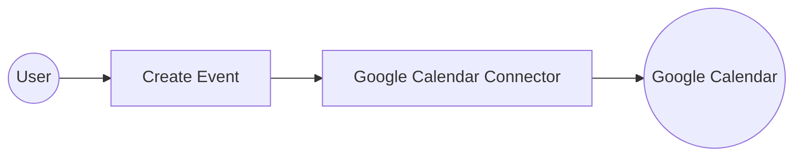

# Example

## What you'll build

Build a Google Calendar integration that creates a new calendar event using OAuth2 credentials stored as configurable variables. The integration runs as an Automation entry point and connects to Google Calendar via the `ballerinax/googleapis.calendar` connector.

**Operations used:**
- **Create Event** : Creates a new event in a specified Google Calendar using an `InputEvent` record with start time, end time, and summary.

## Architecture

## Prerequisites

- A Google Cloud project with OAuth2 credentials: Client ID, Client Secret, and Refresh Token.

## Setting up the Google Calendar integration

> **New to WSO2 Integrator?** Follow the [Create a New Integration](../../../../develop/create-integrations/create-new-integration.md) guide to set up your integration first, then return here to add the connector.

## Adding the Google Calendar connector

Select **Add Connection** in the **Connections** section of the left sidebar (or select the **+** button next to **Connections**) to open the Add Connection palette.

### Step 1: Search for and select the Google Calendar connector

Search for "calendar" in the palette and select the `ballerinax/googleapis.calendar` connector card to open the connection configuration form.

## Configuring the Google Calendar connection

### Step 2: Fill in connection parameters

Bind each OAuth2 field in the **Configure Calendar** form to a configurable variable. Select the record icon next to the **Config** field to open the **Record Configuration** modal, then map the following parameters:

- **refreshUrl** : The OAuth2 token endpoint URL, bound to a configurable variable
- **refreshToken** : The OAuth2 refresh token, bound to a configurable variable
- **clientId** : The OAuth2 client ID, bound to a configurable variable
- **clientSecret** : The OAuth2 client secret, bound to a configurable variable

Set the **Connection Name** to `calendarClient`.

### Step 3: Save the connection

Select **Save**. The `calendarClient` connection node appears in the Connections panel.

### Step 4: Set actual values for your configurables

In the left panel, select **Configurations**. Set a value for each configurable listed below:

- **calendarRefreshUrl** (string) : The OAuth2 token endpoint — use `https://oauth2.googleapis.com/token`
- **calendarRefreshToken** (string) : Your OAuth2 refresh token obtained from Google Cloud Console
- **calendarClientId** (string) : Your OAuth2 client ID from Google Cloud Console
- **calendarClientSecret** (string) : Your OAuth2 client secret from Google Cloud Console

## Configuring the Google Calendar createEvent operation

### Step 5: Add an Automation entry point

In the left sidebar under **Entry Points**, select **+** to add a new entry point. Select **Automation** and name it `main`. The Automation flow canvas opens, showing a **Start** node and an **Error Handler** node.

### Step 6: Select and configure the createEvent operation

Expand the **calendarClient** connection node on the canvas to view available operations.

Select **Create Event** to open the operation configuration form, then fill in the following fields:

- **calendarId** : The calendar identifier — use `"primary"` for the user's default calendar
- **event** : A complete `InputEvent` record with `summary`, `start`, and `end` fields (each `Time` record requires `dateTime` and `timeZone`)
- **result variable** : Leave the default name `calendarEvent`

Select **Save**. The `calendar : createEvent` node is added to the Automation flow canvas, connected to the `calendarClient` connection.

## Try it yourself

Try this sample in WSO2 Integration Platform.

[View source on GitHub](https://github.com/wso2/integration-samples/tree/main/connectors/googleapis.calendar_connector_sample)
