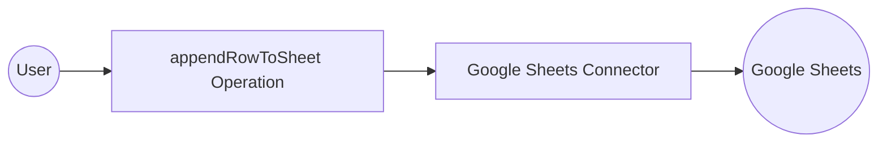

# Example

## What you'll build

Build a WSO2 Integrator automation that appends a row of data to a Google Spreadsheet using the `googleapis.sheets` connector. The workflow configures OAuth2 credentials via configurable variables and invokes the `appendRowToSheet` operation inside an Automation entry point.

**Operations used:**
- **appendRowToSheet** : Appends a new row to the bottom of the table range in the specified worksheet

## Architecture

## Prerequisites

- A Google Cloud project with the Sheets API enabled
- OAuth2 credentials: Client ID, Client Secret, Refresh Token, and Refresh URL (`https://oauth2.googleapis.com/token`)
- The target Google Spreadsheet ID (found in the spreadsheet's URL)

## Setting up the Google sheets integration

> **New to WSO2 Integrator?** Follow the [Create a New Integration](../../../../develop/create-integrations/create-a-new-integration.md) guide to set up your integration first, then return here to add the connector.

## Adding the Google sheets connector

### Step 1: Open the add connection panel

Select **+** next to **Connections** in the WSO2 Integrator sidebar to open the **Add Connection** palette.

### Step 2: Select the Google sheets connector card

Search for `sheets` or locate **Google Sheets** in the grid, then select the **Sheets** connector card to open the **Configure Sheets** form.

## Configuring the Google sheets connection

### Step 3: Bind all OAuth2 connection parameters to configurable variables

In the **Config** field, switch to expression mode and use the **Configurations** panel to create four configurable variables. Enter the composite expression binding all four OAuth2 fields:

- **clientId** : The Google OAuth2 Client ID, bound to a configurable variable
- **clientSecret** : The Google OAuth2 Client Secret, bound to a configurable variable
- **refreshToken** : The OAuth2 Refresh Token, bound to a configurable variable
- **refreshUrl** : The token endpoint URL, bound to a configurable variable

### Step 4: Save the connection

Enter `sheetsClient` in the **Connection Name** field, then select **Save Connection** to persist the connection.

### Step 5: Set actual values for your configurables

In the left panel, select **Configurations**. Set a value for each configurable listed below:

- **sheetsClientId** (string) : Your Google OAuth2 Client ID
- **sheetsClientSecret** (string) : Your Google OAuth2 Client Secret
- **sheetsRefreshToken** (string) : Your OAuth2 Refresh Token
- **sheetsRefreshUrl** (string) : The token endpoint URL (`https://oauth2.googleapis.com/token`)

## Configuring the Google sheets appendRowToSheet operation

### Step 6: Add an automation entry point

1. Select **+ Add Artifact** in the Design view.
2. Under the **Automation** section, select the **Automation** card.
3. Select **Create** on the **Create New Automation** form to open the automation flow.

### Step 7: Select and configure the appendRowToSheet operation

Select **+** in the flow between **Start** and **Error Handler**, then expand **sheetsClient** under **Connections** and select **Append Row To Sheet**. Fill in the operation parameters:

- **Google Sheet ID** : The spreadsheet ID, bound to a configurable variable `sheetsSpreadsheetId` created via the Configurations panel
- **Worksheet Name** : The name of the worksheet tab to append to
- **Row Values** : An array of values representing the row to append

> **Note:** Create `sheetsSpreadsheetId` as a fifth configurable variable using the same Configurations panel flow before saving.

Select **Save** to add the step to the automation flow.

## Try it yourself

Try this sample in WSO2 Integration Platform.

[View source on GitHub](https://github.com/wso2/integration-samples/tree/main/connectors/googleapis.sheets_connector_sample)
