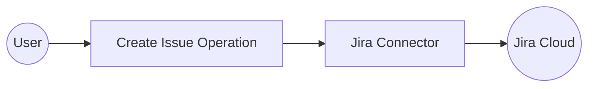

# Example

## What you'll build

Build a Jira Cloud integration that creates a new issue using the `ballerinax/jira` connector. The integration uses an Automation entry point to call the **Create issue** operation, with all secrets safely externalised as configurable variables.

**Operations used:**
- **Create issue** : Creates a new Jira issue in a specified project with a given summary and issue type

## Architecture

## Prerequisites

- A Jira Cloud account with an API token that has project write permission
- A Jira project key (for example, `PROJ`)

## Setting up the Jira integration

> **New to WSO2 Integrator?** Follow the [Create a New Integration](../../../../develop/create-integrations/create-a-new-integration.md) guide to set up your integration first, then return here to add the connector.

## Adding the Jira connector

### Step 1: Open the add connection palette

In the **WSO2 Integrator** sidebar, hover over the **Connections** tree item and select the **Add Connection** (➕) button to open the connector palette.

### Step 2: Select the Jira connector

1. Enter `jira` in the search box.
2. Locate **ballerinax/jira** in the results.
3. Select the connector card to open the **Configure Jira** form.

## Configuring the Jira connection

### Step 3: Fill in the connection parameters

In the **Configure Jira** form, bind each field to a configurable variable:

- **Config** : Accepts a `jira:ConnectionConfig` record — select the **Record** toggle and set `auth.token` to a new configurable variable `jiraToken` (type `string`, no default value)
- **Service Url** : Expand **Advanced Configurations**, open the helper panel for **Service Url**, and create a new configurable variable `jiraServiceUrl` (type `string`)
- **Connection Name** : Leave the default value `jiraClient`

### Step 4: Save the connection

Select **Save Connection**. The form closes and `jiraClient` appears under **Connections** in the left sidebar and as a connection node on the integration canvas.

### Step 5: Set actual values for your configurables

In the left panel, select **Configurations** and set a value for each configurable listed below:

- **jiraToken** (string) : Your Jira API token.
- **jiraServiceUrl** (string) : Your Jira Cloud REST API base URL (for example, `https://your-domain.atlassian.net/rest`)

## Configuring the Jira create issue operation

### Step 6: Add an automation entry point

1. Select **+ Add Artifact** on the canvas.
2. Select **Automation** from the artifact picker.
3. Select **Create** on the **Create New Automation** dialog, leaving all defaults.

The Automation (`main`) appears under **Entry Points** in the sidebar and the flow canvas opens, showing **Start → [empty step] → Error Handler → End**.

### Step 7: Select the create issue operation and configure its parameters

1. Select the **+** (add step) button between **Start** and **Error Handler** on the canvas.
2. The node panel opens on the right, showing all available connections and statement types.

3. Enter `issue` in the **Search** box to filter operations.
4. Select **Create issue** from the `jiraClient` group.
5. In the **Create issue** configuration panel, switch **Payload** to **Expression** mode and enter the payload record literal.

Configure the following parameters:

- **Payload** : A `jira:IssueUpdateDetails` record containing `fields` with `summary`, `project.key`, and `issuetype.name` — for example, `{fields: {"summary": "Integration test issue", "project": {"key": "PROJ"}, "issuetype": {"name": "Task"}}}`
- **Result** : `jiraCreatedissue` (auto-generated)

> **Tip:** Replace `"PROJ"` with your actual Jira project key and update `summary` for your use case.

Select **Save**. The canvas updates to show the completed automation flow with **Start → jira:post → Error Handler → End**.

## Try it yourself

Try this sample in WSO2 Integration Platform.

[View source on GitHub](https://github.com/wso2/integration-samples/tree/main/connectors/jira_connector_sample)

## More code examples

The `Jira` connector provides practical examples illustrating usage in various scenarios. Explore these [examples](https://github.com/ballerina-platform/module-ballerinax-jira/tree/main/examples/), covering the following use cases:

1. [**Create Project and Issue**](https://github.com/ballerina-platform/module-ballerinax-jira/tree/main/examples/create_project_and_issue/) - Creates a new Jira project and adds an issue to it.
2. [**Create Issue and Add Comment**](https://github.com/ballerina-platform/module-ballerinax-jira/tree/main/examples/create_issue_and_add_comment/) - Creates a new issue in an existing Jira project and adds a comment to it.
