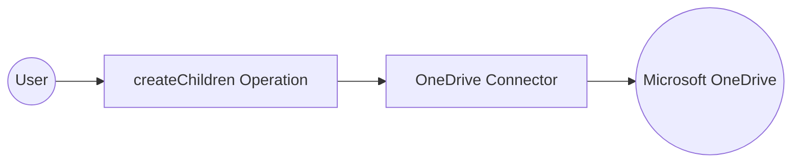

# Example

## What you'll build

Build an integration that connects to Microsoft OneDrive and creates a new folder inside an existing drive item. The integration uses a configurable bearer token for authentication and invokes the `createChildren` operation to create a child folder in a specified OneDrive drive item.

**Operations used:**
- **createChildren** : Creates a new child item (folder) inside a specified OneDrive drive item

## Architecture

## Prerequisites

- A Microsoft OneDrive account with an active bearer token (OAuth 2.0 access token)

## Setting up the OneDrive integration

> **New to WSO2 Integrator?** Follow the [Create a New Integration](../../../../develop/create-integrations/create-new-integration.md) guide to set up your integration first, then return here to add the connector.

## Adding the OneDrive connector

### Step 1: Open the Add Connection palette

Select **+ Add Connection** in the integration design canvas to open the **Add Connection** palette, which shows a grid of pre-built connectors.

### Step 2: Search for and select the OneDrive connector

1. Enter `onedrive` in the search box at the top of the palette.
2. Select the **Onedrive** connector card to open the **Configure Onedrive** form.

## Configuring the OneDrive connection

### Step 3: Fill in the connection parameters

Fill in the connection parameters, binding each field to a configurable variable:

- **Config** : Authentication and HTTP client settings for the connector — bind to a new configurable variable `oneDriveToken` of type `string` using the expression `{auth: {token: oneDriveToken}}`
- **Connection Name** : Logical name used to reference the connection in your integration — set to `onedriveClient`

### Step 4: Save the connection

Select **Save Connection** to persist the connection. The **Connections** section in the left sidebar now lists `onedriveClient` and the design canvas shows the connection node.

### Step 5: Set actual values for your configurables

1. In the left panel, select **Configurations**.
2. Set a value for each configurable listed below.

- **oneDriveToken** (string) : Your Microsoft Graph bearer token with scope `https://graph.microsoft.com/Files.ReadWrite`

## Configuring the OneDrive createChildren operation

### Step 6: Add an Automation entry point

1. Select **+ Add Artifact** on the design canvas toolbar.
2. Select **Automation** from the artifacts panel.
3. Select **Create** to accept the default settings.

An `Automation` entry point named `main` is added under **Entry Points** in the sidebar. The flow canvas opens showing a **Start** node and an **Error Handler** node.

### Step 7: Select and configure the createChildren operation

1. In the automation flow canvas, select the **+** button between the **Start** node and the **Error Handler** node.
2. Under **Connections**, select **onedriveClient** to expand the list of available OneDrive operations.

3. Select **Create Children** to open the **onedriveClient → createChildren** configuration form.
4. Fill in the operation fields:

- **Drive Id** : Unique identifier of the OneDrive drive
- **Drive Item Id** : Unique identifier of the parent drive item (folder)
- **Payload** : The new item to create — set to `{name: "Projects", folder: {}}` to create a folder
- **Result** : Name of the variable to store the returned `DriveItem`

Select **Save**. The operation node is added to the automation flow canvas between **Start** and **Error Handler**.

## Try it yourself

Try this sample in WSO2 Integration Platform.

[View source on GitHub](https://github.com/wso2/integration-samples/tree/main/connectors/microsoft.onedrive_connector_sample)

## More code examples

The `microsoft.onedrive` connector provides practical examples illustrating usage in various scenarios. Explore these [examples](https://github.com/ballerina-platform/module-ballerinax-microsoft.onedrive/tree/master/examples/), covering the following use cases:

1. [Upload File](https://github.com/ballerina-platform/module-ballerinax-microsoft.onedrive/tree/master/examples/upload-file) - This example demonstrates how to use the Ballerina Microsoft OneDrive connector to upload a file from your local system to your OneDrive account.
