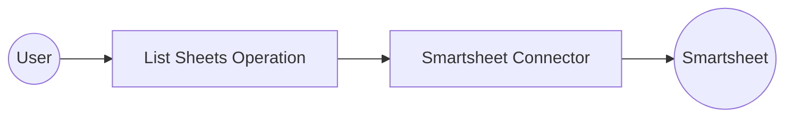

# Example

## What you'll build

Build an automation that connects to Smartsheet using a secure Bearer token and retrieves a list of all sheets in your account. The integration uses the `ballerinax/smartsheet` connector to authenticate and call the Smartsheet API.

**Operations used:**
- **listSheets** : Retrieve all sheets accessible to the authenticated user

## Architecture

## Prerequisites

- A valid Smartsheet account and a Personal Access Token (generated in Smartsheet → **Account** → **Apps & Integrations** → **API Access**)

## Setting up the Smartsheet integration

> **New to WSO2 Integrator?** Follow the [Create a New Integration](../../../../develop/create-integrations/create-a-new-integration.md) guide to set up your integration first, then return here to add the connector.

## Adding the Smartsheet connector

### Step 1: Open the add connection palette

In the left-hand sidebar tree, expand **Connections**, then select the **+** (Add Connection) button. The Add Connection palette opens on the right.

### Step 2: Search for and select the Smartsheet connector

1. Enter `smartsheet` in the search box.
2. Select the **Smartsheet** (`ballerinax/smartsheet`) connector card to open the connection configuration form.

## Configuring the Smartsheet connection

### Step 3: Fill in the connection parameters

Bind the connection parameters to configurable variables in the connection form:

- **Config** : Holds the authentication settings for the connector — enter the expression `{ auth: { token: smartsheetAccessToken } }`, referencing a configurable variable named `smartsheetAccessToken`
- **Connection Name** : Leave as `smartsheetClient`

To create the `smartsheetAccessToken` configurable variable:

1. Select inside the **Config** expression text box to open the helper panel.
2. Navigate to the **Configurables** tab.
3. Select **+ New Configurable**.
4. Set **Name** to `smartsheetAccessToken` and **Type** to `string`.
5. Select **Save**.

### Step 4: Save the connection

Select **Save Connection**. WSO2 Integrator saves the connection definition and returns to the integration design canvas. The `smartsheetClient` node is now visible on the canvas.

### Step 5: Set actual values for your configurables

1. In the left panel, select **Configurations**.
2. Set a value for each configurable listed below.

- **smartsheetAccessToken** (string) : Your Smartsheet Personal Access Token, generated in **Account** → **Apps & Integrations** → **API Access**

## Configuring the Smartsheet listSheets operation

### Step 6: Add an automation entry point

1. On the integration design canvas, select **+ Add Artifact**.
2. In the artifact picker, select **Automation**.
3. In the **Create New Automation** panel, leave the defaults and select **Create**.

WSO2 Integrator adds an Automation entry point named `main` under **Entry Points** in the sidebar tree and opens the Automation flow canvas.

### Step 7: Select and configure the listSheets operation

1. On the Automation flow canvas, select the **+** button between the **Start** node and the **Error Handler** node.
2. In the **Connections** section of the node panel, select **smartsheetClient** to expand it.
3. Select **List Sheets** to open the operation configuration panel.

Configure the following parameter:

- **Result** : Enter `listSheetsResult` as the result variable name

Select **Save** to add the node to the flow.

## Try it yourself

Try this sample in WSO2 Integration Platform.

[View source on GitHub](https://github.com/wso2/integration-samples/tree/main/connectors/smartsheet_connector_sample)

## More code examples

The `Smartsheet` connector provides practical examples illustrating usage in various scenarios. Explore these [examples](https://github.com/ballerina-platform/module-ballerinax-smartsheet/tree/main/examples), covering the following use cases:

1. [Project task management](https://github.com/ballerina-platform/module-ballerinax-smartsheet/tree/main/examples/project_task_management) - Demonstrates how to automate project task creation using Ballerina connector for Smartsheet.
