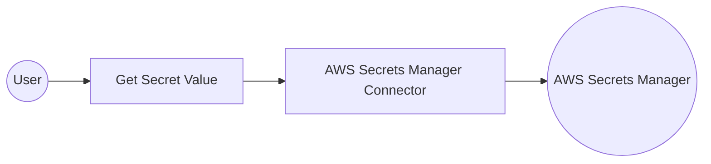

# Example

## What you'll build

This guide walks through building a WSO2 Integrator workflow that connects to AWS Secrets Manager and retrieves a named secret using the **getSecretValue** operation. The integration uses the `ballerinax/aws.secretmanager` connector, wired to an Automation entry point that triggers the secret retrieval on a scheduled basis. The completed flow on the canvas shows an Automation trigger connected to a `getSecretValue` remote function node, which calls the AWS Secrets Manager API and returns the secret value for downstream use.

**Operations used:**
- **getSecretValue** : Retrieves the value of a named secret stored in AWS Secrets Manager, returning the secret string or binary data along with metadata such as the version ID and stage labels.

## Architecture

## Prerequisites

- An active AWS account with Secrets Manager enabled in the target region (e.g., `us-east-1`).
- An IAM user or role with `secretsmanager:GetSecretValue` permission and programmatic access (Access Key ID and Secret Access Key).
- At least one secret already created in AWS Secrets Manager that the integration can retrieve.

## Setting up the aws.secretmanager integration

> **New to WSO2 Integrator?** Follow the [Create a New Integration](../../../../develop/create-integrations/create-new-integration.md) guide to set up your integration first, then return here to add the connector.

## Adding the aws.secretmanager connector

### Step 1: Open the Add Connection palette

Select **+ Add Connection** in the Connections section of the low-code canvas sidebar to open the connector search palette.

### Step 2: Search for and select the aws.secretmanager connector

1. In the palette search box, enter **aws.secretmanager**.
2. Locate the **ballerinax/aws.secretmanager** connector card in the filtered results.
3. Select the connector card to open the connection configuration form.

## Configuring the aws.secretmanager connection

### Step 3: Bind aws.secretmanager connection parameters to configurables

For each connection field, open the helper panel, navigate to the **Configurables** tab, select **+ New Configurable**, enter the variable name and type, and select **Save** to auto-inject the reference into the field.

- **Region** : The AWS region the connector should communicate with (e.g., `us-east-1`).
- **Auth** : The authentication configuration for AWS Secrets Manager, containing the Access Key ID and Secret Access Key bound to configurable variables.
- **Connection Name** : The identifier for this connection instance.

### Step 4: Save the aws.secretmanager connection

Select **Save Connection** to persist the connection configuration. The aws.secretmanager connector node appears on the low-code canvas.

### Step 5: Set actual values for your configurables

In the left panel of WSO2 Integrator, select **Configurations** (listed at the bottom of the project tree, under Data Mappers) to open the Configurations panel, then set a value for each configurable:

- **awsAccessKeyId** (string) : Your AWS IAM access key ID.
- **awsSecretAccessKey** (string) : Your AWS IAM secret access key associated with the above key ID.
- **awsSecretId** (string) : The name or ARN of the secret you want to retrieve.

## Configuring the aws.secretmanager getSecretValue operation

### Step 6: Add an Automation entry point

1. On the low-code canvas, select **+ Add Artifact** and select **Automation** to add a new Automation entry point.
2. In the **Create New Automation** dialog, select **Create** to accept defaults.
3. The Automation flow body appears on the canvas with a Start node, an empty body, and an End/Error Handler node.

### Step 7: Expand the connection and select the getSecretValue operation

1. Inside the Automation flow body, select the **+** (Add Step) button between the Start node and the End/Error Handler node to open the step-addition panel.
2. Under **Connections** in the step panel, select the **secretmanagerClient** (aws.secretmanager) connection node to expand it and reveal all available operations.

3. Select **Get Secret Value** from the list of operations, then fill in the operation fields:
   - **Secret Id** : The ARN or name of the secret to retrieve from AWS Secrets Manager, bound to the `awsSecretId` configurable.
   - **Result** : The name of the local variable that will hold the returned secret value.
   - **Result Type** : The type of the result variable (`secretmanager:SecretValue`).
4. Select **Save** to add the getSecretValue step to the automation flow.

### Step 8: Verify the completed integration flow

The canvas now shows the completed flow: **Start → secretmanager : getSecretValue (secretValue) → Error Handler → End**, with all nodes connected and no error indicators visible.

## Try it yourself

Try this sample in WSO2 Integration Platform.

[View source on GitHub](https://github.com/wso2/integration-samples/tree/main/connectors/aws.secretmanager_connector_sample)
