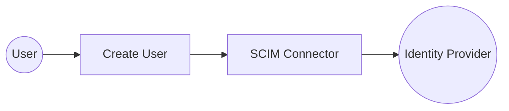

# Example

## What you'll build

This guide walks through configuring a WSO2 Integrator low-code integration that connects to a SCIM-compliant identity provider using the **ballerinax/scim** connector. The integration creates a scheduled Automation that calls the `createUser` operation to provision a new user in the identity provider. The complete flow on the canvas shows an Automation trigger driving the SCIM `createUser` remote function through a saved connection.

**Operations used:**
- **createUser** : provisions a new user in the SCIM-compliant identity provider by sending a SCIM UserResource payload

## Architecture

## Prerequisites

- A SCIM-compliant identity provider accessible at a known base URL (e.g., Asgardeo, Okta, or a custom SCIM v2 server).
- OAuth2 client credentials (Client ID, Client Secret, Token URL) OR a Bearer token with permission to create users, depending on your identity provider's authentication method.

## Setting up the SCIM integration

> **New to WSO2 Integrator?** Follow the [Create a New Integration](../../../../develop/create-integrations/create-new-integration.md) guide to set up your integration first, then return here to add the connector.

## Adding the SCIM connector

### Step 1: Open the Add Connection palette

Select **+ Add Connection** in the Connections section of the low-code canvas sidebar to open the connector search palette.

### Step 2: Search for and select the ballerinax/scim connector

1. Enter `scim` in the palette search box.
2. Locate the **ballerinax/scim** connector card in the filtered results.
3. Select the **ballerinax/scim** connector card to open its connection configuration form.

## Configuring the SCIM connection

### Step 3: Bind SCIM connection parameters to configurable variables

For each connection field, use the **Helper Panel → Configurables → + New Configurable** workflow to create a configurable variable and auto-inject it into the field. The following parameters were configured:
- **Config** : the connection configuration record containing the OAuth2 authentication details (`tokenUrl`, `clientId`, `clientSecret`), set as an expression referencing the configurable variables `scimTokenUrl`, `scimClientId`, and `scimClientSecret`
- **Service Url** : the base URL of the SCIM-compliant identity provider, bound to the configurable variable `scimServiceUrl`
- **Connection Name** : the name used to reference this connection in the integration, set to `scimClient`

### Step 4: Save the SCIM connection

Select **Save Connection** to persist the SCIM connection. The connector entry appears in the Connections panel on the low-code canvas.

### Step 5: Set actual values for your configurables

1. In the left panel of WSO2 Integrator, select **Configurations** (listed at the bottom of the project tree, under Data Mappers).
2. Set a value for each configurable listed below.

- **scimServiceUrl** (string) : the base URL of your SCIM identity provider
- **scimTokenUrl** (string) : the OAuth2 token endpoint URL
- **scimClientId** (string) : your OAuth2 application's client ID
- **scimClientSecret** (string) : your OAuth2 application's client secret

## Configuring the SCIM createUser operation

### Step 6: Add an Automation entry point

1. On the low-code canvas, hover over **Entry Points** in the sidebar and select **Add Entry Point**.
2. Select **Automation** in the artifact selection panel.
3. Accept the default settings and select **Create** to confirm. The automation flow body appears on the canvas with Start and Error Handler nodes.

### Step 7: Expand the SCIM connection and select the createUser operation

1. Inside the automation body, select the **+** (Add Step) button between the Start and Error Handler nodes.
2. In the right-side step panel, locate the **Connections** section and select the **scimClient** connection node to expand it and reveal all available SCIM operations.

3. Select **Create User** from the operations list, then fill in the operation fields:
- **Payload** : the SCIM UserObject record containing the user data to create
- **Result** : the variable name to store the operation response

4. Select **Save** to add the `createUser` step to the automation flow.

## Try it yourself

Try this sample in WSO2 Integration Platform.

[View source on GitHub](https://github.com/wso2/integration-samples/tree/main/connectors/scim_connector_sample)

## More code examples

The `scim` connector provides practical examples illustrating usage in various scenarios. Explore these [examples](https://github.com/ballerina-platform/module-ballerinax-scim/tree/main/examples), covering the following use cases:

1. [**Asgardeo Integration**](https://github.com/ballerina-platform/module-ballerinax-scim/tree/main/examples/asgardeo-integration) – Demonstrates how to provision and manage users in Asgardeo using the SCIM connector. This example shows how to securely connect to Asgardeo SCIM API, create new users, and synchronize identity data between systems.
