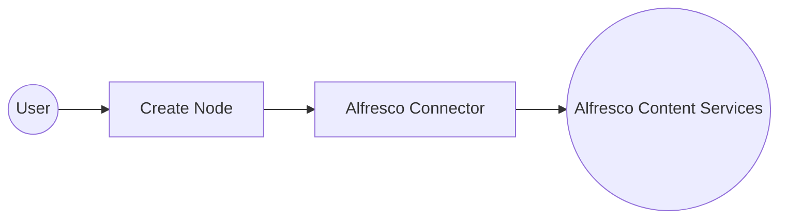

# Example

## What you'll build

This integration uses the **ballerinax/alfresco** connector to connect WSO2 Integrator with Alfresco Content Services, enabling automated document and content management operations. The workflow adds a scheduled Automation entry point that periodically calls the Alfresco `createNode` operation to create a new document node inside a specified parent folder in the Alfresco repository.

**Operations used:**
- **createNode** : Creates a new document or folder node inside a specified parent folder in the Alfresco Content Services repository

## Architecture

## Prerequisites

- A running Alfresco Content Services instance accessible from the integration environment (Community Edition or Enterprise Edition).
- Valid Alfresco credentials (username and password) with permission to create nodes in the target repository.
- The target parent folder's node ID (a UUID) from the Alfresco repository—obtainable from the Alfresco Share URL or REST API.

## Setting up the Alfresco integration

> **New to WSO2 Integrator?** Follow the [Create a New Integration](../../../../develop/create-integrations/create-a-new-integration.md) guide to set up your integration first, then return here to add the connector.

## Adding the Alfresco connector

### Step 1: Open the connector palette

Select the **+ Add Connection** button in the Connections section of the low-code canvas sidebar to open the connector search palette.

### Step 2: Search for and select the Alfresco connector

1. Enter **"alfresco"** in the palette search box to filter the connector list.
2. Locate the **Alfresco** connector card (`ballerinax/alfresco`) in the results.
3. Select the connector card to open the Alfresco connection configuration form.

## Configuring the Alfresco connection

### Step 3: Bind Alfresco connection parameters to configurables

For each connection field, open the helper panel, navigate to the **Configurables** tab, select **+ New Configurable**, enter the variable name and type, and select **Save** to auto-inject the configurable into the field. Repeat for every non-boolean field:
- **Config** : The `ConnectionConfig` record containing authentication credentials, configured as an expression referencing the `alfrescoUsername` and `alfrescoPassword` configurables
- **Service Url** : The base URL of your Alfresco Content Services instance
- **Connection Name** : The identifier for this connection instance

### Step 4: Save the Alfresco connection

Select **Save** to persist the connection configuration. The Alfresco connector node now appears in the Connections panel on the low-code canvas.

### Step 5: Set actual values for your configurables

1. In the left panel of WSO2 Integrator, select **Configurations** (listed at the bottom of the project tree, under Data Mappers).
2. Set a value for each configurable listed below.

- **alfrescoServiceUrl** (string) : The full base URL of your Alfresco instance
- **alfrescoUsername** (string) : Your Alfresco login username
- **alfrescoPassword** (string) : Your Alfresco login password
- **alfrescoParentNodeId** (string) : The UUID of the parent folder where the new node will be created

## Configuring the Alfresco createNode operation

### Step 6: Add an automation entry point

1. In the low-code canvas, select **+ Add Entry Point** to add a new Automation entry point.
2. Accept the default trigger interval or set a suitable schedule.
3. Select **Create** to confirm the automation and view its flow body on the canvas.

### Step 7: Select and configure the createNode operation

1. Inside the automation flow body, select the **+** (Add Step) button between the Start and End nodes to open the step-addition panel.
2. Under **Connections** in the step panel, expand the **alfrescoClient** connection node to reveal all available Alfresco operations.

3. Select **createNode** from the list of operations, then fill in the operation fields:
   - **Node Id** : The configurable variable `alfrescoParentNodeId` referencing the parent folder's node UUID
   - **Payload** : The `NodeBodyCreate` record containing `name` (set to `"IntegrationTestDocument"`) and `nodeType` (set to `"cm:content"` for a document)
   - **Result** : The output variable that holds the created node response
4. Select **Save** to add the `createNode` step to the automation flow.

## Try it yourself

Try this sample in WSO2 Integration Platform.

[View source on GitHub](https://github.com/wso2/integration-samples/tree/main/connectors/alfresco_connector_sample)

## More code examples

The `ballerinax/alfresco` connector provides practical examples illustrating usage in various scenarios. Explore these [examples](https://github.com/ballerina-platform/module-ballerinax-alfresco/tree/main/examples), covering the following use cases:

1. [Upload a Document](https://github.com/ballerina-platform/module-ballerinax-alfresco/tree/main/examples/upload-document) - Create a new file in Alfresco and upload content to it under a specific folder or path.
2. [Download a Document](https://github.com/ballerina-platform/module-ballerinax-alfresco/tree/main/examples/download-document) - Retrieve a document stored in Alfresco.
