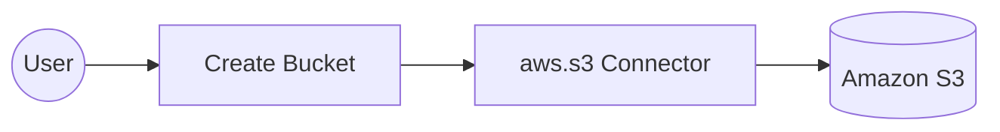

# Example

## What you'll build

This integration demonstrates how to connect to Amazon Web Services Simple Storage Service (S3) using the `ballerinax/aws.s3` connector in WSO2 Integrator. The workflow uses an Automation entry point to invoke the `createBucket` operation, which creates a new S3 bucket in the specified AWS region.

**Operations used:**
- **createBucket** : creates a new Amazon S3 bucket in the specified AWS region using the provided bucket name

## Architecture

## Prerequisites

- An active AWS account with programmatic access enabled (IAM user with S3 permissions).
- An AWS Access Key ID and Secret Access Key with at least `s3:CreateBucket` permission.
- The target AWS region where the S3 bucket will be created (e.g., `us-east-1`).

## Setting up the aws.s3 integration

> **New to WSO2 Integrator?** Follow the [Create a New Integration](../../../../develop/create-integrations/create-a-new-integration.md) guide to set up your integration first, then return here to add the connector.

## Adding the aws.s3 connector

### Step 1: Open the connector palette and select the aws.s3 connector

1. Select **Add Connection** (or the **+** icon next to the **Connections** heading in the sidebar) to open the connector palette.
2. In the palette search box, enter **aws.s3**.
3. Select the **ballerinax/aws.s3** connector card to open the connection configuration form.

## Configuring the aws.s3 connection

### Step 2: Bind the aws.s3 connection parameters to configurable variables

Select the **Config** field, switch to **Expression** mode, then use the **Configurables** tab in the helper panel to create one variable for each connection field:

- **Access Key Id** (string) : the AWS IAM access key ID used to authenticate requests to Amazon S3
- **Secret Access Key** (string) : the AWS IAM secret access key paired with the access key ID for request signing
- **Region** (string) : the AWS region where S3 operations will be performed (e.g., `us-east-1`, `eu-west-1`). Optional — defaults to `us-east-1` if omitted.

After creating all three configurables, bind each connection field to its configurable variable and set **Connection Name** to `s3Client`.

### Step 3: Save the aws.s3 connection

Select **Save Connection** to persist the connection. The S3 connector entry (`s3Client`) appears on the canvas.

### Step 4: Set actual values for your configurables

1. In the left panel, select **Configurations**.
2. Set a value for each configurable listed below.

- **accessKeyId** (string) : your AWS IAM access key ID
- **secretAccessKey** (string) : your AWS IAM secret access key
- **region** (string) : the target AWS region for S3 operations (e.g., `us-east-1`). Defaults to `us-east-1` if not set.

## Configuring the aws.s3 createBucket operation

### Step 5: Add an automation entry point

1. Select **+ Add Artifact** on the canvas toolbar.
2. Under **Automation**, select the **Automation** tile.
3. Select **Create**. No additional configuration is needed.

The automation entry point appears in the sidebar under **Entry Points**, and the canvas switches to the Automation flow editor showing a **Start** node.

### Step 6: Select the createBucket operation and configure its parameters

1. Inside the automation flow body, select the **+** (Add Step) button between the **Start** and **End/Error Handler** nodes to open the step-addition panel.
2. In the step-addition panel, locate the **Connections** section and select the S3 connection entry (**s3Client**) to expand it and reveal all available operations.

3. Select **Create Bucket** from the list of operations to open its configuration form, then fill in the operation fields.

- **Bucket Name** : the name of the new Amazon S3 bucket to create

4. Select **Save** to add the `createBucket` step to the automation flow.

## Try it yourself

Try this sample in WSO2 Integration Platform.

[View source on GitHub](https://github.com/wso2/integration-samples/tree/main/integrator-default-profile/connectors/aws.s3_connector_sample)
