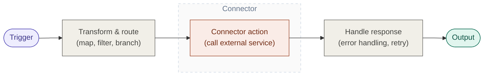

# Connectors Overview

Send a Slack notification when an order ships. Read customer records from Salesforce. Write results to a Google Sheet. Query a database and return the data in an API response.

Connectors make these integrations possible—without writing low-level HTTP or protocol code. WSO2 Integrator includes 200+ pre-built connectors for the services your business already uses.

## How connectors fit into your integration

Every integration in WSO2 Integrator follows the same pattern:

The connector action is where WSO2 Integrator communicates with the external service.

## Key concepts

### Connector

A connector is a pre-built integration component (implemented as a Ballerina package) that wraps an external service's API into ready-to-use operations. Instead of constructing HTTP requests and parsing responses by hand, you select an action from the connector's list and configure its inputs.

### Connection

A connection is a named, reusable configuration that holds the credentials and endpoint settings for an external service—API keys, OAuth tokens, hostnames. You define it once; every action in your integration uses it by name.

For details on creating and managing connections, see [Connections](../develop/integration-artifacts/supporting/connections.md).

### Action

An action is a specific operation you invoke through a connection—"send SMS", "create contact", "execute query". Each connector exposes a list of available actions. Actions are outbound: your integration calls the external service.

### Trigger

Some connectors also support triggers—inbound events the external service pushes into your integration. A database trigger fires when a row changes. A messaging trigger fires when a new message arrives.

| | Actions | Triggers |
|---|---|---|
| Direction | Your integration calls the service | The service calls your integration |
| Example | Send an SMS, create a Salesforce record | New database row, incoming webhook |

Most connectors are action-only. Trigger support is available for select connectors—primarily databases (MySQL, PostgreSQL, MSSQL), messaging systems (Kafka, RabbitMQ), and file storage. See each connector's documentation for what's available.

## Next steps

- [Connector catalog](catalog/index.mdx) — Browse all available connectors
- [Connections](../develop/integration-artifacts/supporting/connections.md) — Create and manage connections
